<div align="center">


# 场记 SceneNote

### 戴上耳机，全世界都在说你听得懂的话 ♪

**iPhone · Android · 不用注册 · 不联网也能用**

> 我是场记的小场记！对方说什么，我小声告诉你；你想说什么，我写成大字给 Ta 看～
> <br>—— 记记酱

</div>

---

## 一分半钟，我全演一遍

<div align="center">

[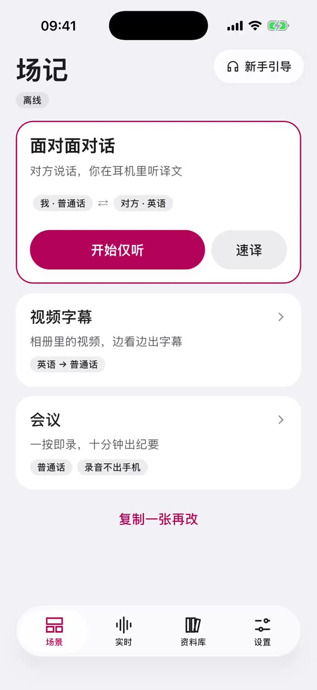](docs/介绍页/video/demo.mp4)

</div>

在国外问路（耳朵里听翻译 → 举起手机给对方看 → 屏幕一人一半）→ 给对方看一句大字 → 把相册里的视频配上字幕 → 开完会顺手出个纪要 → 换个主题色 → 换个界面语言。

一镜到底，**全程飞行模式**：听、翻、整理纪要，都在手机上干完的。

> 点封面下载那 106 秒；想要带播放器的完整版，打开 [`docs/介绍页/index.html`](docs/介绍页/index.html)（中 / EN / 日本語 / 한국어，四种语言都有）。

---

## 一张卡，把选择题先替你答好

麻烦的从来不是听不懂，而是每次开始前都要重新选一遍。

> **什么语言** ＋ **翻不翻** ＋ **翻成什么** ＋ **什么语气** ＋ **要什么结果** ＝ 一张场景卡

存好了，下次按一下就开始，不用再想。自带「面对面对话 / 视频字幕 / 会议」三张；想要自己的，复制一张改改名字和语言就好，不用从头设置。

<div align="center">
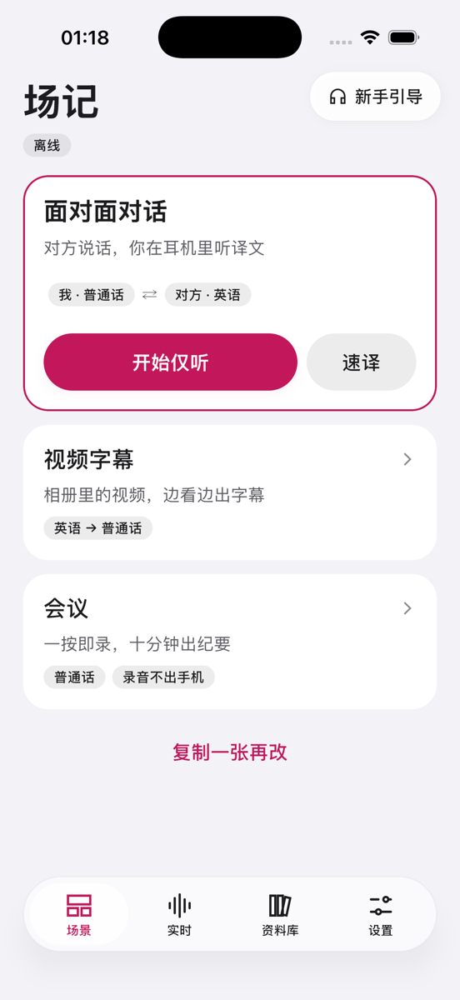
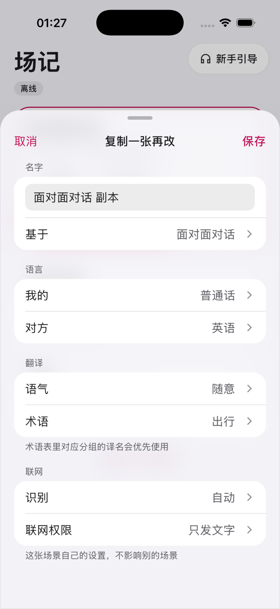
</div>

---

## 面对面对话，四种用法

问路、点餐、饭桌闲聊、小型会议都用得上。不用外放，两个人都自在。先从「仅听」开始，需要时再换。

<div align="center">
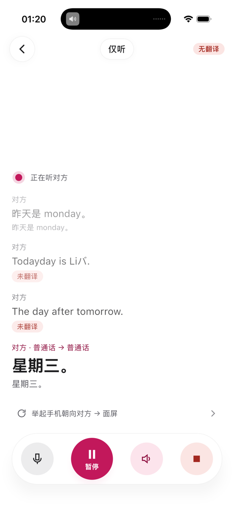
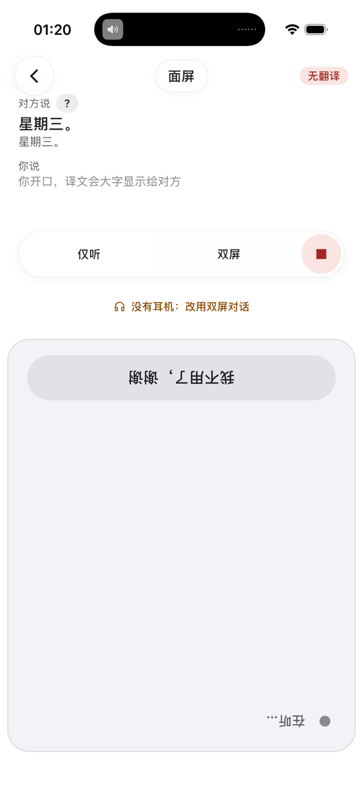
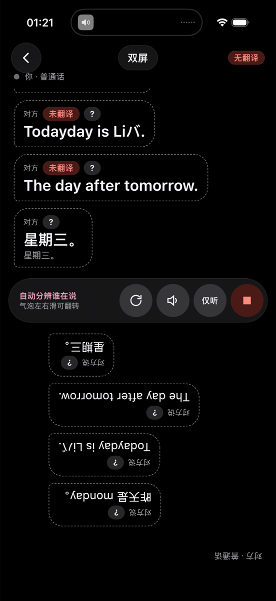
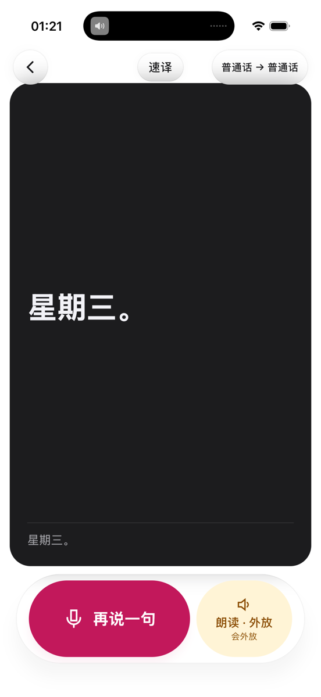
</div>

| 用法 | 什么时候 | 怎么回事 |
|---|---|---|
| **仅听** | 只按一下 | 手机放口袋里就好。对方一开口，翻译就轻轻传进你的耳机。震动两下，就是我开始听啦。 |
| **面屏** | 举起手机自动切换 | 把手机竖起来，下半屏自动转向对方。Ta 看大字，你听耳机，谁也不用凑过来。 |
| **双屏** | 耳机没电也行 | 屏幕一人一半，轮流说，各看各的语言。谁在说话我自动分辨，不用你手动切。 |
| **速译** | 说完就出 | 只想说一句？按住说话，松手就变成一张大字卡，举给对方看。屏幕我会自动调到最亮。 |

聊完我把它整理成一张对话卡：双语对照 + 要点，遇到的新词也顺手记下来。

> 嘘，对方的声音默认不存，只存文字。你不点头，什么都不出手机。

---

## 视频字幕：没字幕的视频，丢给我就好

相册里的视频、微信收到的视频、一条链接，分享给场记就行。什么语言我自己认，边看边出字幕。

<div align="center">
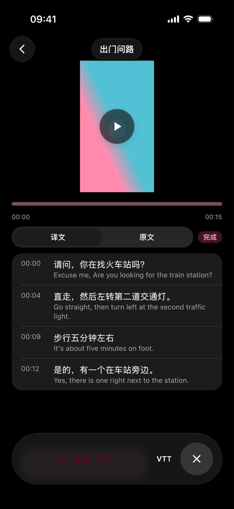
</div>

- 开始几秒字幕就出来了；万一我跟不上，画面会自动等我一下。
- 看完想留着？字幕文件能存下来（SRT / VTT）。遇到的新词我也记住了，下次翻得更准。
- **安卓这边还多一手**：在别的 App 看视频时，下拉通知栏点一下「屏内翻译」，字幕条就浮在画面上。

> Netflix 这类有版权保护的视频，还有 iPhone 网页里正在播的视频，我听不到声音，就不装懂啦。这种可以先保存到相册，再交给我。

---

## 会议纪要：会开完，纪要也差不多好了

一键开录，边说边出文字。散会的时候，能直接发群的纪要也写好了：说了什么、定了什么、谁来做。

<div align="center">
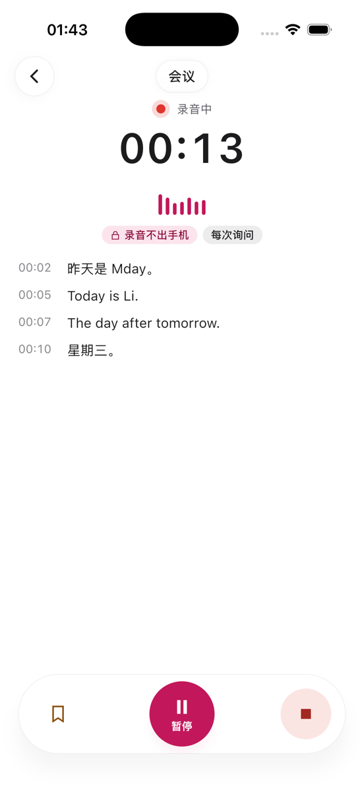
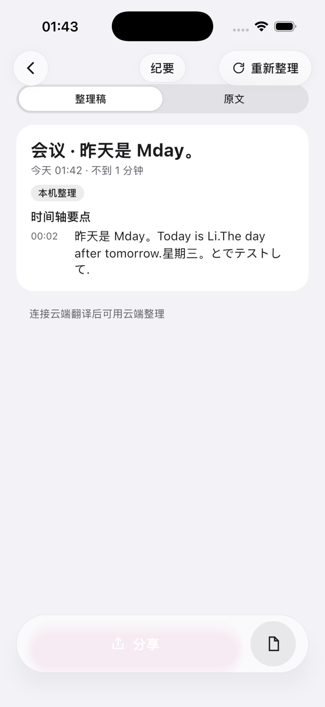
</div>

- 录音一直留在手机里。只有文字会交给云端整理，而且我会先问过你。
- 不联网也行，照样有按时间排好的要点和待办，一样能分享。
- 整理稿和原话随时切着看；不满意的话，换个风格让我重写一遍。

---

## 教我一次，以后都记得

每次聊完、每个视频看完，碰到的新词我都会问你一声要不要记下来。以后再遇到，优先用你定的说法。

<div align="center">
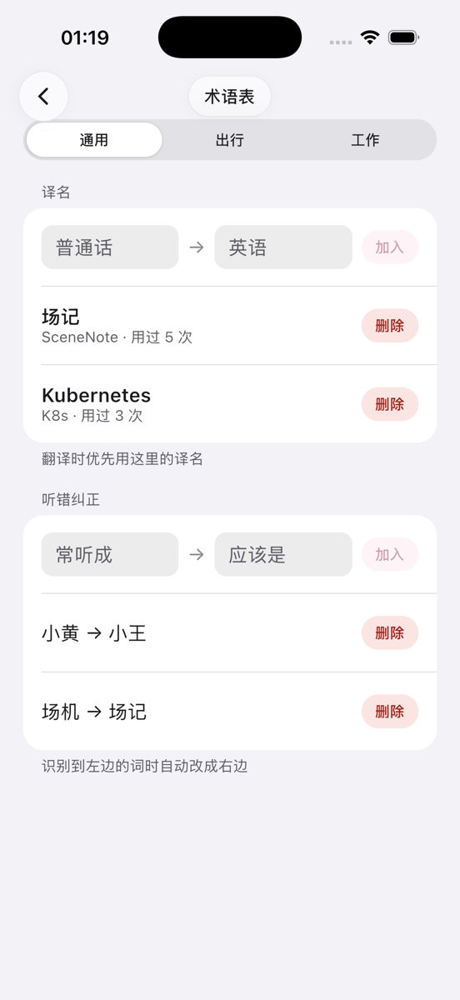
</div>

希望某个词固定翻成你习惯的说法？总把「小王」听成「小黄」？跟我说一次，以后我自动改。分成通用、出行、工作几组，每张场景卡各用各的。

---

## 我的数据去哪了？每一笔都清清楚楚

场记没有自己的服务器，也不要你注册账号。听和转文字都在你手机上干完；只有翻译用的那点文字，和你亲手点了上传的录音，才会离开手机。

<div align="center">
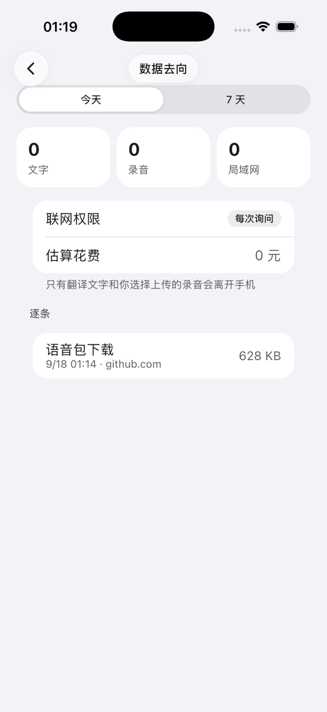
</div>

- 今天有几条文字、几条录音离开过手机，页面上写得明明白白。不是口号，是账本。
- 连了云端翻译的话，花了多少钱也记在同一页。
- 联网权限分四档，每张场景卡单独选：**只在本机 / 只发文字 / 文字和录音 / 每次询问**。

---

## 按一下，就开始

场景卡可以绑到你已经顺手的那个按钮上，出门不用翻手机找 App。

<div align="center">
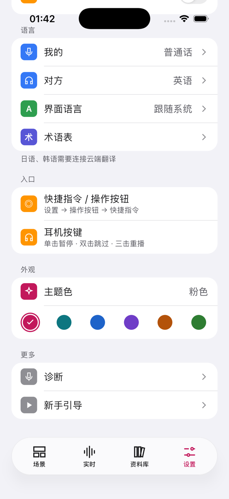
</div>

| 平台 | 按哪儿 |
|---|---|
| **iOS 17 起** | 操作按钮（按住就能速译一句）· 快捷指令（一句 Siri 打开某张场景卡）· 耳机按键（单击暂停 · 双击跳过 · 三击重播） |
| **Android 8.0 起** | 通知栏磁贴（「仅听」和「屏内翻译」）· 桌面小组件（一格一张场景卡）· 分享菜单（视频、语音条「用场记翻译」） |
| **两端都有** | 锁屏、通知栏一键「马上开始听」 |

看腻了粉色？六个主题色点一下全 App 跟着换。界面语言中文 / English / 日本語 / 한국어 随时切，**切完就变，不用重开 App**。

---

## 记记酱不说大话

不联网也是完整的一个 App，不是试用版。想要更准的翻译、更多语言，再连接云端翻译就好：去阿里云这类服务商申请一把密钥，我在 App 里一步步教你。

| ✅ 不联网我就能 | 🔑 连了云端翻译我才能 |
|---|---|
| 听懂并转成文字：普通话、英语、粤语、四川话 | 把话润色得更自然、纪要写成正式格式 |
| 中英互译（第一次要下个语言包，之后完全离线） | 日语、韩语、欧洲语言等更多语言 |
| 四川话直接听成普通话；粤语出粤语字幕 | 粤语真正翻成普通话 |
| 视频字幕，导出字幕文件 | 听懂上海话、闽南语 |
| 会议要点和待办 | |
| 术语表、对话卡片、分享 | |

> 新款 iPhone（15 Pro 起）可以借系统自带的翻译，连云端都省了。
>
> **我们不做的事**：自建服务器 · 账号体系 · 通话录音。

---

## 角色档案

<div align="center">

</div>

- **名字**　记记酱 JIJI
- **工作**　场记的小场记，负责把对方的话小声告诉你
- **装备**　黑框眼镜（挂着肉球）、猫耳、蝙蝠翅膀发夹、落肩的天蓝色开衫
- **口头禅**　「录音留在手机里，这是我的原则！」
- **会的话**　普通话、英语、粤语、四川话；日语韩语要连云端
- **不会的**　有版权保护的视频（听不到声音）、说大话

<div align="center">

**Android 8.0 起 · iOS 17 起 · 没有服务器，没有账号**

截图来自开发中的版本（iPhone 17 Pro 模拟器 / vivo 真机），界面文字以正式版为准。

</div>

---

## 想自己跑一遍？

```
shared/      KMP 库：core/model · core/db(SQLDelight) · core/settings · core/egress · core/designsystem(Apple HIG + Liquid Glass，无 material3) · audio · asr · live · ui · di
androidApp/  Android 壳（MainActivity / Application / Manifest）
iosApp/      Xcode 工程（SwiftUI 壳，embedAndSignAppleFrameworkForXcode）
docs/        方案、规格、流程图、执行计划、验收记录；介绍页与演示视频在 docs/介绍页/
```

```bash
# JDK 21（本机 JBR 可用），Android SDK 在 ~/Library/Android/sdk（local.properties 的 sdk.dir）
export JAVA_HOME=$(/usr/libexec/java_home -v 21)
./gradlew :androidApp:assembleDebug              # Android debug 包
./gradlew :shared:iosSimulatorArm64Test          # 共享模块单元测试（跑在 iOS 模拟器）
cd iosApp && xcodebuild -project iosApp.xcodeproj -scheme iosApp -configuration Debug -sdk iphonesimulator -arch arm64 CODE_SIGNING_ALLOWED=NO build
```

Xcode 的「Compile Kotlin Framework」脚本会自动解析 JDK 21（`/usr/libexec/java_home -v 21`）。真机运行需在 `iosApp/Configuration/Config.xcconfig` 填 `TEAM_ID`。

方案文档见 [docs/00-导读与术语表.md](docs/00-导读与术语表.md)，执行计划见 [docs/13-执行计划.md](docs/13-执行计划.md)，验收记录在 `docs/验收记录/`，演示视频怎么录的见 [docs/介绍页/演示脚本.md](docs/介绍页/演示脚本.md)。

**三条红线**：没有后端；不内置任何密钥；不谈商业模式。
