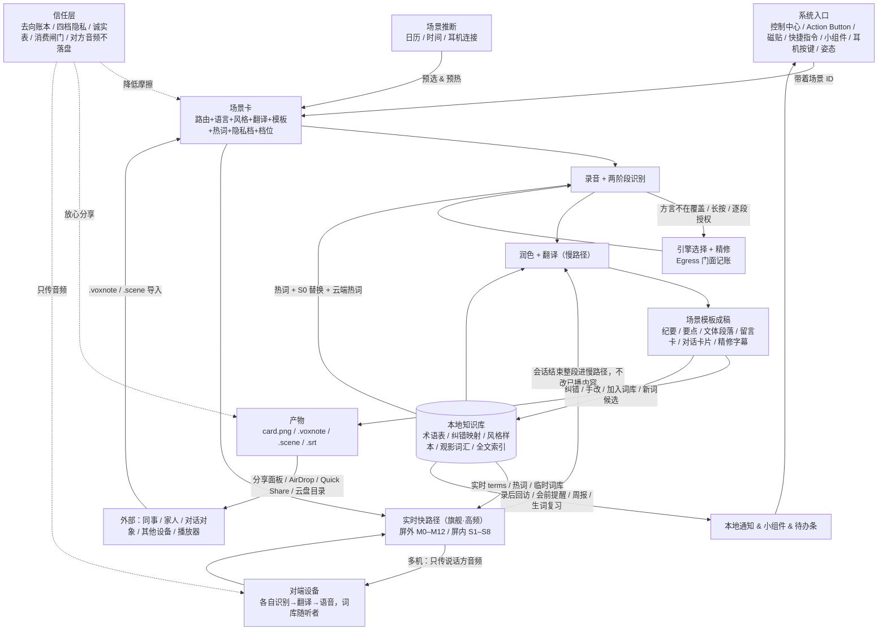

# 04 · 特色能力与业务飞轮

> **这篇讲什么**：除了核心识别翻译之外，这个 App 有哪 9 个"有特点、且互相咬合"的能力；功能之间怎么互相喂养形成飞轮；用户为什么第 8 天还会回来。所有机制都不需要服务器。
> **谁该看**：产品、运营、设计。

## 先看这个

1. **9 个特色能力**：一按即录 / 一按即译的入口矩阵；场景包 `.scene` 互传；方言家庭留言卡；语音卡片 / 笔记包 / 字幕文件三种产物；去向账本（信任层）；纠错即训练（词库越用越准）；场景自动推断与出门预热；围桌共录（v2）；以及贯穿全部的"实时 → 转写 → 润色 → 知识库 → 词库 → 下次更准"闭环。
2. **飞轮为什么在没有服务器的情况下成立**：竞品的飞轮总有一环在服务器上（分享链接、云同步、账号、多人房间）。我们把那一环换成四种系统能力：分享面板 / AirDrop 负责"传出去"，自定义文件类型负责"收进来"，本机目录 + 平台云盘负责"跨设备"，局域网负责"多人房间"。资产在用户手里而不在我们手里——**可带走反而更忠诚**。
3. **诚实边界**：MVP 交付的是两条直线（录音线、实时线），不是完整飞轮。"下次翻译更准"这条回流对云端翻译（`terms` 参数）和端侧 NMT（S0 前置替换 + 占位符回填，解码由我们控制）都生效，零 Key 用户同样在环内。

---

## 4.1 入口矩阵：一按即录 / 一按即译

- **问题**：想录的时候打不开 App，打开了还要选一堆；想听懂对面的人时更不能掏手机。
- **怎么做**：iOS 用 App Intents 一次编写多处生效（控制中心按钮、Action Button、锁屏、快捷指令、桌面小组件）；Android 用磁贴 + 快捷方式；**耳机按键**和**姿态传感器**作为实时场景的"无屏入口"。入口带着场景 ID（以及可选的子场景、隐私档、风格）：Action Button = 采访 + 锁定 + 中性；Action Button 长按 = 面对面 · 速译一句。拉起就加载模型、热词、风格、模板。
- **MVP 的诚实边界**：MVP 所有入口都先把 App 拉到前台再开录；iOS 18 的"后台直接录音"需要同时启动 Live Activity，所以放 v1.1。Key 用"首次解锁后可读"的 Keychain 级别存，保证从锁屏起录时云端路径也能用。"不掏手机"只在出门预热之后成立，冷启动或被打断后会提示"解锁点一下"。
- **留存**：第一次用完某个场景后引导"放到控制中心 / 磁贴 / 桌面 / 耳机单击"；入口绑定率是场景层的核心指标。
- 难度中；MVP；无后端。

## 4.2 场景包 `.scene` 互传

- **问题**：团队每人重配一遍周会场景；老师想把课堂场景发给全班；导游想把"多人同传"预设发给团员。
- **怎么做**：`.scene` 就是场景配置的 JSON（语言标签、风格、翻译目标、模板、实时模式偏好等），通过 AirDrop / Quick Share / 分享面板 / 微信发文件传播，导入后直接出现在首页。
- **默认最小化**：导出时默认剥离个人示例、术语表内容、云厂商、路由、入口绑定、声纹和任何凭据；想附带术语表要显式勾选并预览；导入端显示"含 N 条术语 / M 条样本"。
- **防注入**：`.scene` 里的自定义风格描述、示例、术语在拼提示词时不进系统提示，而是作为带标签的数据块，限长 400 字 / 3 条，导入时过滤"忽略 / 改为 / 把所有…"这类指令句式并提示复核。
- **传播断裂的诚实边界**：微信 / QQ 里扫一扫不会打开我们的自定义链接，没装 App 的人扫码什么也不会发生；所以跨渠道传播一律用 `.scene` 文件，二维码只用于面对面、双方都装了 App 的场合。
- 难度低；MVP 做文件导出导入，深链和二维码 v1.1；无后端。

## 4.3 方言家庭留言卡 + 语音留言翻译

- **问题**：方言长辈和外地晚辈双向沟通不畅；给外国朋友 / 客户发语音，对方听不懂。
- **和实时模式的分工**：**在场、实时** → 03（M0 仅听长辈、M4 速译一句、M1 / M3 面对面）；**不在场、异步** → 本节的留言卡。两者共用方言模型、术语表、系统语音和卡片渲染。
- **只需晚辈装 App 的闭环**：晚辈录长辈的方言（或从微信语音"用其他应用打开"导入）→ 本地识别（粤语 / 四川话）→ 留言卡（方言原文 + 普通话简 / 繁 + 音频 + 可选外语）→ 发回家庭群，**长辈零安装**就能看图听音。反过来，晚辈的普通话 → 润色 → 翻译 → 目标语言的语音文件，连同双语文本走分享面板，对方也不用装 App。
- **长辈愿意装**：进入**极简大字模式**——一张卡、一个大按钮、只显示方言原文和普通话，隐藏引擎徽标和费用；方言模型包由晚辈用 AirDrop / 文件传给长辈手机，不要求长辈自己下载。
- **诚实边界**：MVP 只支持粤语 + 四川话，上海话 / 闽南语在这张卡直接隐藏；系统语音的方言只有粤语，四川话回复用普通话大字 + 晚辈原声音频；安卓长辈 + iPhone 晚辈之间没有 AirDrop 通路时走微信发文件。
- 难度中；MVP；无后端。

## 4.4 三种产物：语音卡片 / 笔记包 / 字幕文件

- **问题**：转写不能直接用；分享出去别人看不懂语音；一场对话或一集视频看完想留下点什么。
- **怎么做**：场景决定模板（纪要 / 时间轴要点 / 文体段落 / 留言卡 / 对话卡片 / 字幕轨），风格决定版式（社媒 → 竖版带话题标签；商务 → 横版纪要卡；面对面 → 双语对照卡；屏内 → 封面 + 三句精选 + 生词）。三种载体：
  - **`card.png`**：任何平台都能看的图；
  - **`.voxnote`**：一个 zip 包（音频 m4a + 分段 JSON + 润色稿 + 译文 + 卡片图 + 元数据），两端注册了文件类型，收到就能导入；音频用 AAC 而不用 Opus，是为了系统播放器解压后直接能播；
  - **`.srt` / `.vtt`**：单语 / 双语 / 精修三种，任何播放器都能加载；Android 存到 Movies 目录同名 srt 会被 VLC / MX 自动加载。
  - 可选二维码只用于 ≤ 500 字的留言卡（二维码装不下一份纪要，超限自动隐藏）。
- **传播**：图覆盖非用户，笔记包覆盖用户，字幕覆盖任何播放器。只统计本机的分享次数和导入次数，不宣称能度量对方装没装。
- 难度低到中；MVP；无后端。

## 4.5 信任层：去向账本 + 隐私锁定 + 逐段授权 + 多机只传音频

- **问题**：用户不知道录音有没有上传、传给了谁；方言草稿不准，但整篇上传既贵又暴露隐私；多机翻译时对方的手机会不会拿到我的文字。
- **怎么做**：App 是第三方 API 的唯一出口，代码里所有出站（HTTP、WebSocket、SSE、局域网帧）都经过一个 `Egress` 门面——按会话隐私档放行或拒绝，同时记账。界面顶部常驻去向徽章；四档隐私（见 02）；草稿段长按可单独授权精修，同一会话问一次就记住；**绝不内置 Key**；**本地消费闸门**：按当前模型价格估算月费，到上限（默认 ¥30）自动切回"仅本机"并通知。多机模式默认只传音频，听者用云端识别时说话方可见。
- **账本的诚实边界**：只记三类——第三方 API 出站、模型资产下载、局域网出站；系统托管的模型 / 语言包（听写包、翻译包、Background Assets）由苹果 / 谷歌下载，不在账本里；局域网加密是应用层的，不写"TLS"。
- **留存**：本地占比、每月出站字节、精修回退率、局域网出站单列。
- 难度中；MVP；无后端。

## 4.6 纠错即训练：词库越用越准

- **问题**：同一个人名、产品名每次都识别错、每次都翻译得不一样。
- **怎么做**：三种纠错入口——识别文本波浪线点改、加入术语表、气泡左右滑翻转 / 字幕长按"加入词库"。术语表按场景分桶，注入到：流式 zipformer 的热词（需要 beam search）、S0 规则层替换（纠错映射 + 同音候选 + 形近字）、云端热词、大模型的术语块、实时翻译的 `terms` 参数。手改的差异沉淀成"风格 × 场景"的个人示例（v1.1）；润色前用全文检索找 3 段最相关的历史稿作上下文（v1.1）；v2 上向量检索。
- **观影词汇**：看完视频自动提取高频 / 新词候选，一键批量入库；知识库有"观影词汇"视图，搜索命中可以跳回视频时间点。
- **诚实边界**：端侧定稿引擎不吃热词，所以端侧识别的真实落点是 S0 替换；翻译侧无论云端（`terms` 参数）还是端侧 NMT（S0 前置把术语替换成占位符，NMT 解码后回填用户译法）都吃术语表——端侧 NMT 的解码由我们控制，这是能做到这一点的原因。
- **度量**：每千字纠错次数按引擎路径分组应下降；润色接受率应上升；加一个反向指标"纠错入口打开率"区分"变准了"和"懒得纠了"；实时会话的术语命中数应上升。
- 难度中；术语 + 纠错映射 + 同音替换 + 实时 terms + 观影词汇 MVP，示例和语料回响 v1.1，向量 v2；无后端。

## 4.7 场景自动推断与出门预热

- **问题**：连"选场景"这一步也想省。
- **怎么做**：日历（会前 5 分钟通知"一键开录《周会》"，与会者名和议题喂给热词和润色上下文）、时间 / 星期、**耳机连接事件与姿态**（耳机连上 + 日历里有外方会议 → 预热面对面卡）、进入旅行 / 商务场景 → 提示"现在按一下，接下来一天不用掏手机"（出门预热）。推断只是预选，命中率高的时段自动升为默认场景。运动状态与粗略定位 v2 且默认关。
- **国内日历的现实**：飞书 / 钉钉 / 企微日历未必同步到系统日历，引导页说明怎么开系统日历订阅，并把"时间 / 星期"作为没日历时的兜底。
- **没有通知权限时**：会前提醒改成 App 内待办条和桌面小组件上的"下一场：周会 14:00 一键开录"。
- 难度中；MVP 做时间 + 日历 + 耳机连接；无后端。

## 4.8 围桌共录（v2，并入多机骨干）

- **问题**：多人会议一台手机收音差、分不清谁在说。
- **怎么做**：每人一机天然分轨，各机本地识别自己的说话人，会后交换带时间戳的文本段落（这是"只传音频"规则的显式例外——会后产物交换而非实时传输），主持人按时间轴合并 → 一次润色成纪要 → AirDrop 回传。传输层和加密复用 03 的 P2P 骨干，不再单独维护。
- **独有部分**：双向二维码认证（防同网攻击者冒充参与者拿合并稿）、时钟对齐、段落级合并与冲突双版本保留。
- **退化路径**：没同网就主持人开热点；还不行就"各自录 + AirDrop `.voxnote` 合并"（MVP 就能用）。
- 难度高（传输层已被 v1.1 摊平）；v2；无后端。

## 4.9 最短闭环：实时对话 / 观影 → 转写 → 润色 → 知识库 → 词库 → 下次更准

这是飞轮里最短、最高频的一圈，逐环说"谁产出什么、谁消费什么"：

| 环 | 产出方 | 产物 | 消费方 | 本地指标 |
|---|---|---|---|---|
| ① 实时对话 / 观影（快路径） | 实时管线 / 屏内管线 | 原文 + 临时译文；会话临时词库（用户长按标记、云翻译回填的新名词） | 耳机 / 半屏 / 画中画 | 周实时会话数、句尾 → 首音 P50、首条字幕耗时 |
| ② 转写定稿（慢路径入口） | 会话结束一次性触发；对话按说话人 / 语言拆成两条稿子 | 完整原文 + 时间戳 + 说话人；对方音频不落盘 | S0 规则层 | 慢路径完成率 |
| ③ 润色（S0–S4） | 润色管线（Key / 系统模型 / 本地模型 / 规则层） | 精修文本、整段重译、纪要 / 章节、新词候选、精修字幕轨 | 详情页三栏对照；字幕导出默认精修版；对话卡片 | 润色接受率、精修轨导出占比 |
| ④ 知识库 | 本地目录 + SQLite 全文索引 | `conversations/…`、`screenin/…`：原文、润色、译文、字幕、元数据（含视频书签） | 搜索（可跳回视频时间点）、语料回响（v1.1）、周报 | 搜索命中率、复用动作数 |
| ⑤ 词库 | 用户纠错 + 慢路径新词候选"待确认"一键入库 + 观影词汇批量入库 | 术语表、纠错映射、风格样本（v1.1） | 下一次快路径：术语命中 → 翻译 `terms` / 热词；S0 替换；云端热词；多机时随听者走 | 词库条数、观影入库数、纠错率 |
| ⑥ 下次翻译更准（全部用户） | 翻译阶段（云端 terms / 端侧 NMT 占位符回填）+ 识别阶段（普通话 / 英文热词） | 译名一致、专名不再猜、方言词按用户译法 | 用户体感：同一人名在多场对话里稳定 | 实时术语命中（应上升）、手动翻转率（应下降）、实时纠正率（应下降） |

四条约束保证闭环不失真：① 慢路径永不改已播内容，只补写字段并打"精修"标签；② 术语回流到快路径只走 `terms` / 热词 / S0 替换三条已验证通道，不在快路径引入大模型示例（延迟不允许）；③ 屏内和屏外共用同一份词库（按场景分桶，可勾选共享）——看剧学到的词下次面对面对话里就命中，这是"越用越像自己"最直观的体感；④ 零 Key 用户走同一条链：S0 替换 + 端侧 NMT 占位符回填 + 卡片术语高亮 + 普通话 / 英文热词，闭环对全部用户成立。

---

## 5. 业务飞轮

**功能怎么互相喂养**：
1. **入口喂场景**：入口越多、录音越碎片，越依赖场景预设自动成稿；实时场景把入口从"屏幕"扩展到"耳机与姿态"，触发不再要求看手机。
2. **实时层是高频入口**：会议一周一次，问路 / 饭桌 / 看视频一天多次；每次实时会话结束都自动进知识库和词库，用户不需要额外"整理"。
3. **场景喂产物**：场景决定模板与版式，产物越贴场景越值得分享；`.scene` 把新用户直接带进同一场景；`.srt` 让任何播放器成为落点。
4. **产物喂数据层**：纠错进词库、手改进风格样本、成稿进知识库、观影生词进词库；下次识别、润色、翻译都更准更像自己。
5. **多机只传音频**：对端设备不是服务器，是另一台跑着同一个飞轮的客户端；词库、模型、Key 都留在听者本机。
6. **数据层喂回访**：录后回访、会前提醒、周报、生词复习全部由本地数据触发本地通知 / 小组件，不需要推送服务器。
7. **信任层贯穿**：去向账本和诚实分层让用户敢在方言、采访、家庭、面对面陌生人这些敏感场景用；"对方音频不落盘""默认只传音频""听者上云对说话方可见"让对方也敢配合。

**MVP 时点的飞轮（哪些边什么时候通）**：

| 边 | MVP | v1.1 | v2 |
|---|---|---|---|
| 入口 → 场景 | 是 | — | — |
| 推断 → 场景 | 时间 + 日历 + 耳机连接 | — | 位置 / Wi-Fi |
| 场景 → 录音 → 产物 | 是 | — | — |
| 场景 → 实时快路径 → 听 / 看 | M0 / M1 / M3 / M4；S4 / S8；Android S1 / S3 | M5 / M8 / M9 / M12；S2 / S5 / 悬浮窗；iOS S1（验证后） | M10 / M11 / 网页；S6 / S7 |
| 实时 → 慢路径 → 知识库 | 是 | — | — |
| 实时 → 对端设备（只传音频） | — | M8 / M9 | M10 / M11 / S7 |
| 产物 → 外部 → 导入 | 文件、字幕 | 深链 / 二维码 | 围桌合并 |
| 产物 → 数据层 | 纠错映射 / 术语 / 观影词汇 | 示例 / 语料回响 | 向量 |
| 数据层 → 识别（端侧） | S0 替换 + zipformer 热词 | 标点后处理增强 | — |
| 数据层 → 识别（云端） | 百炼热词、qwen-mt terms | 火山热词 | — |
| 数据层 → 实时翻译 | 云端：terms / 术语块 / 临时词库；端侧 NMT：S0 前置替换 + 占位符回填 | 屏内快路径增强 | — |
| 数据层 → 回访 | 录后 10 分钟 / 3 天 / 会前 / 小组件"本周 N 分钟" | 周报 / 一年前的今天 / 连续记录 / 生词复习 | — |

**MVP 交付的是两条直线，不是完整飞轮**：18 周后能验证的是"入口 → 场景 → 录音 → 整理 → 产物 → 分享"和"触发 → 快路径 → 听 / 看 → 慢路径入库"各自是否成立，以及信任层是否降低了敏感场景的摩擦；数据层对实时翻译的回流在灰度期就能观察，对识别的回流从 v1.1 起验证。

---

## 6. 忠诚度与粘性机制

所有指标只写本机 SQLite，"我的场记"页可视化，不上传——这本身也是信任层的一部分。

| 层 | 机制 | 触发 | 阶段 | 本地指标 |
|---|---|---|---|---|
| 场景层 | 场景入口绑定 | 首次完成某场景后引导绑定（含耳机单击） | MVP | 绑定入口数、入口触发占比 |
| 场景层 | 推断命中与默认场景升级 | 录音开始与日历 / 时间 / 耳机连接匹配 | MVP | 推断命中率、日历提醒接受率、预热后当日首次 M0 触发率 |
| 场景层 | 会前提醒 / 录后回访 | 日历前 5 分钟；录后 10 分钟"纪要已生成，分享？" | MVP | 提醒 → 开录转化率、24 小时内分享率 |
| 实时层 | 升级阶梯与礼貌退出 | M0 → M1 姿态触发、摘耳机降 M3、"我不用了谢谢" | MVP | 模式升级率、礼貌退出率、实时会话分钟数 |
| 实时层 | 延迟与可靠性体感 | 每句本机自测；耳机断开事件 | MVP | 延迟 P50 / P95、耳机断开次数（"不外放"本机不可度量，实验室验收）、降级率 |
| 实时层 | 屏内"看完留下东西" | S1 / S4 结束 → 精修轨 + 生词抽屉 + 字幕 | MVP | 周屏内会话数、字幕导出数、观影入库词数、抓取被拒率 |
| 数据层 | 纠错即训练 | 波浪线点改 / 加入术语表 / 气泡翻转 / 字幕加入词库 | MVP | 词库条数、纠错率（按端侧 / 云端 / 实时分组）、热词命中率、纠错入口打开率、实时术语命中 |
| 数据层 | 风格档案成长 | 手改润色段并接受 | v1.1 | 风格样本数、润色接受率（应上升） |
| 数据层 | 检索复用 | 全文搜索并打开历史（含跳回视频） | MVP | 周搜索次数、命中率、复用动作数 |
| 信任层 | 去向徽章 + 逐段授权精修 | 每条录音保存 / 长按精修 | MVP | 本地占比、月出站字节、精修回退率 |
| 信任层 | 多机只传音频 | 多机会话 | v1.1 | 局域网月字节、提示启用比例（应低） |
| 信任层 | 可带走承诺 | 配置本地目录 / 导出 | MVP（本机目录）/ v1.1（云盘） | 目录配置率、导出次数 |
| 输出层 | 三种产物传播 | 分享面板 / AirDrop / 媒体库 | MVP | 分享次数、笔记包导入数、场景包导入数、字幕导出数 |
| 通用 | 周报 / 一年前的今天 / 连续记录小组件 / 观影生词复习 | 周日 20:00 本地通知；每日首录 | v1.1 | 周报打开率、连续天数、周分钟数、方言占比、实时分钟数 |

**第 2–14 天回访（正面回答"第 8 天为什么回来"）**——全部 MVP 交付，有没有通知权限都有载体：

| 时点 | 机制 | 有通知 | 没通知 |
|---|---|---|---|
| 录后 10 分钟 | "纪要已生成，分享？" / "对话卡片已生成，3 个新词待确认" | 本地通知 | App 内待办条 |
| 录后 3 天 | "这条纪要还没分享 / 还没纠错，3 处术语待确认" | 本地通知 | 小组件"待处理 1 条"、待办条 |
| 每天 | 小组件"本周 N 分钟 · 上次：周会 / 面对面 12 分钟"+ 一按开录 / 一按仅听 | — | 小组件本身 |
| 出门 / 旅行首日 | "现在按一下，接下来一天都不用掏手机" | 本地通知（日历有出差 / 航班关键词） | 首页顶部卡片 |
| 第 7 天 | 首周小结："录了 N 条 / M 分钟，实时对话 K 场，词库 J 条" | 本地通知 | 首页顶部卡片 |
| 会前 5 分钟 | 日历命中 | 本地通知 | 小组件"下一场" |
| 观影后次日 | "昨天看《…》学到 5 个词，复习？"（v1.1） | 本地通知 | 知识库"观影词汇"红点 |

通知是**可选**权限（用户可以拒绝），所有回访指标都以"通知权限已授予"为分母。
