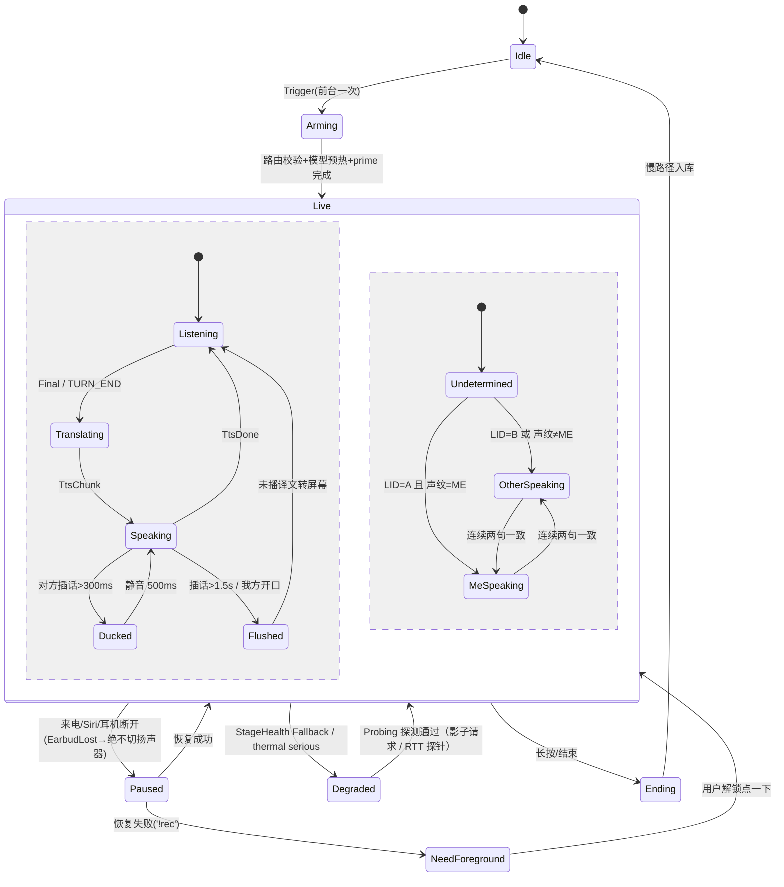

# 实时翻译场景矩阵（含耳机即翻译）——最终规格 v1.0

> 日期：2026-09-16。骨架：设计 1（实时性与可靠性优先），嫁接设计 0 的「仅听零门槛入口 + 升级阶梯 + 不切扬声器 + 礼貌退出」与设计 2 的「12 格矩阵组织 + 对方视角视觉反馈 + 姿态触发 + 听者反馈」。
> 硬约束：纯客户端、无自建后端、无账号、无商业化；多设备互连仅用系统/局域网/蓝牙；云端 ASR/翻译/TTS 仅客户端 BYOK 直连。
> 标注「待验证」的条目必须在 §13 实测清单中闭环后才能进入验收。
> **与主方案的关系（2026-09-16 修订）**：分期、数据结构、模块划分、语言标签、加密模型、延迟口径与隐私档语义以《AI语音转文字-KMP-App-产品与技术方案》（下称主方案）§10、附录 A（含 A.5 旧名 → 新名映射）、§7.2、§3.4、§3.1、§7.12 为唯一真相源；本规格中与之冲突处以主方案为准。本次修订已同步的要点：耳机模式去掉 `.defaultToSpeaker`；发送侧 ME 声纹门控与 host 同源去重；`CAPS.audioEgress` / `ROOM_POLICY`；sender-key 加密与 HKDF 方向密钥；Wi-Fi/TCP 档关 FEC；`_scenenote._tcp` / `scenenote://join`；serious 档保留 zipformer；待机档预热；ModeSpec × 12（无 M2）；§9.1 / §9.4 标为历史草案。

---

## 1. 一句话定义与用户洞察复述

**一句话定义**：说话的人只管说，听的人只需戴上耳机。麦克风在手机（指向对方），译文从我的耳机（私密）或面向对方的屏幕出来；多台设备之间**默认只传说话方的音频流**（文本只在三种显式可见的情况下出站：听者请求 HINT、网页听者 M11-web、字幕共享 S7，见 §7.1「主规则适用范围」），每个听者在自己的设备上用自己的模型或自己的 Key 完成 ASR→翻译→TTS，各听各的语言；听者若选云端识别，说话方可见（`CAPS.audioEgress`）。

**屏外与屏内的关系**：本规格覆盖的是**屏外**翻译（输入源 = 麦克风采集真实世界，M0–M12）；**屏内**翻译（输入源 = 设备自己正在播放或保存的媒体：系统抓取音频 / 屏幕文字 / 文件与直链，S1–S8）复用本规格的双速管线、`PipelineProfile` / `RoutePolicy` / `PrivacyMode` / `LiveSegment`（旧名 `Segment`）/ `Translation` / `StageHealth` 定义（**均以主方案附录 A 为准**）与 P2P 骨干（只传源语文本、不转播第三方音频），并共用同一份本地知识库与术语表；屏内模式的平台诚实矩阵、载体、交互与分期详见《屏内翻译-模块规格.md》。两者在主方案中合并为"输入源 × 输出形态 × 输出设备 × 交互形式"的四维矩阵（§2.4）。

**两条核心洞察的产品翻译**：
1. 输入与输出分离：输入永远是「距离说话人最近的手机内置麦克风」，输出永远是「听者自己的耳机或面向对方的屏幕」，二者不在同一条声学回路上，因此不需要 AEC、不需要半双工、不需要把手机递来递去。
2. 零社交摩擦：默认路径里不举手机、不看屏幕（手机放胸前口袋 / 手持胸前 / 挂绳；裤兜姿态的 SNR 与判向准确率待「三姿态 × 三噪声」实测，主方案 §3.3）、任何声音不外放、对方不需要碰我的设备；判向由声纹 + ASR 输出脚本自动完成（whisper-tiny LID 包 ≈ 98 MB 为可选），纠错靠耳机手势；所有外放路径只作显式黄标降级，不进 P0/P1 主入口。

**用户追加指导的落实**：按「输出形态 × 输出设备 × 交互形式」三维组织（§2）；多人必须同时译成不同语言（§7）；说话方只发音频，听者侧各自处理，含协议、拓扑、带宽、降级、可选 Hint 扩展（§7）。

**目标指标（继承设计 1；周 10 验收通过后才写入对外文案）**：对方句尾→译文首音入耳 P50 ≤ 1.5 s、P95 ≤ 2.2 s（iPhone 15 / 骁龙 8 Gen 2，混合档，普通话 ↔ 英文流式路径；粤 / 川非流式路径 P50 ≤ 2.2 s）；**度量口径**：起点 = VAD 语音结束时刻减静音阈值回推的句尾（远端流 = `TURN_END`），终点 = 译文首音入耳（实验室脚本以麦克风旁录耳机出声为准）；本机 `metrics` 自测终点为 TTS 首帧写入 `AudioSink`，不含 A2DP 入耳，折算阈值 P50 ≤ 1300 ms / P95 ≤ 2000 ms（主方案 §3.1、§11）。30 分钟连续对话不断流、不降频崩溃；耳机断开时绝不外放（实验室拔耳机脚本验收，泄漏窗口 ≤ 100 ms 为诚实边界；本机不可度量）。

---

## 2. 场景组合矩阵

### 2.1 维度定义

| 维度 | 取值 | 说明 |
|---|---|---|
| 输出形态 F | T 文本 / V 语音 / TV 两者 | 指译文呈现；原文字幕默认总有（可关） |
| 输出设备 D | L 本机 / R 其他设备 | R 细分子类：R-app（对方手机+耳机，装了本 App）、R-web（对方浏览器）、R-watch（我的手表，伴随显示）、R-bcast（系统广播，观察项） |
| 交互形式 I | C 对话 / S 单工 | C：双向轮流、自动判向、气泡展示；S 细分 S-in（对方说→我听，即「仅听」）与 S-out（我说→译出） |

3 × 2 × 2 = 12 个基础格；R 子类与 S 子向作为格内的子模式展开，不新增格。收敛为 **12 个模式 M0、M1、M3–M12（编号 M2 保留不分配：第 8 格「静音字幕」折叠进 M0，为保持历史编号而跳号；`ModeSpec × 12`）**；第四维（输入源）的逐格展开表见主方案 §3.2。

### 2.2 完整矩阵（逐格判定）

| 格 | F×D×I | 有意义 | 模式名 | 真实场景 | 谁戴耳机 | 输入 | 输出 | 对方需 App | 触发 | MVP |
|---|---|---|---|---|---|---|---|---|---|---|
| 1 | V×L×S-in | 是 | **M0 仅听** | 问路、听讲座、听方言长辈、被搭话 | 我 | 我手机内置麦（cardioid 朝外） | 我的耳机 | 否 | 耳机单击 / Action Button / 磁贴 / 手表 | **P0 零门槛入口** |
| 2 | TV×L×C | 是 | **M1 耳听·面屏**（旗舰） | 陌生人临时对话；我私听、对方看我半屏 | 我 | 我手机内置麦 | 我耳机 + 对方半屏 | 否 | 从 M0 翻转手机自动升级 | **P0** |
| 3 | T×L×C | 是 | **M3 双屏对话** | 耳机没电/嘈杂/正式场合要对方看字 | 无 | 我手机内置麦 | 上下半屏 | 否 | App 内 / 从 M1 摘耳机自动降级 | **P0（兜底）** |
| 4 | T×L×S-out | 是 | **M4 速译卡片** | 一句话：地址、过敏原、价格 | 可选（听回复） | 我手机内置麦 | 屏幕大字朝对方 | 否 | Action Button 长按 / Siri「翻译一句」 | **P0** |
| 5 | V×L×C | 是 | **M5 分耳对话** | 亲友/同事，一副 TWS 一人一只，L/R 分语种 | 双方各一只 | 我手机内置麦 | 双声道各语种 | 否 | App 内 + 一次性引导 | P1 |
| 6 | V×L×S-out | 黄标 | **M6 外放速译** | 柜台后不看屏、视障对方 | 无 | 我手机内置麦 | 本机扬声器（−12 dB 近场限幅） | 否 | M4 内开关 | P2（显式降级，不进主入口） |
| 7 | TV×L×S-out | 黄标 | **M7 卡片+朗读** | M4 + 外放 | 无 | 同上 | 屏幕 + 扬声器 | 否 | M4 内开关 | P2（同 M6） |
| 8 | T×L×S-in | 折叠 | M0 的「静音字幕」开关 | 没带耳机看本机字幕 | 无 | 我手机 | 本机屏幕 | 否 | M0 内关闭 TTS | 随 M0 |
| 9 | V/TV×R-app×C | 是 | **M8 双机私聊** | 双方都装 App，各自耳机、各自语言、各自 Key | 双方各自 | 各自手机内置麦；互发音频流 | 各自耳机（+可选本机气泡） | 是 | 同网自动列表 / 二维码 | P1 |
| 10 | T×R×C | 是（三子） | **M9 双机字幕**（R-app 关 TTS）/ **M12 抬腕字幕**（R-watch）/ **M11-web 网页字幕**（R-web，最后兜底） | 对方有 App 无耳机；会议里抬腕；对方无 App 只想看字 | 我（可选） | 我手机 / 各自手机 | 对方屏 / 我手表 / 对方浏览器 | app 是；watch 否；web 否 | 同 M8 / 手表 App / 二维码 | M9 P1；M12 P1；web P2 |
| 11 | V/TV×R-app×S-out | 是 | **M10 多人同传** | 饭桌、小会、导览：一人说 N 人各听各语言 | 听者各自 | 说话者手机内置麦 | 各听者耳机 | 是（web 可降级） | 发起人开房，听者扫码 | P2 |
| 12 | T×R×S-out | 是 | **M11 讲座字幕** | 一人讲多人看；网页零安装 | 无 | 说话者/旁听者手机 | App 听者屏 / 网页 | 混合 | 二维码 | P2 |

**无意义或折叠的组合**（不做，原因写明）：
- T × R-app 耳机：耳机无法显示文本。
- V × R-watch：手表扬声器公放且音质差，违背隐蔽原则；手表只做震动 + 字幕。
- TV/V × R-web × C：http 非安全上下文下 Safari/Chrome 禁用 getUserMedia，网页端无法回传语音，网页只能是单工听者。
- V × L × C 的「双方共用本机外放」变体：正是社死场景，仅作 M3 内「朗读给对方」黄标开关。
- V × R × S-in：等于站在对方视角的 M10，不是独立模式。
- R-bcast（Auracast）：iOS 26 不支持、Android 第三方需 BLUETOOTH_PRIVILEGED，P3 观察项。

实现层收敛为三条骨干：**单机骨干**（M0–M7）、**P2P 音频流骨干**（M8–M12 app 侧）、**本地网页骨干**（M11-web，最后兜底）。三者共用同一条本机管线（§5），多机只是把「麦克风」换成「远端 Opus 流」。

### 2.3 升级阶梯（每级只加一个动作，永远可退回，切换不重启音频管线）

```
M0 仅听 ──翻转手机(姿态检测)──▶ M1 耳听·面屏 ──摘下耳机──▶ M3 双屏对话
   │                                │
   │                                └──对方愿意戴一只──▶ M5 分耳
   │
   ├──对方也有 App(同网自动发现/扫码)──▶ M8 双机私聊 ──多人──▶ M10/M11
   │
   ├──只想说一句──▶ M4 速译卡片
   └──对方无 App 且坚持要看字──▶ M11-web 网页字幕（最后兜底，优先同网 Wi-Fi）
```

任一级都可一键回到 M0；回退时撤回屏幕、停止对方半屏，会话继续私密。

### 2.4 第四维：输入源（屏外 / 屏内）

§2.1 的三维（输出形态 F × 输出设备 D × 交互形式 I）之上还有一个正交维度——**输入源**：

| 输入源 | 含义 | 模式系列 | 规格文档 |
|---|---|---|---|
| `MIC`（屏外） | 手机内置麦克风采集真实世界（含"媒体档"调参用于外放旁听） | M0–M12（本规格）；S8 外放旁听 = M0 媒体档 | 本文 |
| `SYSTEM_AUDIO`（屏内） | 其他 App 正在播放的音频（Android MediaProjection 可行；iOS ReplayKit 广播扩展待验证、标"实验"） | S1 系统字幕 / S2 系统配音 / S6 / S7 | 《屏内翻译-模块规格.md》§2–§3 |
| `SCREEN_TEXT`（屏内） | 屏幕硬字幕 / 界面文字（Android OCR 可行；iOS 仅静态图片） | S3 屏幕取词 | 同上 |
| `MEDIA_FILE`（屏内） | 本地 / 相册 / 分享进来的文件；直链 MP4 / HLS 是其入口分支，不是独立模式 | S4 文件字幕 / S5 文件配音（两端 CORE） | 同上 |
| `REMOTE_STREAM` | 对端设备经 P2P 发来的 Opus 音频流（实现层视为"远端麦克风"） | M8–M12 听者侧 | 本文 §7 |

规则：屏内一律 `SIMPLEX_IN`（视频不会等我，不存在对话轮次），`DirectionStage` 关闭；屏内只替换 `AudioSource` 实现（系统抓取流 / 文件解码流 / socket 流），**不新增独立档位**——屏内场景 = ProfileTier 按主方案 §7.5 映射 + `ScenePreset.vad = VadProfile.media()`（VAD 阈值 0.6–0.7、min silence 500–700 ms、BGM 检测）+ `AudioMode.MEDIA`（旧名 `PipelineProfile.SCREEN_IN` 废弃），`VadGate → AsrStage → SegmenterStage → TranslateStage → TtsStage → PlaybackQueue` 与 Stage Health 降级链全部复用（§5）；跨设备共享字幕时只传源语文本、不转播第三方音频，沿用 §7 的"听者侧自翻"原则。屏内 8 个模式（S1–S8）、平台诚实矩阵（CORE / ANDROID_ENHANCED / IOS_EXPERIMENTAL / FALLBACK）、载体三档（PiP → Overlay → 无画面）、配音三策略与分期详见《屏内翻译-模块规格.md》，本规格不重复。

---

## 3. 零社交摩擦设计

### 3.1 触发：手机不出口袋

| 触发器 | iOS | Android | 约束 |
|---|---|---|---|
| 耳机按键 | **仅会话 `Live` 期**播 −60 dB 近静音轨成为 Now Playing App，`MPRemoteCommandCenter`：单击 togglePlayPause=开始/暂停；双击 nextTrack=跳过当前译文（对话模式=翻转上句并重译）；三击 previousTrack=重播上句 | media3 `MediaSessionService`，`KEYCODE_MEDIA_PLAY_PAUSE/NEXT/PREVIOUS` 同映射 | 双耳同时长按被 iOS 26 Live Translation 独占，不争；**待机期不播近静音轨、不接管媒体键**，单击只在「当前无其他 Now Playing App」时可用，用户听音乐时入口退回 Action Button / 磁贴 / 手表软开关（预热引导页说明） |
| Action Button / Siri | `AppIntent(openAppWhenRun=true)` + `AppShortcutsProvider` | 磁贴 `TileService`（Android 13+ `requestAddTileService()`） | iOS 后台不能开始录音（'!rec' 561145187）；Android 14+ 麦克风 FGS 须由可见 UI 启动 |
| 手表 | `WCSession.sendMessage` 软开关（翻译门控 / 方向翻转 / 跳过） | Wear OS `MessageClient` 同 | 只切软开关，不启动录音 |
| 姿态 | CoreMotion：手机从水平/口袋姿态转为竖直且屏幕朝外 → 自动进入 M1 对方半屏 | SensorManager 同 | **只在 App 前台且屏幕已点亮时生效**：iOS 后台 App 不能点亮屏幕或自行进入前台，且屏幕朝外时 Face ID 看到的是对方，M1 真实路径是「解锁 → 掏出 → 翻转」（§4 记 1–2 步）；背向 Face ID 解锁失败率待验证 |

**出门预热 = 待机档**：进入旅行/商务场景时提示「现在按一下，接下来一天都不用掏手机」，前台激活一次 `.playAndRecord`（待机期加 `.mixWithOthers`，不打断用户音乐）并让 AVAudioEngine 输入常驻（`audio` background mode / Android `microphone` FGS）；待机档**只常驻 Silero VAD**，ASR / 声纹 / LID 全部卸载（避免 500 MB 常驻被 jetsam / OEM 回收），触发后 1–2 s 重载并以震动「短-短」确认就绪，进入 `Live` 后再切独占会话并起近静音轨；待机在线状态用 Live Activity / 常驻通知可见，进程被回收时本地通知「预热已失效，解锁点一下」。**物理前提**：手机在胸前口袋 / 手持胸前 / 挂绳三种姿态之一，引导页画出来；裤兜姿态实测不达标则文案只写「不用举手机、不用看屏幕」。橙点常亮在首次启用时解释。冷启动或被打断后恢复失败时诚实提示「解锁并点一下」，不假装能后台恢复。「待机 8 小时电量」与「待机 → Live 重载时延」列入周 10 验收。

### 3.2 自动判向（零按键双向）

1. 会话只设两种语言 {A=我, B=对方}，LID 只做二分类：MVP 主判据是 **ASR 输出脚本判别**（zipformer zh-en 双语单模型输出的 CJK / 拉丁比例，零体积；因此 MVP 自动判向只支持中 ↔ 英，粤 / 川只作单工 M0，对方说日 / 韩 / 欧语需在线档 + Key（多语端侧 ASR 包与更多 NMT 语言对 v1.1 评估），主方案 §3.5）/ SenseVoice 首 token 语种（粤语路径）/ 云端 ASR 自带检测；sherpa-onnx `SpokenLanguageIdentification` 需 whisper-tiny **encoder + decoder**（int8 ≈ 98 MB，非「编码器」）作可选下载包，v1.1 评估。
2. 声纹投票：会话开始说一句注册「我」的 embedding（sherpa-onnx 3D-Speaker/CAM++），每段余弦相似度阈值 0.6；LID 置信度 < 0.7 时 embedding 权重加倍；两人同语（普通话 vs 方言）时纯靠声纹。
3. 防抖：连续两句同向才切换；置信度 < 0.55 沿用上一方向并在气泡打「?」。
4. 纠错：气泡左右滑=翻转重译；耳机双击=撤回上句反向重译；同一方向连续纠正两次→在线调高声纹权重；连续误判 3 次弹「固定方向」建议（退化为单工）。
5. 单工模式（M0/M4/M10/M11）锁方向，不跑 LID，仅做「我的声音不译」的说话人过滤；**发送侧同样有说话人门控**：P2P 说话方在 VAD 之上叠加 ME 声纹判定，只发 speaker = ME 的段（§7.1）。

### 3.3 礼貌开场与录音告知（修正设计 1 的「口袋里外放」矛盾）

- **默认不外放开场白**。首次触发只有耳机侧震动确认（短-短）。
- 录音告知由**对方半屏礼貌卡**完成：当我掏出手机、姿态检测触发 M1 时，对方半屏首屏显示对方语言的「我在用翻译听你说话，请正常说」+ 录音图标，3 s 后淡出为字幕区。在 M0 纯仅听（不掏手机）下，UI 常驻录音指示，设置里提供「进入 M1 时自动播一句开场白（−6 dB）」的可选开关，默认关。
- 默认不落盘对方音频，只存文本；知识库只存「我的语音」。德/法/日等地区首次使用时弹一次合规说明，不强制阻断。

### 3.4 隐蔽输出

- 耳语档：耳机输出限幅 −20 dB，按麦克风 RMS 估计的环境噪声自适应。
- 震动语义（Core Haptics / VibrationEffect）：开始监听（短-短）、译文就绪（短）、方向切换（长）、掉线（长-长-长）、听者「没听清」（双短）。不用提示音。
- 抬腕字幕（M12）：最近两句译文 + 方向箭头，延迟 100–500 ms（待验证）。
- 引导关闭 AirPods 对话感知（会误压音量）；M5 再引导关闭自动入耳检测与 Mono Audio。

### 3.5 对方视角（吸收设计 2）

- M0：对方只看到一个戴耳机、专注点头的人，无任何设备出现。
- M1：对方看到一块转向自己的字幕屏，上面用他的语言写着礼貌卡；他说话时半屏边缘有**呼吸灯=「我在听」**，句尾出现**对勾=「已收到」**，消解「听到了吗？」的反复确认；随后逐字出现我说的话的译文（灰 partial → 黑 final，≥ 28 pt，屏幕最亮、不锁屏）。对方从头到尾不碰我的手机。
- M5：对方拿到一只干净耳塞（提示一次性耳套），戴上就有自己语言的声音。
- M8/M10：对方扫一次码，戴自己的耳机，手机放回口袋；听者一键「没听清/慢一点」→ 说话方手机震动，而不是开口打断。
- **对方拒绝/不适**：礼貌卡常驻「我不用了，谢谢」按钮，按下播一句对方语言的退出语（这是唯一默认允许的一次外放，−6 dB），并一键退回 M0 或结束会话、丢弃未落盘缓冲。

---

## 4. 每种模式的交互流程（前提：已预热；否则 +1 步「解锁并打开 App」+3 s）

| 模式 | 步骤 | 步数 | 到首句译文（含对方说 3 s） |
|---|---|---|---|
| M0 仅听 | ① 耳机单击（震动）→ ② 对方说 → ③ 耳机播译文 | 1 | ≈ 4.5 s（句尾后 ≤ 1.5 s） |
| M1 耳听·面屏 | 在 M0 上 ① 掏出手机 → ② 解锁（iOS 必需，屏幕朝外时 Face ID 看不到我）→ ③ 竖起朝向对方（前台 / 亮屏时姿态自动进入，礼貌卡出现） | +2–3 | +3–5 s |
| M1 冷启动 | ① Action Button/磁贴 → ② 解锁 → ③ 自动开始 | 2 | ≈ 9 s |
| M3 双屏对话 | ① 从 M1 摘下耳机（自动）或 App 内点「面对面」→ ② 放桌上/举起 | 1–2 | ≈ 6 s |
| M4 速译卡片 | ① Action Button 长按说话 → ② 松手 → ③ 屏幕大字朝对方 | 1–2 | 说完后 ≈ 1 s |
| M5 分耳 | ① 选「分耳」→ ② 首次引导 30 s（之后跳过）→ ③ 递一只 → ④ 任一方说话 | 首次 4，之后 2 | 首次 ≈ 60 s，之后 ≈ 15 s |
| M8 双机私聊 | 同网：① 双方打开 App 自动列出 → ② 一方点名字另一方确认 → ③ 各戴耳机；非同网：① 我开热点显示二维码 → ② 对方扫码 → ③ 各戴耳机 | 每人 1–2 | 同网 ≈ 10 s；热点 20–30 s；之后每句 ≤ 1.5 s |
| M9 双机字幕 | 同 M8，听者关 TTS | 同上 | 同上 |
| M10/M11 多人 | 发起人开房 → 每人扫同一个码 → 各选目标语言（默认系统语言） | 发起 1，每人 2 | ≈ 10–15 s/人 |
| M11-web 网页字幕 | 优先同网：① 对方扫码打开 `http://<host-ip>:8080` → ② 点「开始收听」；无同网才开热点：+ 对方扫 Wi-Fi 码入网一步 | 对方 2–3 | 同网 15 s；热点 30–45 s |
| M12 抬腕字幕 | 随 M0/M1 自动开启 | 0 | +0.1–0.5 s |

---

## 5. 实时双速管线与延迟预算

### 5.1 快路径 / 慢路径

**快路径**（每句硬实时）：`AudioSource`（本机麦 / 远端 Opus 流）→ `VadGate` → `AsrStage`（流式 partial/final）→ `SegmenterStage`（合并 < 400 ms 间隔相邻段；远端流用 `TURN_END` 强制端点）→ `DirectionStage`（声纹 + 输出脚本 / 可选 LID）→ `TranslateStage`（流式，半句提前翻译）→ `TtsStage`（按标点切块）→ `PlaybackQueue`（FIFO、提速、合并、ducking）→ `AudioSink`（A2DP / 双声道 / 屏幕 / 手表）。每 Stage `withTimeout` 并有降级链：云翻译 1.5 s → 端侧 NMT（`core/nmt` OnnxNmtTranslator，opus-mt 中 ↔ 英）；云 TTS 首包 0.8 s → 系统 TTS（无语音包时 Matcha）；云 ASR 首包 1.2 s → 端侧流式。每 Stage 有 Health 状态机：Ok → Slow（超时一次）→ Fallback（切下一档）→ **Probing**（Fallback 期原档不再被调用、「连续 5 句正常」无从观测，故每 5 句对原档发一次影子请求不上屏，或 RTT 探针 < 400 ms）→ Recovered（探测连续 2 次正常即升回）；语言对 NMT 模型未下载时没有下一档，云翻译超时延长到 3 s、超时后仅本句标「未译」并提示下载（≈ 80 MB / 方向），不改变 Health 状态；该规则与平台无关，两端一致。

**慢路径**（会话 `Ending` 一次性执行；空闲 ≥ 20 s 只做增量 S0 规则层 + 新词候选，不调 LLM、不加载本地模型）：整段对话 + 风格×场景 + 词库 → 主 App 的润色阶梯（云 LLM → 系统模型 → 本地 GGUF → 规则层，用户可选切换强模型如 Claude Sonnet 5 / Opus 5；零 Key 亦有规则版沉淀，主方案 §2.4）→ 按说话人 / 语言拆两条 Transcript → `polished`、`finalTranslation[lang]`、纪要、新词候选 → 知识库。只补写字段与「精修」标签，永不改动已播内容。**术语澄清**：屏内的逐句「灰字 → 白字定稿」属于快路径内的 partial → final，不叫慢路径（《屏内规格》§5.2）。

### 5.2 端云组合矩阵

| 档位 | ASR | 翻译 | TTS | 句尾→首音 | 自动选中条件 |
|---|---|---|---|---|---|
| 离线 | 流式 Zipformer zh-en int8（rule1 1.5 s / rule2 0.5–0.7 s / rule3 12 s）/ SenseVoice+VAD（粤语）/ Paraformer 川渝+VAD（两端统一 sherpa-onnx） | 端侧 NMT（opus-mt 中 ↔ 英 int8，ORT；术语 S0 替换 + 占位符回填） | 系统 TTS（无语音包时 Matcha+Vocos 兜底） | **0.9–1.5 s** | 无网、RTT > 400 ms、用户选隐私 |
| 混合（默认） | 端侧流式 | qwen-mt-lite/flash（国内）/ Claude Haiku 4.5（关 thinking、max_tokens 200；**固定前缀 ≤ 300 token 低于 Haiku 4.5 的 4096 token 最小可缓存长度，`cache_control` 不生效，仅 Opus 5（≥ 512）/ Sonnet 5（≥ 1024）可缓存**）/ Gemini Flash-Lite | 系统 TTS | **1.2–2.1 s**（Eager 开后 P50 目标 ≤ 1.5 s） | 有网且 Key 可用 |
| 在线 | fun-asr-realtime / qwen3-asr-flash-realtime / 豆包流式（方言、语义断句） | 同上 | qwen3-tts-flash（方言音色）/ ElevenLabs Flash / MiniMax turbo | 1.0–2.0 s | 方言、要音质、5 GHz 或蜂窝良好 |
| 一体化 S2S | GPT-Realtime-Translate / Qwen3.5-LiveTranslate-Flash | 内置 | 内置 | ≈ 2.8 s | 用户显式选「懒人模式」，无词库无纪要 |

分项（混合档，本机麦，流式路径）：静音阈值 0.5–0.7 s + 半 chunk 0.16 s + 终结解码 0.05 s ≈ 0.7–0.9 s；翻译首字 0.3–0.7 s；系统 TTS 首包 0.1–0.6 s（iOS `AVSpeechSynthesizer.write` 首次合成常见 0.3–0.6 s；Android 依赖引擎 `onAudioAvailable`，按平台单列实测）；A2DP（AAC/SBC 编码 + 耳机缓冲）0.15–0.25 s；**合计 1.25–2.45 s**，表中数字取 TTS 首包中位值，P50 ≤ 1.5 s 是验收后再对外承诺的目标。上表离线 / 混合行只描述普通话 / 英文流式路径；粤 / 川走 SenseVoice / Paraformer 非流式（VAD 段结束后整段推理，无 partial、Eager 不可用、热词不生效），另加 0.5–1 s，分行预算见主方案 §3.5。热词生效前提是 `modified_beam_search`（RTF ×1.5–3），周 4 分别测 greedy 与 beam=4。

**远端流的架构红利（内部假设，实测通过后才进对外文案）**：说话方 `TURN_END`（hangover 300 ms）替代听者侧 0.5–0.7 s 静音等待，加上链路 < 10 ms + 抖动缓冲 60 ms 且在 `TURN_END` 到达时一次性排空喂 ASR，句尾→首音反而比本机麦**快 150–300 ms**（待验证实测收益）。

### 5.3 半句提前翻译（Eager，默认开）

LocalAgreement-2：连续两次 partial 的公共前缀视为稳定；稳定前缀出现子句边界（逗号/「然后/但是/because/and」）或 ≥ 1.5 s 未变即送翻译，标 `provisional=true`；final 后只译增量并附「已译前缀，续译勿重复」；编辑距离 > 15% 才整句重译并替换字幕（耳机端按设置补播差异或重播）。中→英对「把/被/虽然…但是」只在 ≥ 8 字子句后触发。

### 5.4 打断与 ducking（软半双工）

耳机模式输入（内置麦）与输出（A2DP）天然全双工无声学回灌，ASR 在 TTS 播放期间持续工作，**不开 AEC**。对方插话 > 300 ms：100 ms 内 duck −12 dB，语音结束 500 ms 后恢复；> 1.5 s：丢弃剩余队列并标「未播完」。我方开口：立即 `stop()` 并把未播译文转屏幕文字。积压 ≥ 2 句语速 1.15–1.25×；≥ 4 句合并并标「已合并」。开放式耳机泄漏兜底：对 ASR 输出与刚播 TTS 文本做相似度过滤（> 0.8 丢弃）。

### 5.5 资源、发热与电量四级阶梯

监听 `ProcessInfo.thermalState` / `PowerManager.addThermalStatusListener`：

| 状态 | 动作 |
|---|---|
| nominal | 默认组合 |
| fair | 关闭半句提前翻译（减少 30–50% 翻译调用） |
| serious | **保留 zipformer 但线程数降 1、chunk 间隔加倍**；关 Eager / 声纹 / LID（固定方向 + 滑动翻转）；TTS 强制系统；字幕刷新 5 Hz（不在发热时加载 237 MB 的 SenseVoice：加载即内存 / CPU 尖峰，且 < 4 GB 机型与未下载粤语包的设备没有该模型；SenseVoice 只在已驻留的粤语会话中作降级目标） |
| critical | 暂停 TTS 只显示字幕；提示用户；多机模式向 host 发 CAPS 更新 |

Android `PowerManager` 热状态 7 级映射：NONE / LIGHT → nominal、MODERATE → fair、SEVERE → serious、CRITICAL 及以上 → critical。内存规则：快路径任一时刻只驻留一个 ASR + 一个 TTS；端侧 LLM 永不进快路径；**会话进行中禁止加载本地 LLM**；6 GB 机型禁止 ASR + Matcha + 端侧 LLM 同驻。电量 < 20% 触发省电模式。目标（无来源，待周 10 实测）：混合档 1 小时 ≤ 15% 电量；待机档 8 小时 ≤ 10%。

---

## 6. 蓝牙音频路由与一机两耳/多耳方案

### 6.1 RouteManager 铁律：内置麦 + A2DP，禁 HFP

- **iOS**：`AVAudioSession` `.playAndRecord` + `[.allowBluetoothA2DP]`，**绝不加 `.defaultToSpeaker`**（其定义就是「无耳机 / 蓝牙路由时输出走扬声器」，A2DP 断开瞬间系统会在 App 收到通知前把正在播的 TTS 切到扬声器，与「绝不外放」直接冲突；v1.0 的写法已改正），**绝不加 `.allowBluetooth` / `.allowBluetoothHFP`**（iOS 26 新增的 `bluetoothHighQualityRecording` 仅作录音场景可选备注）；`setPreferredInput(builtInMic)` + 数据源 `back` + `preferredPolarPattern = .cardioid` 朝向对方（先查 `supportedPolarPatterns`，不支持时降级 omni 并在状态条显示）；mode 耳机下 `.default`。监听 `routeChangeNotification`（newDeviceAvailable / oldDeviceUnavailable / categoryChange）与 `interruptionNotification`：`oldDeviceUnavailable` 在通知回调内**同步** `AudioSink.stop() + flush()`（先停播放节点再处理会话），其余变化 200 ms 内重新校验「输入=内置麦（含输入端口类型）、输出=A2DP」并在状态条显示。
- **Android**：`MODE_NORMAL` + `AudioSource.MIC`（或 `VOICE_RECOGNITION`）+ `USAGE_MEDIA`；**输入强制 `AudioRecord.setPreferredDevice(TYPE_BUILTIN_MIC)` 并用 `getRoutedDevice()` 校验**（LE Audio 耳机作系统默认输入时 `AudioRecord` 无需 SCO 即被路由到耳机麦）；不调 `setCommunicationDevice` / `MODE_IN_COMMUNICATION` / `startBluetoothSco`；监听 `AudioDeviceCallback` **与更早到达的 `ACTION_AUDIO_BECOMING_NOISY`**（收到即同步 `AudioTrack.pause() + flush()`，A2DP 断开时 AudioTrack 默认回落扬声器）。OEM 在 `VOICE_COMMUNICATION` 源下自动拉 SCO 列入 QA（三星/小米/OPPO，待验证）；LE Audio 耳机加入实测矩阵。
- 保活 prime：只在待机档 → `Live` 过渡使用（`Live` 期近静音轨持续播放、链路已醒，不再 prime）——TTS 队列由空转非空前 200 ms 送 −60 dB 噪声帧唤醒耳机接收端，省掉 100–300 ms 首包睡眠。TTS 输出路径唯一：系统 TTS 经 `AVSpeechSynthesizer.write` / `TextToSpeech` `onAudioAvailable` 拿 PCM 后由 App 混音写 `AudioSink`，不允许系统 TTS 直接出声与 `AudioSink.play` 并存。
- 延迟不可信：`AVAudioSession.outputLatency` 对 AirPods 不可靠，字幕固定先于音频 150 ms 显示。
- LE Audio/LC3：Android 13+ 单播自动受益，App 无需处理；iOS 26 不开放，不做假设。
- **耳机断开/摘下：绝不自动切扬声器**。路由变化 → `Paused(EarbudLost)`：路由回调内同步 `stop() + flush()`，未播译文转屏幕文字，重连后从未播句续播。**诚实边界**：A2DP 掉线到通知到达之间已写入硬件缓冲的音频可能经听筒 / 扬声器泄漏，`AudioSink` 硬件缓冲上限 ≤ 40 ms、泄漏窗口 ≤ 100 ms；App 无法从本机感知是否有声音从扬声器泄出，「100% 不外放」是实验室拔耳机脚本（麦克风旁录）的验收项，不是本机 `metrics` 指标。

### 6.2 外放路径（仅 M6/M7/M3 朗读黄标）

iOS VPIO：mode `.voiceChat`，**先接好播放图再** `setVoiceProcessingEnabled(true)`；Android `AcousticEchoCanceler`/WebRTC AEC3；播放后 800 ms 麦克风门控，收到新语音立即解除。近场限幅 −12 dB。

### 6.3 一机两耳（M5）

一副 TWS 拆两只，App 写双声道 PCM：L = A 语言 TTS，R = B 语言 TTS（iOS：两个 `AVAudioPlayerNode` 各设 `pan = ±1`（`pan` 属于 `AVAudioMixing` 协议，设在 player 节点上，写在 `AVAudioMixerNode` 上不能分别定位左右）汇入 `mainMixerNode`，或单 player 写 2ch 交织缓冲——主方案附录 A `AudioSink.play(chunk, channelMask)` 采用后者 / Android `AudioTrack` 立体声）；无译文的声道填零。进入前三项引导：关闭自动入耳检测、关闭对话感知、检查 Mono Audio 未开；提示一次性耳套。任一只放回充电盒触发系统下混单声道 → App 检测路由变化后提示「对方摘下耳机」。Android 各品牌单耳下混行为待验证。

### 6.4 平台差异

| 项 | iOS | Android |
|---|---|---|
| Share Audio / Dual Audio | 两副耳机同一条流，不能分语种 | 三星 Dual Audio 同 |
| 多耳不同语言 | 只能 M5 分声道或 M8/M10 多机 | 同 |
| Auracast | 不支持 | Android 16 系统 UI 引导，第三方无 API（P3） |
| 后台录音 | 前台激活后 audio mode 维持 | microphone FGS |

---

## 7. 两机/多机互连与多人多语言

### 7.1 架构规则与推论

**说话方只发音频流；听者在自己设备做 ASR→翻译→TTS。** **发送侧说话人门控（同室多机必需）**：M8 / M10 是同一房间面对面，我手机的内置麦同时拾到我和对方，VAD 只判「有语音」不判「谁在说」——按 VAD 直接发会让听者把自己刚说的话再翻一遍；因此说话方在 VAD 之上叠加 3D-Speaker 余弦判定（会话开始注册一句「我」），**只发 speaker = ME 的段**，帧 flags 附 `ownerConf`（2 位）供听者侧再丢弃低置信段。推论：(1) 每个听者自选目标语言、引擎、Key，天然多语言；(2) 说话方只做 VAD + ME 声纹门控 + Opus 编码，不需要 ASR / 翻译 / TTS 模型与 Key，但**至少需要随包内置的声纹包（≈ 28 MB）与一句注册**，不再是「零模型的最旧手机」；(3) 默认设备间不传文本；(4) 延迟关键路径上没有说话方 ASR 的等待。

**主规则适用范围**：实时语音模式（M8–M11）只传说话方音频；文本只在三种显式、可见的情况下出站——① 听者 `WANT_HINT` 后说话方选择发送 `HINT_ASR / HINT_MT`；② M11-web 网页听者（host 本机 ASR + 翻译后推送文本）；③ S7 字幕共享（只共享本机已生成的源语字幕，不转播第三方音频）；围桌共录（v2）是会后产物交换，同为显式例外。每一例外在 UI 与账本单列。**听者的云端识别对说话方可见**：听者选在线档时说话方原声会被送到听者配置的云 ASR，故 `CAPS` 增加 `audioEgress = local | cloud:<provider>` 并经 `ROSTER` 广播，说话方 UI 常驻「N 位听者使用云端识别」；host 开房可发 `ROOM_POLICY.localAsrOnly = true` 禁用听者在线档；对端知情文案改为「由他们各自在本机或其配置的云服务翻译」。

角色：Speaker（采集+VAD+编码）、Listener（解码+管线）、Host（Ktor CIO 服务器，成员管理、控制消息广播、音频 fan-out、缓存每路最近 10 s 音频与 200 条控制消息；host 不解码不识别不翻译，自己作为听者另起本地虚拟成员）。

### 7.2 传输层选型

| 通道 | 平台 | 发现 | 用途 |
|---|---|---|---|
| 同一 IP 网络（现场 Wi-Fi 优先，其次我方热点）+ mDNS/Bonjour + Ktor CIO WebSocket | iOS↔Android 通用 | iOS `NWBrowser/NWListener`（`_scenenote._tcp`，与场景包共用单一 scheme / 服务名；`NSLocalNetworkUsageDescription` + `NSBonjourServices`）；Android `NsdManager` | **主通道** |
| BLE GATT（自研 Service，Notify 分片） | 通用 | 广播名含房间码 | 无 Wi-Fi 兜底，仅 1:1 或 1:2；按最坏协商 MTU 185（iOS）设计，每 Notify 1 帧；应用层吞吐待实测（主方案附录 B 22，正文不给具体 Mbps） |
| Network.framework P2P（`includePeerToPeer=true`） | iOS↔iOS | Bonjour | 同平台加速；不用 Multipeer（iOS 26 不稳定） |
| Nearby Connections `P2P_STAR` | Android↔Android | 内置 | 同平台加速 |
| Wi-Fi Aware / Auracast / App Clip | — | — | 2027 观察项 |

Ktor 3.x `ktor-server-cio` 在 Kotlin/Native iOS 可用但仅 HTTP/1.x 无 TLS（Ktor「Supported platforms」页列出 iosArm64，「Native server」页只列 macOS / Linux / Windows 且明言原生端不支持无反向代理的 HTTPS——目标受支持、服务端场景无官方保证），故应用层端到端加密。热点：Android 用 `LocalOnlyHotspot`（Android 8+）；iOS 只能引导控制中心开启。

### 7.3 配对与拓扑

- 配对：同网 Bonjour 列表（首选，零扫码——**仅 M8 且需另一方确认**；TXT 只发布公钥指纹）；二维码 `scenenote://join?host=…&port=…&pk=<X25519 公钥>&salt=…&lang=…`（非同网时同一码附 Wi-Fi 配置）；**M10 / M11 加入必须校验二维码 `salt` 或房间 PIN**，避免同一咖啡馆 Wi-Fi 的陌生人静默加入收听。
- 拓扑：星型，发起人 = host。1:1 直连同协议无特殊分支；第三台加入时自动升级星型。
- **host 退出规则**：热点场景 host 退出即散会（热点随之消失），UI 明示「发起人请勿离开/锁屏」；仅现场 Wi-Fi 场景启用 `joinOrder` 最小者自动接任（所有人已持有会话密钥与 roster）。
- **流所有权与同源去重**：饭桌上每人一机，所有内置麦都拾到同一个说话人；① 只有本机 ME 声纹命中才发（§7.1）；② host 按 `ptsMs` ± 200 ms 与帧能量做同源去重，保留能量最高一路并对其余发送方回 `SUPPRESSED`；③ `MODE=圆桌` 默认「同一时刻只允许一路 SPEECH」，UI 显示当前发言者。
- 多说话者（讲座 / 白名单模式）：每个 streamId 一条 ASR 实例，听者侧并发上限 2 路，超出按能量丢弃弱者并标「有人同时说话」。

### 7.4 音频流协议

- 采集 16 kHz 单声道 PCM16（ASR 原生采样率）。
- 编码 Opus（bundle libopus：iOS cinterop / Android JNI），VoIP 模式，20 ms 帧，**CBR 24 kbps**（Wi-Fi）/ 16 kbps（BLE），**Wi-Fi / WebSocket（TCP）档关闭 in-band FEC**（TCP 无应用层丢包，丢失只表现为重传与队头阻塞，FEC 比特永远用不上）、BLE 档开 in-band FEC（预期丢包 10%）+ 滑动窗口 + NACK，**DTX 关闭**（用自有 VAD 门控，避免双重判定）。Opus 两套绑定（iOS cinterop libopus xcframework；Android 独立 C JNI + Kotlin/JVM `external`，NDK 交叉编译与 16 KB 页对齐校验），v1.1 预留 2 人周，PoC 含 iOS↔Android 互通与 code-3 多帧包解析一致性。
- VAD + 声纹门控发送：Silero VAD 判定语音段且 ME 声纹命中才发；语音开始前回溯 200 ms 预滚一并发出；结束后 hangover 300 ms 继续发，随后发 `TURN_END`。
- 帧格式：

```
+-------+-----+-------+----------+-------+--------+--------+-------+-----------+----------+
| magic | ver | flags | streamId | seq   | ptsMs  | ctrLow | len   | opus[]    | tag(16B) |
| 1B 'X'| 1B  | 1B    | 2B       | 2B    | 4B     | 4B     | 2B    | 1–2 帧    | AEAD tag |
+-------+-----+-------+----------+-------+--------+--------+-------+-----------+----------+
flags: bit0 turnStart  bit1 turnEnd  bit2 speechActive  bit3 hasFEC  bit4 keyframe(重同步)  bit5–6 ownerConf(发送侧 ME 声纹置信 0–3)
ctrLow: nonce 计数低 4 字节，接收端按 epoch + seq 重建高位；RESUME 后以 host 缓存的最后 seq 对齐
ptsMs: 说话方单调时钟（ms），会话开始 CLOCK 三次往返估偏移，之后每 30 s 一次
seq:   每 streamId 独立递增，回绕 65536
```

- 打包：Wi-Fi 下每 WebSocket 帧打包 2 个 Opus 帧（40 ms），**使用 Opus 多帧 TOC（code 3 packet）而非自定义双 len**，帧头单一 len 指整个 Opus packet；BLE 下每 Notify 1 帧（≈ 60 B，按最坏 MTU 185（iOS）设计），滑动窗口 32 帧 + 选择性 NACK + FEC 前瞻 1 包（in-band FEC 需拿到下一包才能对丢失帧 `decode_fec=1`）。不做 60 ms 合并（多 40 ms 延迟）。
- 抖动缓冲（面向 ASR 而非扬声器）：目标 Wi-Fi 60 ms、BLE 120 ms，自适应 40–200 ms（按最近 2 s 抖动 P95）；`TURN_END` 到达时**立即排空**剩余帧一次性喂 ASR（BLE 档末帧丢失无后续包可 FEC，走 PLC）；TCP 档的抖动来源是重传而非乱序，「丢帧」语义改为「延迟 > N ms 触发缓冲扩张 / 丢弃过期帧」；BLE 档丢失帧 Opus PLC 补；连续丢失 > 200 ms 插静音并标「[信号中断]」。
- 加密（**sender-key 模型**，详见主方案 §3.4）：① 成员 ↔ host 成对通道——X25519（二维码携带 host 公钥，客户端临时密钥对；Bonjour TXT 只携带指纹）→ HKDF 派生**两把方向密钥**（label `c2s` / `s2c`），杜绝「双向共用同一密钥 + 同一 4 B 前缀、各自从 0 计数」导致的 nonce 重用（v1.0 的写法存在此设计级漏洞，已改正）；② 每个说话方生成自己的**流密钥**（ChaCha20-Poly1305），经与 host 的成对通道加密分发给 roster，host 只 fan-out 密文、不解密不重加密（真正的端到端；host 接任时新 host 需重新分发，不能假设「所有人已持有会话密钥」）；成员加入 / 退出即 `REKEY`（新 epoch 流密钥）；**nonce = 4 字节流随机前缀 + 8 字节单调计数**，帧头显式携带低 4 字节 `ctrLow`；计数达 2^40 或会话 > 4 小时触发 `REKEY`；帧头明文、payload 加密；整套模型列入 v1.1 立项前安全评审。

### 7.5 控制消息（JSON 文本帧，带 sid/mid）

| 类型 | 方向 | 字段 | 说明 |
|---|---|---|---|
| `HELLO` | 成员→host | name, platform, protoVer, pubKey, joinOrder | 握手 |
| `CAPS` | 双向 | asrLangs[], mtPairs[], ttsLangs[], hasCloudKey, **audioEgress(local / cloud:<provider>)**, listenLang, wantsHint(none/asr/mt), canHintAsr, canHintMt, cpuClass, thermal | 能力协商；host 汇总广播；`audioEgress` 让说话方知道谁会把自己的原声送云 |
| `ROSTER` | host→all | members[]（含各成员 audioEgress）, hostId, mode | 成员表 |
| `ROOM_POLICY` | host→all | localAsrOnly | 房间级「仅端侧识别」，禁用听者在线档 |
| `MODE` | host→all | C/S, speakerAllowlist[], singleSpeech | 圆桌 vs 讲座单工白名单；圆桌默认同一时刻一路 |
| `SUPPRESSED` | host→说话方 | streamId, ptsMs | host 同源去重（ptsMs ± 200 ms + 能量）时回给被抑制的发送方 |
| `SRC_LANG` | 说话方→all | streamId, lang, conf, source(user/lid) | 声明源语言，听者可跳过 LID |
| `TURN_START/TURN_END` | 说话方→all | streamId, utteranceId, ptsMs | 句尾信令，听者立即强制 ASR 端点 |
| `SILENCE` | 说话方→all | streamId, sinceMs | 每 2 s，区分「没人说」与「掉线」 |
| `WANT_HINT` | 听者→说话方 | streamId, level, targetLang | 听者主动请求扩展 |
| `HINT_ASR/HINT_MT` | 说话方→指定听者 | utteranceId, text, partial, lang | 可选扩展（§7.8） |
| `FEEDBACK` | 听者→说话方 | utteranceId, kind(retry/slower/didntGet) | 说话方手机震动 |
| `CLOCK` | 双向 | t0..t3 | NTP 式偏移；会话开始三次往返、之后每 30 s（围桌共录共用同一次数） |
| `PING/PONG` | 双向 | ts | 心跳 2 s，3 次未答判掉线 |
| `RESUME` | 成员→host | lastSeq per streamId | host 补发缓存的 10 s 音频与 200 条控制消息 |
| `REKEY` | host→all / 说话方→host | epoch, streamId, wrappedKey | 流密钥轮换（成员变动 / 2^40 帧 / 4 小时），wrappedKey 经成对通道加密 |
| `END_SESSION` | host→all | reason | 各端触发慢路径 |

掉线重连：指数退避 0.5→8 s；> 30 s 提示重新扫码；网页端 3 s 自动重连。

### 7.6 带宽估算（Opus 24 kbps + 帧头/加密 ≈ 30 kbps/流）

| 规模 | 同时说话 | host 上行 | host 下行 | 结论 |
|---|---|---|---|---|
| 1:1 | 1 | 30 kbps | 30 kbps | BLE 亦可 |
| 4 人 | 1 | 30 | 90 | 热点轻松 |
| 8 人 | 2（抢话） | 60 | 420 | < 0.5 Mbps；iOS 热点上限 5 客户端（待验证）→ > 6 人用现场 Wi-Fi |
| 讲座 1→20 | 1 | 30 | 600 | host 强制 5 GHz（BT 与 Wi-Fi 共用 2.4 GHz 天线） |
| BLE 1→2 | 1 | 20 | 40 | 16 kbps 档 |

VAD + ME 声纹门控后只有说话人自己的手机在发（上表「4 人 1 路」的前提正是发送侧门控；否则 N 台手机同时发同一个人的话，host 下行会按 N 路计），平均只有峰值的 30–40%。host 转发 20 路 × 50 帧/s 的内存拷贝可忽略；听者每路 ASR 占一个大核 15–25%。

### 7.7 听者侧降级阶梯（只对该听者生效，由听者主动请求）

| 级 | 听者具备 | 行为 |
|---|---|---|
| D0 | ASR 覆盖源语言 + 翻译 + TTS | 完整本地管线（主规则） |
| D1 | 无源语言 ASR，有翻译与 TTS | `WANT_HINT(asr)`；说话方若 `canHintAsr` 附带转写，听者只做翻译+TTS |
| D2 | 只有 TTS | `WANT_HINT(mt, targetLang)`；说话方按 `listenLang` 去重翻译（3 个英语听者只翻一次） |
| D3 | 网页听者 | 等同 D2；TTS 用 `speechSynthesis`（首屏手势解锁）或 host 用系统 TTS 生成 **AAC/WAV 片段**经 `<audio>` 播放；**禁止裸 Opus `<audio>`** |
| D4 | 说话方也无能力 | 听者只收音频，提示「下载离线模型（≈ 70–230 MB）或填 Key」，同时把原声播到耳机至少不漏听 |

说话方 UI 可见「N 位听者需要我帮忙转写」，并诚实显示由此增加的算力/费用。

### 7.8 可选扩展：说话方附带 ASR 转写提示

若说话方本机已在跑 ASR（例如它同时是 M1 用户），可在 `HINT_ASR` 附带 partial/final。听者用法（默认关闭）：(a) D1 降级来源；(b) `SegmenterStage` 辅助——听者 final 与 hint 编辑距离 < 10% 时采用 hint 的标点与数字格式；(c) 说话方语言是听者模型弱项（方言）时，用户可设「信任对方转写」。**不请求就永远只发音频，主规则不变**。

---

## 8. 对方无 App 的路径

按对方门槛从低到高，且**所有外放路径不进主入口**：

1. **M1 耳听·面屏 / M3 双屏 / M4 速译卡片**（零门槛，P0）：对方只看我的屏幕。
2. **M5 借一只耳机**（P1）：亲友场景，一次性耳套。
3. **M11-web 网页字幕**（P2，最后兜底）：**优先同网 Wi-Fi**——对方扫码直接打开 `http://<host-ip>:8080`，不必断掉自己的外网；仅在无同网时才引导我方热点（iOS 网关固定 172.20.10.1；Android `LocalOnlyHotspot`），并提示对方关闭「无网自动切回蜂窝」。页面 < 100 KB 全内联，大字号/深色/翻转/「没听清」按钮；首屏「点击开始收听」解锁 `speechSynthesis` 与 `AudioContext`；不依赖强制门户弹页。网页只做听/看，说话仍对着我方手机。
4. **Auracast**（P3 观察）：Android 16 仅引导系统「音频分享」；iOS 不可用。
5. **AirDrop / Quick Share 卡片**（会后）：双语纪要、地址、价格要点走系统分享，不用于实时。

---

## 9. KMP 技术实现

### 9.1 模块划分（历史草案——已被主方案 §7.2 取代，以主方案为唯一真相源）

本节 v1.0 的模块树（`:core:audio / :core:vad / :core:lid / :core:mt / :pipeline / :p2p / :modes / :knowledge / :webclient` 等）不再维护；工程模块以主方案 §7.2 的目录结构为准，旧名 → 新名映射如下（完整表见主方案附录 A.5）：

| 本规格旧名 | 主方案 §7.2 新名 |
|---|---|
| `:core:audio` AudioCapture / AudioSink / RouteManager / Haptics / PostureSensor | `core/audio`（AudioSource、VadGate）+ `core/audio-route`（RouteManager / AudioSink / EchoControl / Haptics / PostureSensor / ThermalMonitor） |
| `:core:codec` | `core/codec`（v1.1；Opus 两套绑定） |
| `:core:vad` | `core/audio` VadGate |
| `:core:asr` + `:core:lid` | `core/asr-engine`（AsrEngine + LangIdentifier + SpeakerEmbedder；端侧统一 sherpa-onnx，系统识别为 v1.1 可选插件） |
| `:core:mt` | `core/nlp` FastTranslator + `core/nmt` OnnxNmtTranslator（默认离线档）；系统翻译为 v1.1 可选插件 |
| `:core:tts` | `core/tts` |
| `:pipeline` | `core/live-pipeline` |
| `:p2p` | `core/p2p-transport` + `core/security`（Crypto） |
| `:modes` ModeSpec × 12 | `core/model`（ModeSpec 静态表随版本；无 M2） |
| `:triggers` | `core/triggers` |
| `:webclient` | `core/webclient`（v2） |
| `:feature:live` | `feature/live` |
| `:watch` | `platform/watch`（v1.1） |
| `:knowledge` | `core/nlp` + `core/database` + `core/vault` |

### 9.2 expect/actual 边界

| commonMain 接口 | iOS actual | Android actual |
|---|---|---|
| `AudioCapture.frames(): Flow<PcmFrame>` | AVAudioEngine inputNode tap 16 kHz | AudioRecord / Oboe |
| `AudioSink.play(chunk, channelMask)` / `volume` / `flush()` | AVAudioPlayerNode 写 2ch 交织缓冲（或两个 PlayerNode 各 pan ±1） | AudioTrack 立体声 |
| `RouteManager.ensure(policy)` / `routeEvents` | AVAudioSession + 通知 | AudioManager + AudioDeviceCallback |
| `EchoControl.enable(bool)` | setVoiceProcessingEnabled | AcousticEchoCanceler |
| `ThermalMonitor.state` | ProcessInfo.thermalState | PowerManager thermal |
| `PostureSensor.events` | CoreMotion | SensorManager |
| `Discovery.advertise/browse` | NWListener/NWBrowser | NsdManager |
| `HotspotHelper` | 仅引导 | LocalOnlyHotspot |
| `BleTransport` | CoreBluetooth | BluetoothGatt |
| `MediaKeyReceiver` | MPRemoteCommandCenter + 静音轨 | MediaSessionService |
| `SystemTts` | AVSpeechSynthesizer | TextToSpeech |
| `OnnxNmtTranslator`（commonMain 纯 Kotlin，ORT + opus-mt） | 同一实现（cinterop onnxruntime，与 sherpa-onnx 共用） | 同一实现（JNI onnxruntime） |
| `SystemTranslatorPlugin`（可选，v1.1，MVP 不实现） | Translation framework 为 Swift-only：若实现由 iosApp/SwiftImpl 注入（常驻 SwiftUI 宿主 `.translationTask`） | ML Kit Translation（androidMain） |
| `SystemAsrPlugin`（可选，v1.1，MVP 不实现） | SpeechAnalyzer / SpeechTranscriber 为 Swift-only：若实现由 Swift 注入 | `createOnDeviceSpeechRecognizer`（GMS） |
| `WatchBridge` | WCSession | Wearable MessageClient |

Ktor server/client、帧编解码、JitterBuffer、加密调度、Stage 逻辑、状态机全部 commonMain；libsodium 与 Opus 绑定是平台原生依赖（两端各一套）。

### 9.3 状态机



P2P 链路：`Discovering → Pairing(密钥交换+CAPS) → Connected → Reconnecting(RESUME) → Closed`；模式升级阶梯只改 `ModeSpec` 的 sinks/inputs，不销毁 `AudioCapture`。

### 9.4 数据结构草案（历史草案——已被主方案附录 A 取代）

本节 v1.0 的 Kotlin 草案与主方案附录 A 存在类型冲突，**以主方案附录 A.1–A.4 为唯一真相源**，本节只保留差异清单，避免照本节实现产生类型冲突：

- `Lang` 枚举（`zh-Hans / zh-Hant / yue / zh-Hans-x-sichuan / und`）→ 统一为 `String` BCP-47 标签 `zh-CN / yue-HK / zh-CN-sichuan / auto`（主方案 A.1 `LangChip.tag` 注释）；`Caps.asrLangs / listenLang`、`Translation.targetLang`、`Utterance.lang`、`Ctrl.SrcLang.lang` 等一律 `String`。
- 实时段 `Segment` → `LiveSegment`（`Segment` 留给录音层）；`asrEngine: String` → `EngineInfo`；只有 FINAL 段映射为录音层 `Segment`（`Source` 增 `REMOTE`）。
- `Conversation.scene: Scene` → `sceneId: String`；`Conversation.mode: ModeSpec` → `modeId: String`（只存 id，运行时查表）；`Conversation.glossaryHits` → `Utterance.glossaryHits`；`Utterance.finalTranslation: Translation?` → `Map<String, Translation>`（M10 多语）。
- `PipelineProfile(asr, mt, tts, eagerTranslate, timeoutsMs)` → 增 `tier: ProfileTier`；`UttSource` 增 `SYSTEM_AUDIO / MEDIA_FILE`；`FastPathEvent.TranslationDelta` 增 `provisional`；`FastPathEvent.TtsChunk.pcm: ByteArray` → `ShortArray`；`FastPathEvent` 增 `Direction / Flushed`。
- `StageHealth { OK, SLOW, FALLBACK, RECOVERED }` → 增 `PROBING`。
- `ModeSpec` 增 `input: InputSource`、`stage`；`ModeSpec × 12`（M0、M1、M3–M12）。
- P2P：`AudioFrame` 增 `ctrLow`、flags 增 `ownerConf`（bit5–6）；`Nonce(sessionPrefix, counter)` + 单一会话密钥 → `PairKeys`（HKDF `c2s` / `s2c` 方向密钥，成员 ↔ host）+ `StreamKey`（sender-key，每说话方流密钥）；`Caps` 增 `audioEgress`；`Ctrl` 增 `RoomPolicy(localAsrOnly)`、`Suppressed(streamId, ptsMs)`；`Mode` 增 `singleSpeech`；`Rekey(epoch)` → `Rekey(epoch, streamId, wrappedKey)`；`OpusEncoder.fec` 默认 `false`（Wi-Fi/TCP 档），BLE 档开；`JitterBuffer` 增 `fecLookahead`。
- 二维码 payload `xlate://join` → `scenenote://join`；Bonjour 服务名 `_xlate._tcp` → `_scenenote._tcp`。
- `AudioCapture.frames(): Flow<PcmFrame>` → `AudioSource.frames: Flow<ShortArray>`；`CaptureConfig.mode` 只用 `AudioMode`（DEFAULT / MEASUREMENT / LIVE_HEADSET / LIVE_SPEAKER / MEDIA）一套枚举。

### 9.5 平台原生要点

- iOS：`UIBackgroundModes: audio`；Ktor 服务器随录音会话保活（CIO accept loop 锁屏存活待验证，兜底 host 保持前台——二维码/举屏本来就要亮屏）；`NSLocalNetworkUsageDescription`；`bluetooth-central/peripheral`。
- Android：`foregroundServiceType="microphone"` 由 Activity/磁贴启动；`NEARBY_WIFI_DEVICES`（API 33+）、`BLUETOOTH_*`；引导关闭 OEM 电池优化。

---

## 10. 与主 App 能力的咬合

- **录音→润色→知识库→分享卡片**：每个 `Conversation` 在 `Ending` 触发慢路径；`polished`/`finalTranslation` 复用主 App 的 LLM 润色模块（同一套风格×场景 prompt）；纪要、双语对照、新词条写入本地语音知识库；分享走系统分享表（AirDrop / Quick Share）生成「对话卡片」。默认只含我的语音与全部文本。
- **个人词库→翻译**：Aho-Corasick 在 raw 上命中 ≤ 10 条；qwen-mt 走原生 `terms/tm_list/domains`，LLM 走 prompt Glossary 段；会话临时词库只由「用户长按标记」与「云翻译返回的 `terms` / 结构化 `names[]`（仅 LLM 型后端）」两条通道写入，不做自动 NER；慢路径新词候选进「待确认」。P2P 中**词库跟着听者走**（听者自己翻译），说话方可在 `SrcLang` 附带公开术语表（可选）。
- **风格×场景→礼貌度**：实时只做一句话级 `style_line`（旅行=简短礼貌；商务=正式全称；家庭=亲昵）；日/韩目标语决定敬体/常体；礼貌卡与退出语模板按场景选；BUSINESS 场景默认关外放、开手表字幕。
- **端云切换**：沿用主 App 引擎选择器与 BYOK 密钥保管（Keychain/Keystore），本模块只增 `PipelineProfile` 预设与自动降级开关；`AUTO + 音频上云` 也停在混合档，在线档需用户在胶囊里显式选（主方案 §7.5 / §9.1）；P2P 每台设备独立选择。
- **方言**：主 App 已下载的方言模型自动出现在 M0 与听者 ASR 选项；选方言时要求预下载 1 个端侧方言模型作离线兜底。

---

## 11. 失败与边界处理

| 情况 | 检测 | 处理 |
|---|---|---|
| 噪音大 | 麦克风 RMS/SNR | cardioid 拾音；VAD 阈值自适应；置信度低的句子只上屏不 TTS 并灰显；连续 3 段低置信提示「靠近一点或改用面屏」 |
| 语种/方向误判 | LID 置信度低 / 连续纠正 | 二分类+声纹+两句防抖；滑动翻转；耳机双击撤回；3 次误判建议固定方向 |
| 混说 | 双脚本输出 | 按主脚本判向，译文保留嵌入词；提示为弱项 |
| 云端超时/断网 | 每 Stage 超时；RTT > 400 ms | 逐档降级端侧；UI 标「离线·基础质量」；Probing（影子请求 / RTT 探针）通过后升回；语言对 NMT 模型未下载时超时延长到 3 s、仅本句标「未译」并提示下载 |
| 耳机断开/摘下 | routeChange / `ACTION_AUDIO_BECOMING_NOISY` / interruption | **绝不切扬声器**（不加 `.defaultToSpeaker`）；回调内同步 stop + flush，泄漏窗口 ≤ 100 ms；字幕继续，未播句转屏幕；重连续播；M5 提示「对方摘下耳机」 |
| 路由被拉到 HFP | 输出端口类型 | 自动重配 A2DP；连续失败提示「请勿在系统里把麦克风切到耳机」 |
| 来电/Siri | interruption | 保存队列；ended 后尝试恢复；失败进 NeedForeground，通知/Live Activity「点一下继续」 |
| P2P 掉线 | 3 次 PING 无答 | 退避重连 + RESUME 补 10 s 音频；> 30 s 提示重扫码；热点 host 退出即散会（UI 明示） |
| 热点在无客户端 90 s 后关闭 | 客户端计数 0 | Apple 官方条件是「90 秒内没有任何设备连接」而非链路空闲：最后一个客户端断开时 host 立即提示「热点将在 90 s 后关闭」；`SILENCE` 只用于区分掉线与静默，不承担保活 |
| 对方拒绝/不适 | 用户操作 | 礼貌卡「我不用了谢谢」播一句退出语并退回 M0 或结束；丢弃未落盘缓冲 |
| 多人抢话 / 同源多流 | 多路 SPEECH | host 先按 ptsMs ± 200 ms + 能量同源去重（`SUPPRESSED`）；圆桌默认单路；讲座模式最多 2 路并行 ASR，其余丢弃并标注 |
| 发热/低电 | thermal/battery | §5.5 四级阶梯 |
| 长独白 > 12 s | rule3 | 强制分句翻译 + 耳机侧震动「长」（不用提示音，与 §3.4 一致） |
| Android 无中文 TTS 包 | 启动自检 | 切 Matcha 中文或提示安装 |
| OEM 杀前台服务 | 服务销毁 | 通知「翻译已中断，点击恢复」；引导白名单 |
| 网页 TTS 解锁失效 | speak 静默 | 退回纯字幕 + 「再点一次收听」 |
| 开放式耳机泄漏 | 与刚播 TTS 相似度 > 0.8 | 丢弃该识别结果；提示降低音量 |

---

## 12. 与 Apple / Google / Samsung 自带能力的差异化

| 维度 | Apple Live Translation（iOS 26） | Google Translate 耳机 | 三星 Interpreter | 本方案 |
|---|---|---|---|---|
| 设备门槛 | iPhone 15 Pro+ & Apple Intelligence & 指定 AirPods；大陆设备不可用 | 任意耳机，需联网 | Galaxy + Buds3/4 + 三星账号 | 任意手机 + 任意 A2DP 耳机，含大陆设备、老机型、Android+AirPods 混搭 |
| 语言 | 10 种，无方言 | 70+，无中文方言 | 十余种 | 粤/川渝/闽南/吴 + BYOK 任意云模型 |
| 双方私密 | 需两台 iPhone 各自开启 | 单向听 | 对方只能外放 | M5 分耳 / M8 双机 / M10 多人各听各的 |
| 离线 | 端侧不可选 | 必须联网 | 需语言包 | 离线/混合/在线/S2S 四档可选 |
| 多人多语 | 否 | 否 | 否 | 星型 N 人各听各语言，网页零安装兜底 |
| 术语/风格/纪要 | 否 | 否 | 否 | 词库注入、礼貌度、慢路径纪要入知识库 |
| 零按键判向 | 双耳长按（系统独占） | 自动检测 | 需选模式 | 声纹投票 + 输出脚本判向 + 耳机手势纠错 |
| 隐蔽 | 对方看屏/外放 | 看屏 | 外放 | 耳语档、震动语义、抬腕字幕、外放只作黄标 |

话术上不与其比通用语种质量，押注：大陆用户、老机型、方言、任意耳机、双方私密、多人多语、离线+BYOK、会后沉淀。

---

## 13. 分期路线与风险

### 13.1 分期（周数以主方案 §10 为准）

本节 v1.0 的相对周数（P0 8–10 周 / P1 +8 周 / P2 +8 周）与主方案 §10 的 18 周 MVP + 10 周 v1.1 + 14 周 v2 排期对账后，**以主方案 §10 为唯一真相源**：屏外 P0 落在 MVP 周 3–4（离线 M0 骨架）、周 7（混合档 + StageHealth）、周 9–10（交互 + 周 10 go/no-go 验收）、周 16（热/电四级阶梯）；P1 = 主方案 v1.1（周 19–28）；P2 = v2（周 29–42）。下列条目按能力归属保留，其中热/电四级阶梯与 Stage Health 已提前到 MVP，BLE 兜底推到 P2（v2），讲座旁听卡放 P1。

- **MVP（P0，对应主方案 §10 周 1–18 中的屏外部分）**：M0 仅听、M1 耳听·面屏、M3 双屏对话、M4 速译卡片；混合与离线两档 profile（MVP 语言对 = 中 ↔ 英自动判向 + 粤 / 川单工）；RouteManager（内置麦强制 + A2DP，无 `.defaultToSpeaker`）；软半双工 ducking；声纹判向 + 输出脚本判别；会话期耳机媒体键 / Action Button / 磁贴触发；待机档预热；姿态检测进入 M1（前台）；礼貌卡 + 呼吸灯/对勾 + 礼貌退出；耳语档与震动语义；热/电四级阶梯 + Stage Health（含 Probing）；慢路径接入知识库。验收（周 10）：iPhone 15 / 骁龙 8 Gen 2 句尾→首音 P50 ≤ 1.5 s、P95 ≤ 2.2 s（实验室口径）；粤语 M0 P50 ≤ 2.2 s；30 分钟连续对话无降频崩溃；实验室拔耳机脚本 100% 不外放；三姿态 × 三噪声；待机 8 小时电量。
- **P1（= 主方案 v1.1，周 19–28）**：M8 双机私聊、M9 双机字幕、M5 分耳、M12 抬腕字幕；P2P 协议 v1（Wi-Fi/热点主通道，TCP 档 FEC 关）、sender-key 端到端加密 + HKDF 方向密钥 + REKEY、发送侧 ME 声纹门控 + host 同源去重、`CAPS.audioEgress` / `ROOM_POLICY`、CLOCK、RESUME、FEEDBACK；在线 profile；讲座旁听卡；安全评审前置。
- **P2（= 主方案 v2，周 29–42）**：BLE GATT 兜底；M10 多人同传、M11 讲座字幕、M11-web 网页字幕（同网优先）、D1–D4 降级与 HINT 扩展；M6/M7 黄标外放；同平台加速通道；S2S 档；省电模式。
- **观察项（2027）**：Wi-Fi Aware 跨平台、Auracast 第三方广播、App Clip 入会、iOS 27 LE Audio 开放。

### 13.2 主要风险

1. iOS 路由脆弱与后台不能开始录音：预热依赖前台一次，被打断后可能要求回前台；「不掏手机」在冷启动时不成立，产品只能诚实提示。
2. 端点阈值 0.5–0.7 s 与半句提前翻译在中英语序差异大时的撤回代价；SegmenterStage 合并不当会断句错误。
3. 跨境云端 RTT 使在线档 1.8–2.1 s，需 Eager + 端侧 TTS 才达标；sherpa-onnx 官方 RTF 为桌面数据，手机 ×2–3（待验证）。
4. Ktor CIO 在 iOS 后台/锁屏存活性未实测；Ktor Native 无 TLS，sender-key 分发 / HKDF 方向密钥 / ctrLow 重建需安全评审（前置到 v1.1 PoC 之前）；iOS 热点 5 客户端上限（仅社区经验）与「无客户端 90 s 关闭」；MDM 禁热点。
5. BLE 通道需自研分片/滑动窗口/NACK/FEC 前瞻，iOS 作 peripheral 多 central 稳定性一般，实际吞吐待实测（按最坏 MTU 185 设计），只承载 1:1/1:2。
6. M5 分耳受入耳检测/单耳下混/Mono Audio/对话感知干扰且无 API 关闭；卫生与社交接受度存疑。
7. Android OEM：VOICE_COMMUNICATION 自动拉 SCO、A2DP 下硬件 AEC 参考路径不确定、杀前台服务、无 Google 中文 TTS 包。
8. LID（输出脚本判别）对 < 1 s 短句、口音、混说误判；声纹在噪声下下降；发送侧 ME 门控可能误拒自己的话；方向跳变靠防抖与快速纠错兜住。
13. 同室多机若不做发送侧门控与同源去重，M8 / M10 会把对方 / 自己的话重复翻译；听者选在线档时说话方原声被送云，必须经 `audioEgress` 可见并可由 host 禁用。
14. 「手机不出口袋」的裤兜姿态声学未验证；M1 姿态触发在 iOS 熄屏 / 背向 Face ID 时不成立；全天预热与 Now Playing 独占 / jetsam / 功耗冲突——已改为待机档 + 三姿态实测。
9. 端侧 NMT（opus-mt 中 ↔ 英 int8）质量只到「基础可懂」，且与 ASR + TTS 同跑有 CPU 争用与发热风险；系统翻译插件（Apple Translation / ML Kit）仅 v1.1 可选且均无粤语。
10. 竞品迭代：Apple Intelligence 大陆上线或 iOS 27 开放 API 会收窄通用语种差异化。
11. BYOK 密钥纯客户端存储与各厂商客户端直连的 CORS/签名逐家验证。
12. 网页降级路径把 ASR+翻译压回说话方，网页听者多时说话方发热与费用上升；需在 UI 诚实显示并限制 D2/D3 听者数。

### 13.3 上线前实测清单（合并三份）

1. 各端侧模型在目标机型的 RTF/首包/内存；2. qwen-mt-lite / Haiku 4.5 / Gemini Flash-Lite / 豆包实测 TTFT；3. 混合档 30 分钟温度与耗电；4. OEM 在 VOICE_COMMUNICATION 下的 SCO 行为；5. TWS 各品牌单耳下混；6. AirPods 4 开放式泄漏对手机麦的影响；7. iOS 后台 Ktor CIO accept loop 存活；8. iOS 热点客户端上限与 90 s 关闭；9. Safari speechSynthesis 锁屏/切换后失效回归；10. BLE 音频通道 iOS↔Android 实际吞吐与丢包；11. TURN_END 强制端点相对静音等待的实测收益；12. WatchConnectivity 字幕延迟；13. Android 16 音频分享是否包含第三方媒体流；14. 姿态检测误触发率（口袋内翻动）与背向 Face ID 解锁失败率；15. 三姿态（胸前口袋 / 手持胸前 / 挂绳，裤兜对照）× 三噪声环境的 SNR、判向准确率；16. 待机档 8 小时电量与待机 → Live 重载时延；17. 发送侧 ME 门控误拒率与 host 同源去重阈值；18. 拔耳机脚本下的实际泄漏窗口（≤ 100 ms）；19. 系统 TTS 首包按平台；20. greedy vs modified_beam_search=4 的句尾→首音；21. LE Audio 耳机作默认输入时的路由；22. sender-key / HKDF / ctrLow 安全评审。
