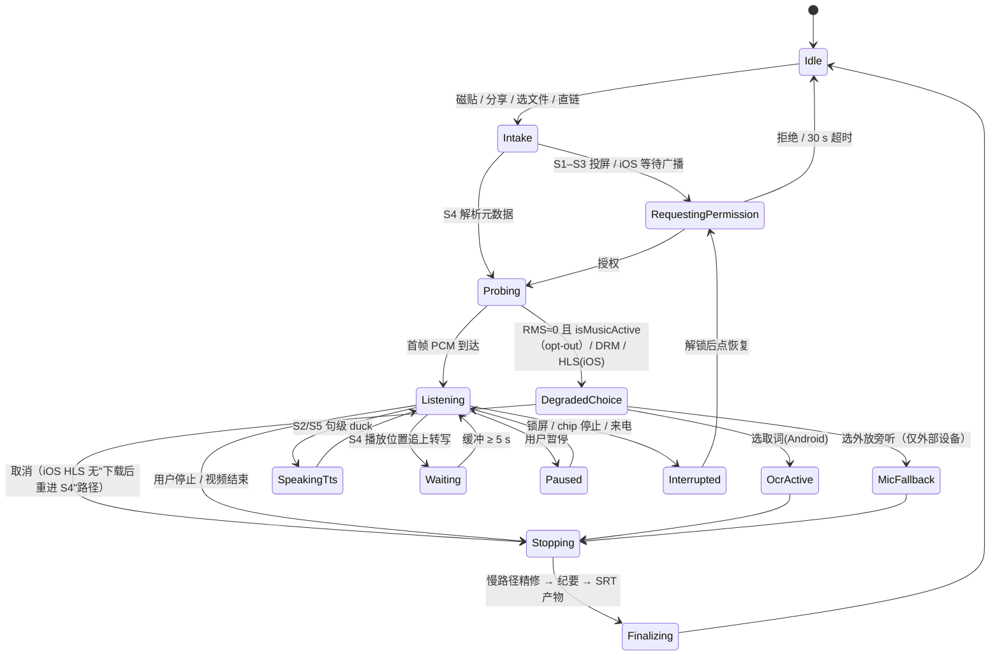

# 屏内翻译（Screen-In）——最终规格 v1.0

> 日期：2026-09-16。以设计 0（Android 体验最大化）为骨架，合并设计 1 被点名的四块：文件/相册/分享/直链第二主线、文件模式双速分工、逐平台 tier 字段、量化验收指标。所有"待验证"项均沿用调研标注，不作承诺。本文与《实时翻译场景矩阵-模块规格》共用 `PipelineProfile / RoutePolicy / PrivacyMode / LiveSegment（旧名 Segment）/ Translation / StageHealth` 等定义，**数据结构、模块划分与语言标签一律以《AI语音转文字-KMP-App-产品与技术方案》（下称主方案）附录 A（含 A.5 旧名 → 新名映射）与 §7.2 为唯一真相源**，本文 §6.1 / §6.4 已标为历史草案。
> **2026-09-16 修订要点**："慢路径"术语与主方案统一（S1 逐句白字定稿属快路径内 partial → final）；可抓性探测不再用 `isClientSilenced`；iOS HLS "下载后重进 S4"路径删除；iOS 27 Generated Subtitles 降为观察项；iOS 四项验证改为"纯字幕 PiP 探审核 / DRM 静音 / 功耗 / 保活链路"；Android 单 PiP 冲突、PiP 字号、OCR 截入自家字幕、`registerCallback` 前置补齐；S8 不适用于本机播放；周数以主方案 §10 为准。

---

## 1. 一句话定义与用户洞察复述

**屏外**翻译解决"听不懂对面的人"：麦克风采集真实世界，输出走耳机，核心是零社交摩擦（M0–M12）。
**屏内**翻译解决"听不懂/看不懂手机里正在播的东西"：输入源从麦克风换成**设备自己正在播放或保存的媒体**，译文字幕浮在画面上或译文配音进耳机，看完后字幕、纪要、生词落入本地知识库。

用户原话的原型场景是"在手机上看外语视频时，翻译后的字幕显示在屏幕上"，并判断"这个能力可能只有 Android 方便做"。本规格的回应：

- **Android**：用户原话场景就是 MVP 主路径——一键开启、任意允许被抓取的 App 通用（MediaProjection 音频抓取 → PiP/悬浮字幕 → 耳机配音 → OCR 降级）。
- **两端并列的第二主线**：相册/文件/分享/直链视频 → 内置播放器同步字幕 → SRT/VTT 导出。它不依赖被抓 App 是否允许、不依赖 OEM 悬浮窗、不依赖审核默许，是 iOS 用户在 MVP 就能拿到的完整"屏内"价值。
- **iOS 系统抓取**：ReplayKit 广播扩展 + PiP 字幕，在四项真机验证通过前一律标"实验"；网页视频、通用 OCR、DRM 平台明确不支持，外设麦听兜底。

屏内跨设备（S7）**不转播第三方音频，只共享本机已生成的源语字幕，对端只做翻译与 TTS**——这是主方案 §3.4 "只传音频"主规则的三种显式例外之一（另两种是 HINT 与 M11-web）。**用户原型场景在 iOS 上的诚实答复**："我在手机上看外语视频"若指其他 App 内正在播放的视频，iOS 在 MVP 没有 App 内路径（ReplayKit 实验层 v1.1 且四项验证前置），MVP 的显式降级步骤是"保存到相册 / 分享面板存储到文件 / Safari 下载 → 分享给本 App → S4"；S8 外放旁听不适用于本机播放。

---

## 2. 输入源维度与屏内模式表

### 2.1 第四维：输入源

`MIC`（屏外）/ `SYSTEM_AUDIO`（其他 App 正在播放的音频）/ `SCREEN_TEXT`（屏幕硬字幕/界面文字）/ `MEDIA_FILE`（本地/相册/分享进来的文件；**直链 MP4/MP3 与 HLS 是它的入口分支，不是独立模式**）。其余三维沿用屏外：输出形态（文本/语音）× 输出设备（本机屏/本机耳机/手表/对端 App）× 交互形式。**屏内一律 `SIMPLEX_IN`**——视频不会等我，不存在对话轮次。

### 2.2 模式表（8 个，S 编号避开 M0–M12）

| # | 模式 | 输入源 | 输出形态 | 输出设备 | 交互 | Android | iOS | 触发 | MVP |
|---|---|---|---|---|---|---|---|---|---|
| S1 | 系统字幕 | SYSTEM_AUDIO | 文本 | 本机 PiP/Overlay | 单工 | 可行（ANDROID_ENHANCED） | 待验证（IOS_EXPERIMENTAL） | QS 磁贴 / App 内"翻译我正在看的视频" | Android P0；iOS 验证后 |
| S2 | 系统配音 | SYSTEM_AUDIO | 语音 | 本机耳机 | 单工 | 可行 | 待验证（实验） | S1 内开"耳机配音" | P1 |
| S3 | 屏幕取词 | SCREEN_TEXT | 文本 | 本机原位覆盖 | 单工 | 可行 | 不可行（FALLBACK：截图/相册图片 OCR） | S1 内按钮 / opt-out 自动推荐 | Android P0（手动截帧） |
| S4 | 文件字幕 | MEDIA_FILE（含直链分支） | 文本 | 内置播放器 | 单工 | 可行（CORE） | 可行（CORE） | 分享面板 / PHPicker / SAF / 剪贴板直链检测 | 两端 P0 |
| S5 | 文件配音 | MEDIA_FILE | 语音 | 本机耳机 | 单工 | 可行（CORE） | 可行（CORE） | S4 内开关 | P1 |
| S6 | 抬腕字幕 | SYSTEM_AUDIO / MEDIA_FILE | 文本 | 我的手表 | 单工 | 可行 | 可行 | 随 S1/S4 自动 | P2（复用 M12） |
| S7 | 字幕共享 | SYSTEM_AUDIO / MEDIA_FILE | 文本 | 对端 App | 单工 | 可行 | 可行 | S1/S4 内"分享字幕给旁边的人" | P2（复用 P2P 骨干） |
| S8 | 外放旁听 | MIC（媒体档） | 文本/语音 | 本机 | 单工 | 可行（FALLBACK） | 可行（FALLBACK） | 屏内入口兜底按钮 | P0（=M0 调参）；**仅对电视 / 电脑 / 别人手机，不适用于本机正在播放的视频**（本机外放 + 本机麦触发外放 AEC 路径且公放即社死） |

折叠掉的组合：SYSTEM_AUDIO 转播音频给朋友（版权/政策风险，S7 只传源语文本）；MEDIA_FILE 外放译文（无意义，S5 内黄标开关）；SCREEN_TEXT 读屏语音（属无障碍读屏，超出范围）。

---

## 3. 平台诚实矩阵

tier 决定商店描述与帮助页措辞：`CORE` 可写进商店描述；`ANDROID_ENHANCED` 写"Android，且被播放的 App 允许时"；`IOS_EXPERIMENTAL` 写"实验功能，可能随时调整"；`FALLBACK` 只在帮助页出现。**禁止"Beta 即将推出"类前置承诺。**

### 3.1 Android

| 路径 | 判定 | 用户可感知差异 / 文案 |
|---|---|---|
| MediaProjection 抓其他 App 音频 | 可行 | 每次会话系统弹窗；Android 15 QPR1+ 状态栏 chip、锁屏自动停止、投屏期间隐藏敏感通知——披露页提前解释 |
| 被抓 App 可抓性 | Netflix / Spotify **不可**（公开来源，核实 2026-09）；YouTube / Twitch / Prime / VLC / SoundCloud **社区报告、待真机复核**；Chrome / 抖音 / B 站 / 腾讯视频 / 爱奇艺**待验证**；兼容表初值注明核实日期 | "该应用不允许其他应用获取它的声音（版权保护）"，自动给 S3/S8；探测判据见 §6.2（不用 `isClientSilenced`） |
| PiP 字幕 | 可行 | 免权限、最顶层；位置限四角、**全系统同时只一个 PiP**（用户回桌面时 YouTube 自身 PiP 会顶掉本 App PiP → `onPictureInPictureModeChanged` 退出后自动切通知栏最近一句或提示开 Overlay）；PiP 最小尺寸约 240×100 dp，**PiP 内字号只允许 14 / 18 sp**；从 Tile 透明 Activity 直进 PiP 要求 Activity resumed，MIUI / ColorOS / OriginOS 可行性待验证 |
| Overlay 字幕 | 可行（SAW） | 小米/OPPO/vivo 需"后台弹出界面"；银行类 App 隐藏 overlay 属正常 |
| 耳机配音 | 可行 | 落后画面 2–4 s；部分播放器把 duck 当暂停→自动切纯混音 |
| OCR 屏幕文本 | 可行 | 包体 +12–16 MB；FLAG_SECURE 画面截黑；截帧前 `hide()` 本 App PiP 或按 PiP 矩形裁剪，否则 OCR 识别出自己的译文再翻一次 |
| 文件/直链 | 可行 | HLS 直链先自行拉取分片再处理 |
| 播放抓取 + 麦克风同开 | 待验证（OEM） | 仅从 App 可见状态启动 |

### 3.2 iOS

| 路径 | 判定 | 用户可感知差异 / 文案 |
|---|---|---|
| 直接抓其他 App 音频 | 不可行 | — |
| ReplayKit 扩展抓 `.audioApp` + PiP | 待验证（四项，见 §10.1） | 需点"开始直播"3 秒倒计时、红色指示常驻；只能一个 PiP，会顶掉 YouTube 自己的 PiP；窗内不可交互；**PiP 承载纯字幕（非视频内容）是 App Review 灰区**（有翻译 / 计时器类被拒先例），无 PiP 时退"耳机 TTS + 通知最近一句" |
| DRM 平台 | 视频黑屏确定，音频待验证 | "该应用可能受版权保护，无法获得声音" |
| 网页视频 / WKWebView | 不可行 | "网页视频暂不支持，请使用该平台的 App 版或系统实时字幕" |
| 通用 OCR | 不可行 | 仅截图/相册图片 OCR（Vision） |
| 文件/相册/分享/直链 MP4 | 可行 | 与 Android 一致；**HLS（m3u8）直链 MVP 标 `Unsupported`**：`MTAudioProcessingTap` 不支持 HLS，且 `AVAssetDownloadTask` 产出的 .movpkg 仍是 HLS 资产、`AVAssetReader` 不可读，"先下载再走文件模式"不成立；只给"外放旁听 / 用平台 App"两条出路；自行 URLSession 拉分片（fMP4 可 AVAssetReader 读单段、TS 需自写解复用）→ AudioConverter 列 v1.1 待验证 |
| 外设麦听 | 可行 | 兜底 |

首次进入屏内入口的诚实说明（iOS）：

> 在 iOS 上，为相册、文件或分享来的视频生成翻译字幕是完整支持的。对其他 App 正在播放的视频，需要通过"屏幕录制"获取声音并以画中画显示字幕，这是实验功能：需在面板里点"开始直播"，顶部有红色指示；Netflix 等受版权保护的应用可能没有声音；Safari 网页视频请改用对应 App；同一时间只能有一个画中画。若视频正在本机其他 App 里播放，可先保存到相册或文件再用文件字幕；若在电视 / 电脑上播放，可把手机放在旁边用"外放旁听"。

---

## 4. 交互流程

以上平台断言的核实来源与日期：MediaProjection / AudioPlaybackCapture / Android 15 QPR1+ chip 与锁屏停止 / Android 15 SAW-FGS 变更 / PiP 宽高比与免 SAW（Android 官方文档，2026-09）；Broadcast Upload Extension 50 MB、单 PiP、ContentSource iOS 15+（Apple 文档与 DTS 论坛，2026-09）；Netflix / Spotify opt-out（公开报道，2026-09）；其余标"社区报告"或"待验证"。

### 4.1 Android S1：从"正在看视频"到字幕出现

目标：**冷启动 ≤3 步 ≤8 s；热启动 2 步 ≤5 s。**

1. 在 YouTube 中下拉通知栏点 Quick Settings 磁贴"屏内翻译"（TileService `startActivityAndCollapse`），或 App 内点"翻译我正在看的视频"。
2. 系统投屏弹窗（用 `createConfigForDefaultDisplay()` 只保留整屏，单 App 选择对音频 UID 范围的影响待验证）→ 点"开始"。
3. 前台服务（`mediaProjection|microphone`）启动，PiP 字幕条以"正在聆听…"出现；2 s 可抓性探测通过后显示第一句灰色快路径字幕。

首次额外插入两页：**显著披露页**（抓取应用音频、是否离开设备、BYOK 去向、锁屏停止、状态栏 chip）与**载体选择页**（角落画中画/全宽悬浮条，后者跳 `ACTION_MANAGE_OVERLAY_PERMISSION` 并按 `Build.MANUFACTURER` 显示 OEM 引导）。停止：通知栏、chip、磁贴再点、`onStop()`。锁屏停止后解锁弹低打扰通知"点击恢复"，重新走系统弹窗（不可避免，诚实告知）。

载体三档：PiP（默认，2.39:1 长条，2 行）→ Overlay（增强，1–3 行，可拖，记忆横竖屏位置）→ 无画面（耳机 TTS + 通知里最近一句）。样式：黑 60% 半透明圆角底 + 白字描边，字号按载体分档——PiP 仅 14 / 18 sp（2.39:1 最小尺寸下 18 sp 一行约 13 字），Overlay / 播放器 14 / 18 / 22 / 28 sp，默认仅译文，双语时源语小字在上；PiP 冲突策略：被其他 App PiP 顶掉时自动切通知栏最近一句或提示开 Overlay；Overlay 本体不可点（不透明度 ≤0.8 防 tapjacking），仅 32 dp 角标长按展开"暂停/切语言/切载体/取词/停止"。

### 4.2 Android S2 耳机配音

在 S1 上打开开关（+1 步，+2–4 s）。三策略（详见 §5.3），定位"听得懂，不对口型"。

### 4.3 Android S3 屏幕取词

S1 内点角标"取词"或 opt-out 后自动推荐。复用 S1 的 MediaProjection（S1 只用 AudioPlaybackCapture、**不创建 VirtualDisplay**；S3 首次取词时在同一 projection 上先 `registerCallback(MediaProjection.Callback)` 再 `createVirtualDisplay`，Android 14+ 同一 token 只能创建一次，销毁后需重新授权）；截帧前 `hide()` 本 App PiP 或按 PiP 矩形裁剪。两种节奏：按需一次 / 每 1 s 自动（仅截用户框选的字幕区域）。译文原位覆盖（半透明底遮原文）。

### 4.4 S4 文件字幕（两端一致，"默认不问问题"）

| 起点 | 步骤 | 步数 | 首条字幕 |
|---|---|---|---|
| 相册/文件管理器/微信收到的视频 | 分享 → 选本 App（Share Extension / `ACTION_SEND video/*`）→ 自动开始 | 2 | ≈3–5 s |
| App 内 | 屏内 Tab → 选视频（PHPicker / `ACTION_OPEN_DOCUMENT`，不申请相册权限）→ 自动开始 | 2 | 同上 |
| 直链 | 复制链接 → 打开 App（剪贴板检测"翻译这个链接？"）→ 确认 | 2 | MP4 ≈4–6 s；HLS：Android 自取分片，iOS `Unsupported` |
| 已处理过 | 打开即播，字幕来自本地缓存 | 1 | 0 s |

语言自动检测（LID 前 5 s），场景/风格沿用上次，目标语言=系统语言；播放器顶部一条芯片"英语→中文 · 字幕风格"可改，改后从当前位置重翻不重转写。**零 Key 端侧原文轨只覆盖普通话 / 英文 / 粤语 / 四川话**（主方案 §7.4 无日 / 韩端侧 ASR）；日 / 韩 / 欧语视频需配置 Key，入口即提示；多语端侧 ASR 包 v1.1 评估（系统识别引擎仅为 v1.1 可选插件）。cue 点击回跳 3 s，长按"纠错/加入词库/复制"。

### 4.5 iOS S1（实验）

App 内点"屏内字幕（实验）"→ 说明页 → `RPSystemBroadcastPickerView`（隐藏麦克风按钮）→ "开始直播"倒计时 → 主 App 进入 PiP 字幕窗（自动进入需 `canStartPictureInPictureAutomaticallyFromInline` + 用户主动切后台 + 活跃 `.playback` 会话）→ 切回视频 App。3 步，首条字幕 ≈8–12 s。30 s 未连接 socket 提示"请点开始直播"。**保活链路**：S1 无音频输出时 audio 后台模式不保活，主 App 必须靠 PiP 存活或持续播放 TTS / 近静音轨二选一；用户关掉 PiP 即主 App 挂起、App Group socket 无人读，扩展侧 socket 5 s 无 ACK 即 `finishBroadcastWithError` 结束广播，避免红条常驻。

### 4.6 外部设备

看电视/电脑/别人手机：走 S8 = M0 媒体档（`VadProfile.media()`：VAD 阈值 0.6–0.7、min silence 500–700 ms、BGM 检测），沿用屏外的耳机单击/磁贴触发。**S8 不适用于本机正在播放的视频**（本机外放 + 本机麦会触发外放 AEC 路径，且公放本身就是社死场景），UI 明示。

---

## 5. 管线与延迟

### 5.1 复用双速管线

屏内只替换 `AudioSource` 实现（系统抓取流 / 文件解码流 / socket 流），`VadGate → AsrStage → SegmenterStage → TranslateStage → TtsStage → PlaybackQueue` 与 Stage Health 降级链全部复用；`DirectionStage` 关闭（单工）；**不新增独立档位**——屏内场景 = ProfileTier 按主方案 §7.5 映射 + `ScenePreset.vad = VadProfile.media()`（VAD 0.6–0.7、min speech 250 ms、min silence 500–700 ms、BGM 谱平坦度检测丢弃纯音乐段）+ `AudioMode.MEDIA` + SenseVoice `use_itn`；旧名 `PipelineProfile.SCREEN_IN` 废弃（主方案附录 A.1 / A.5）。

### 5.2 实时字幕（S1/S2）缓冲策略

- **快路径内两段**（术语与主方案统一）：partial——流式 ASR 0.5–1.5 s 分块 → 轻量 MT → 灰色未定稿字幕；**定稿（per-cue final）**——VAD 断句后完整句 → 定稿 ASR → 翻译 + `style_line` + 术语表 → 白色定稿替换灰字。这与屏外 STABLE_PREFIX → FINAL 同构，**属于快路径内的 partial → final 替换，不是慢路径**；本规格 v1.0 把它叫"慢路径"与主方案"慢路径永不改动已显示内容"直接冲突，已改正。**慢路径**只指会话 `Stopping` 后对整段 `SubtitleTrack` 一次性跑 S0–S4 生成第二条"精修"轨（§5.4），永不替换已显示 cue。端到端字幕落后画面 1.5–3 s。
- 显示缓冲：保留最近 2 句；新句从下推入，旧句淡出；partial 修正只在同一 cue 内原位替换，避免闪烁。
- TTS 只对 **FINAL cue**（定稿）配音（避免 partial 修正导致重复朗读，且不必等会话结束），队列超过 2 句则合并/提速（沿用 PlaybackQueue 规则）。
- 无法获得被抓 App 播放进度，时间戳为会话相对时间。

### 5.3 耳机配音与原声（S2 系统模式 / S5 文件模式）

| 策略 | Android S2 | iOS S2（实验） | S5 文件模式（两端） |
|---|---|---|---|
| 句级替换（默认） | `AUDIOFOCUS_GAIN_TRANSIENT_MAY_DUCK`，播完 abandon | `AVAudioSession .duckOthers`（可关，关后为 `.mixWithOthers`） | 原声在有台词 cue 压到 −18 dB；TTS 比 cue 长则播放器自动暂停等待（可关） |
| 纯混音不抢焦点 | `USAGE_ASSISTANCE_ACCESSIBILITY` 直接叠加 | `.mixWithOthers` | 原声 −8 dB 双语混听 |
| 静音原声 | 记忆媒体音量后调 0，结束恢复 | 不可控他人音量→提示用户手动 | AVPlayer/ExoPlayer volume=0 |

自动检测：请求焦点后被抓音频 RMS 归零且 `isMusicActive` 变 false 连续两次 → 判定"duck 被当暂停"，切纯混音并提示。TTS 一律 `excludeUid(自身)` 防回环。`setPreferredDevice` 分路不承诺。

### 5.4 完整字幕两遍法（S4）

音频已全部在手，双速分工重定义：
- **快路径 = 边转边看**：`MediaExtractor+MediaCodec` / `AVAssetReader` 流式解码 16 kHz mono → VAD 媒体档分段 → 批式端侧 ASR（SenseVoice / Paraformer，两端统一 sherpa-onnx；主方案模型表无多语 Whisper，日 / 韩音频需 Key；桌面 10–30× 实时，**手机预期 5–15×**）→ 轻量 MT → `SubtitleTrack` cue。播放器要求"转写进度 ≥ 播放位置 + 5 s"，否则**自动暂停等待**并显示"字幕生成中 x%"——文件模式独有的精确同步。
- **慢路径 = 整段精修**：转写完成或退出时（`Stopping` 一次性执行），整段 raw + 场景×风格 + 词库 → 主 App 润色阶梯（云 LLM → 系统模型 → 本地 GGUF → 规则层，可选切换强模型；零 Key 亦有规则版，主方案 §2.4）→ 合并碎句、统一译名、补标点 → 第二条"精修"字幕轨、纪要、章节、新词候选 → 知识库。**导出默认精修版**。

### 5.5 RoutePolicy × PrivacyMode

`LOCAL_ONLY`：全端侧；两端 ASR 统一 sherpa-onnx（SenseVoice / Paraformer / zipformer），翻译统一 `core/nmt` 端侧 NMT（opus-mt 中 ↔ 英；语言对模型未下载时提示下载）；系统识别 / 系统翻译插件仅 v1.1 手动启用后参与。`AUTO` / `CLOUD_FIRST`（`RoutePolicy` 只有 LOCAL_ONLY / AUTO / CLOUD_FIRST 三值，无 `BYOK_ALLOWED`）：会话开始页醒目行显示"当前会话音频/文本将发送到：你配置的 XXX"；`CLOUD_FIRST` 需隐私档为音频上云。屏内场景（看视频·字幕 / 看课程·笔记 / 看剧·口语）默认 `AUTO + TextOnlyCloud`。低电量（<20% 未充电）策略只做两件事：降低快路径分块频率、提示"改用文件模式下载后处理"——不做"网络比 NPU 省电"这类未验证假设。

### 5.6 验收指标（MVP）

- Android S1：冷启动 ≤3 步 ≤8 s，热启动 2 步 ≤5 s，首条字幕落后画面 ≤3 s。
- S4（iPhone 15 / 骁龙 8 Gen 2，10 分钟 1080p）：首条字幕 ≤5 s，全片转写 ≤1/4 时长（旗舰机；据 SenseVoice 手机端 5–15× 实测后定，主方案周 13），导出 SRT 在 VLC 正常加载。
- 30 分钟 S1 连续运行：Android 中端机 CPU 均值 <25%、电量 <10%（需实测）。

---

## 6. 技术实现

### 6.1 KMP 模块（历史草案——已被主方案 §7.2 取代）

本节 v1.0 的模块树不再维护，以主方案 §7.2 为唯一真相源；旧名 → 新名映射（完整表见主方案附录 A.5）：

| 本规格旧名 | 主方案 §7.2 新名 |
|---|---|
| `:core:audio` | `core/audio`（AudioSource、VadGate、重采样） |
| `:core:pipeline`（含 `PipelineProfile.SCREEN_IN`） | `core/live-pipeline` + `core/screen-pipeline`（屏内媒体预设 = `VadProfile.media()` + `AudioMode.MEDIA`，无独立档位） |
| `:core:media` | `core/media`（MediaAudioExtractor、DrmProbe、ShareIntake、ClipboardLinkDetector） |
| `:core:syscapture` | `core/audio-capture`（SystemAudioCapture、CaptureProbe） |
| `:core:caption` | `core/overlay`（CaptionHost、OverlayPermission、CaptionStyle） |
| `:core:ocr` | `core/ocr` |
| `:core:subtitle` | `core/subtitle` |
| `:core:export` | `core/export`（SubtitleBurner v2） |
| `:core:intake` | 并入 `core/media` |
| `:feature:screenin` | `feature/screen` |
| `:feature:screenin:android` | `platform/android-service`（ScreenInForegroundService、CaptionPipHost、CaptionOverlayHost、OcrFrameGrabber、DuckingController、OemGuide、TileService） |
| `:feature:screenin:ios` / `iosApp/ScreenInBridge` | `iosApp/SwiftImpl`（Swift-only API 的实现层：PiP ContentSource / MTAudioProcessingTap / ReplayKit socket——实现 commonMain 接口并经 Koin 注入，不是 cinterop 也不是 expect/actual）+ `platform/ios-bridge` |
| `iosApp/BroadcastExtension` | 同名（独立 Swift target，只转发 `.audioApp` → 16 kHz mono → App Group socket，< 10 MB，不含任何 ASR） |

原则：Kotlin 共享层只承载编排、状态机、字幕/词库/文件生成与 BYOK 客户端；扩展不引入 Kotlin/Native 运行时。

### 6.2 expect/actual 边界

| commonMain | Android actual | iOS actual |
|---|---|---|
| `SystemAudioCapture.start(): Flow<PcmChunk>` | AudioPlaybackCaptureConfiguration + AudioRecord 16k mono PCM16 | App Group socket 接收；启动返回 `NeedsBroadcastPicker` |
| `CaptureProbe.probe(): CaptureCapability` | `excludeUid(自身)` 且本 App 播放器静默的前提下，2 s 抓取 RMS ≈ 0 且 `AudioManager.isMusicActive()` 为真 → opt-out；**不用 `isClientSilenced()`**（它只反映麦克风并发被更高优先级 App 静音，与被抓 App opt-out 无关，仅保留在 S8 / M0 麦克风路径提示） | 扩展侧 RMS 回传 |
| `MediaAudioExtractor.pcm(ref): Flow<PcmChunk>` | MediaExtractor + MediaCodec 不落盘；HLS 自取分片 | AVAssetReader；直链 MP4 走 MTAudioProcessingTap；HLS 返回 `Unsupported(HLS)`（movpkg 不可读，下载不解决；分片自取 v1.1 待验证） |
| `CaptionHost.show/update/hide/supported` | PiP Activity（单 PiP 冲突策略、字号 14 / 18）/ TYPE_APPLICATION_OVERLAY / 内置播放器；S3 截帧前先 `hide()` | PiP ContentSource（AVSampleBufferDisplayLayer，Swift-only → Swift 实现注入）/ 内置播放器；Overlay = `Unsupported` |
| `ScreenTextGrabber.grab(region)` | VirtualDisplay + ImageReader | `Unsupported` |
| `OcrEngine.recognize(bitmap)` | ML Kit v2 bundled 中日韩+拉丁 | Vision（仅静态图片） |
| `SystemDucker.beginSentence/endSentence` | AudioFocus TRANSIENT_MAY_DUCK / 无焦点混音 | `.duckOthers` / `.mixWithOthers` |
| `PlayerDucker.duck(db)` | ExoPlayer volume | AVPlayer volume |
| `SubtitleBurner.burn(ref, track)` | Media3 Transformer TextOverlay | AVAssetExportSession + CoreAnimationTool |
| `ShareIntake.events` | ACTION_SEND/VIEW + takePersistableUriPermission | Share Extension + PHPicker |
| `SystemSubtitleUserToggle`（替代不可实现的 `SystemSubtitleDetector`） | 无 | iOS 27 Generated Subtitles 仅英语音频 → 英语字幕、仅美 / 加、`AVPlayerViewController` 自动叠加，App 无 API 检测或关闭；只在设置里提供"我已看到系统字幕，只做翻译"手动开关（观察项） |
| `SessionKeepAlive.acquire()` | 前台服务 | PiP 存活或持续播放 TTS / 近静音轨二选一（无音频输出时 audio 后台模式不保活）；扩展侧 5 s 无 ACK 结束广播 |
| `PlatformCaps` | `supportsSystemCapture=true, supportsOcrOverlay=true, supportsOverlay=canDrawOverlays()` | `supportsSystemCapture=EXPERIMENTAL, supportsOcrOverlay=false, singlePipOnly=true` |

`SystemDucker` 与 `PlayerDucker` 拆成两个 expect，避免"控制他人焦点"与"控制自家播放器音量"共用一个语义模糊的接口。

### 6.3 状态机

### 6.4 Kotlin 数据结构与接口草案（历史草案——已被主方案附录 A.4 取代）

本节 v1.0 的 Kotlin 草案与主方案附录 A 存在类型冲突，**以主方案附录 A.4（屏内）、A.1（ScenePreset / VadProfile / AudioMode）、A.2（InputSource / PipelineProfile / Translation）为唯一真相源**，本节只保留差异清单：

- `InputSource { MIC, SYSTEM_AUDIO, SCREEN_TEXT, MEDIA_FILE }` → 五值，增 `REMOTE_STREAM`（与《矩阵规格》§2.4 一致）。
- `CaptureCapability.Silenced.reason` 增 `flag_secure`；增 `NeedsBroadcastPicker`（iOS 等待"开始直播"，§6.2 已提到但 v1.0 枚举漏列）。
- `ScreenInEvent` 增 `DuckDetectedAsPause(switchedTo)`（对应 §5.3 "duck 被当暂停"检测）；`SubtitleTrack` 增 `timebase`（`media` S4 精确 / `session` S1 会话相对，对应 §5.2）。
- `Lang` 枚举 → `String` BCP-47（`zh-CN / yue-HK / zh-CN-sichuan / en / ja / ko / auto`）；`SubtitleCue.srcLang`、`SubtitleTrack.srcLang / targetLangs`、`ScreenInConfig.targetLangs`、`toSrt(lang)` 参数一律 `String`。
- `ScreenInConfig.scene: Scene` → `sceneId: String`；`ScreenInConfig.mode: ScreenInModeSpec` / `ScreenInSessionRecord.mode` → `modeId: String`（只存 id，运行时查内置 `ScreenInModeSpec × 8` 表）。
- `CaptionStyle.fontSp` 按载体限制：PIP 仅 14 / 18，OVERLAY / IN_APP_PLAYER 14–28。
- `CaptionHost` 增 `supported: Set<CaptionHostKind>`；iOS PIP 宿主与 `SystemAudioCapture(iOS)` 由 Swift 实现注入，不是 `expect class`。
- `PipelineProfile` 增 `tier: ProfileTier`；不存在 `PipelineProfile.SCREEN_IN`，屏内用 `VadProfile.media()` + `AudioMode.MEDIA`。
- `SystemSubtitleDetector` → `SystemSubtitleUserToggle`。
- `RoutePolicy` 只有 `LOCAL_ONLY / AUTO / CLOUD_FIRST`，无 `BYOK_ALLOWED`。

### 6.5 平台原生要点

**Android**：`ScreenInForegroundService` 类型 `mediaProjection|microphone`，Android 14+ 先 `startForeground` 再 `getMediaProjection`（同一 token 只能 `getMediaProjection` 一次）；S1 只持有播放抓取 `AudioRecord`（`addMatchingUsage(MEDIA/GAME/UNKNOWN)` + `excludeUid(自身)`），**不创建 VirtualDisplay**（AudioPlaybackCapture 不需要它）；S3 首次取词时在同一 projection 上**先 `registerCallback(MediaProjection.Callback)` 再 `createVirtualDisplay + ImageReader(RGBA_8888)`**（否则抛 `IllegalStateException`；同一 MediaProjection 只能 `createVirtualDisplay` 一次，销毁后需重新授权）；截帧前隐藏本 App PiP；`CaptionPipHost` 为透明 Activity（`setAutoEnterEnabled`、`setSeamlessResizeEnabled`，2.39:1）；`CaptionOverlayHost` 用 `TYPE_APPLICATION_OVERLAY` + ComposeView 自建 LifecycleOwner；Android 15 起 SAW 后台启 FGS 需可见 overlay，用常驻角标满足；不使用 AccessibilityService；ML Kit bundled 中日韩作为动态特性模块（中国渠道直接打包）；`OemGuide` 为 App 内静态 JSON 随版本更新。

**iOS**：扩展 `RPBroadcastProcessMode = SampleBuffer`，只处理 `.audioApp`，视频 buffer 立即 invalidate，AVAudioConverter → 16 kHz mono；主 App `AVAudioSession(.playback, .mixWithOthers)` + Background Modes audio/PiP；PiP 无限 `timeRange`、≤10 fps（纯字幕 PiP 审核灰区，探审核前置）；保活：PiP 存活或持续播放 TTS / 近静音轨二选一，扩展 socket 5 s 无 ACK 即结束广播；ASR 统一 sherpa-onnx（SenseVoice / zipformer）> BYOK（PiP ContentSource 为 Swift-only，由 iosApp/SwiftImpl 实现注入；系统识别插件 v1.1 可选）；S4 不检测 Generated Subtitles（无 API，且仅美 / 加英语），只提供手动开关；扩展与主 App 各自 `PrivacyInfo.xcprivacy`。

### 6.6 资源与耗电

一律 16 kHz mono 避免二次重采样；字幕仅在 cue 变化时重绘，静止 0 fps；快路径 partial 用流式小模型 int8 20–40 MB，**定稿（per-cue final，仍属快路径）** SenseVoice int8 约 230 MB 仅主 App；慢路径（会话末 S0–S4）在 ASR 卸载后运行，会话进行中禁止加载本地 LLM；6 GB 机型禁止 ASR + 端侧 LLM 同驻；S4 长视频走 WorkManager 前台任务 / BGProcessingTask 并禁止息屏；OCR 默认按需，自动模式 1 fps 且仅截框选区域；沿用热/电四级阶梯（Android 7 级映射见主方案 §3.5）：serious → 定稿 ASR 停用只保留流式小模型、降线程、字幕 5 Hz（不在发热时加载大模型），低电量 → 降快路径频率 + 提示切文件模式。

---

## 7. 与主 App 能力的咬合

- **字幕文件产物 → 分享/知识库**：任何屏内会话结束可导出 SRT/VTT（单语/双语/精修三种，commonMain 生成）；S1 时间戳为会话相对时间，S4 为精确时间；Android 写 MediaStore `Movies/` 同名 `.srt`（VLC/MX 自动加载）+ `ACTION_SEND`；iOS `UIActivityViewController`；烧录 MP4 作 v2。会话记录（精修字幕、纪要、章节、双语对照）进 FTS 知识库，搜索命中可跳回视频时间点（本地文件存 bookmark，系统抓取只存文本）。分享卡片复用主 App card.png（封面 + 三句精选 + 生词）。
- **观影词汇 → 词库**：cue 长按"加入词库"（带例句、来源视频、时间点）→ 同一视频后续 cue 立即重翻；会话结束自动提取高频/新词候选一键批量入库；知识库"观影词汇"视图按视频/日期聚合，CSV 导出。
- **术语表 → 翻译**：词库/纠错映射通过 S0 替换与 zipformer 热词（普通话 / 英文，需 modified_beam_search）回流 ASR，qwen-mt `terms` / LLM prompt Glossary 段同一实现，屏内屏外共用；离线档翻译（`core/nmt` 端侧 NMT）通过 S0 前置占位符替换 + 解码后回填同样吃术语表，回流对云端与端侧快路径都生效。
- **风格 → 字幕语体**：场景预设"看视频·字幕 / 看课程·笔记 / 看剧·口语"映射字幕语体（字幕档：短句、口语化、不超两行）；风格切换从当前位置重翻不重转写。
- **端云切换**：沿用主 App 引擎选择器与 BYOK 密钥保管，本模块只增屏内媒体预设（`VadProfile.media()` + `AudioMode.MEDIA`）与屏内场景默认路由（`AUTO + TextOnlyCloud`）；无独立档位。
- **触发**：QS 磁贴、耳机单击（S8）、手表复用屏外 M12 通道。

---

## 8. 失败与边界

| 情况 | 检测 | 处理与文案 |
|---|---|---|
| 被抓 App opt-out（Netflix / Spotify / 腾讯视频类） | `excludeUid(自身)` + 自家播放器静默 + 2 s RMS≈0 且 `isMusicActive`（不用 `isClientSilenced`） | "该应用不允许其他应用获取它的声音（版权保护）。可改用屏幕取词或外放旁听。" 不提供绕过 |
| FLAG_SECURE 截黑 | OCR 帧全黑 | "该应用禁止截屏，无法翻译屏幕文字；声音字幕不受影响（如允许）。" |
| iOS DRM | 扩展 RMS≈0 | "该应用可能受版权保护，未收到声音。可试系统实时字幕（不翻译）或外放旁听。" |
| iOS HLS 直链 | m3u8 | "暂不支持流媒体链接：可用该平台的 App 播放并用外放旁听，或改用已保存的视频文件。"（不再引导下载：movpkg 仍是 HLS 资产，下载后同样不可读） |
| iOS 网页视频 | WKWebView/Safari | "网页视频暂不支持，请使用该平台的 App 版。" |
| 投屏授权拒绝 | resultCode | 回 Idle，提示可改用文件模式 |
| Android 15 锁屏 | `onStop()` | "屏内翻译已因锁屏停止。系统要求重新授权，点击恢复。" |
| PiP 位被占（iOS） | 启动失败 | "同一时间只能有一个画中画，请先关闭其他画中画。" |
| PiP 被其他 App 的 PiP 顶掉（Android） | `onPictureInPictureModeChanged(false)` | 自动切通知栏最近一句，或提示开 Overlay；不自动重进 PiP |
| OCR 截到自家字幕（Android） | 截帧含 PiP 矩形 | 截帧前 `hide()` PiP 或按 PiP 矩形裁剪 |
| 主 App 被挂起、扩展仍在广播（iOS） | socket 5 s 无 ACK | 扩展 `finishBroadcastWithError` 结束广播，红条消失；主 App 恢复后提示重新开始 |
| duck 被当暂停 | 焦点后 RMS 归零两次 | "检测到视频被暂停，已切换为直接混听。" |
| 被覆盖 App 隐藏 overlay | 窗口不可见回调 | 自动切 PiP；再不可用退通知栏最近一句 |
| OEM 杀后台 / 悬浮窗被禁 | 服务被杀 / `canDrawOverlays=false` | 按品牌引导页；PiP 优先 |
| 横屏沉浸模式 | `onConfigurationChanged` | 字幕按比例重排，横屏字号 +1 档；沉浸只藏系统栏不影响 overlay |
| 内存压力 | `onTrimMemory` / jetsam 预警 | 慢路径延后、卸载 OCR 模型；扩展始终 <10 MB（只转发 PCM，不含任何 ASR 模型） |
| 麦克风 + 播放抓取同开失败（OEM） | 其中一路静音 | 提示二选一（待验证） |

---

## 9. 与系统自带能力的差异化

| 能力 | Android Live Caption | Pixel 11 Live Translate 媒体 | 三星 Voice Captioning | iOS Live Captions | iOS 27 Generated Subtitles | 本模块 |
|---|---|---|---|---|---|---|
| 翻译 | 否 | 6 语无中文 | 是（国行折叠机） | 否 | 仅英语音频→英语字幕（不翻译；仅美 / 加） | 中/英/方言互译；日/韩需 iOS 26 语言资产或 Key |
| 中文方言 / 中英混说 | 否 | 否 | 部分 | 普通话/粤语转写 | 否 | 是 |
| 机型 | Pixel 及部分 | 仅 Pixel 11 | Fold7/Flip7 国行 | iPhone 11+ | iOS 27 且 AVPlayer | 机型无关 |
| DRM 平台 | 可（系统权限） | 可 | 可 | 可 | 视播放器 | **不可**（诚实标注，主动引导用系统字幕） |
| BYOK / 端侧切换 | 否 | 否 | 否 | 否 | 否 | 是 |
| 知识库 / SRT / 词库回流 | 否 | 否 | 摘要 | 否 | 否 | 是 |
| 风格 / 场景 / 术语表 | 否 | 否 | 否 | 否 | 否 | 是 |
| 耳机配音 / 手表 / 对端 | 否 | 否 | 否 | 否 | 否 | 是 |

差异化固定五条：中文/方言与中英混说、BYOK 与端侧自由切换、全离线、机型无关、字幕/纪要进知识库并回流术语表。对 DRM 平台主动引导用户去用系统 Live Caption/Live Captions；iOS 27 Generated Subtitles 无法被 App 检测（且仅美 / 加英语），只提供"我已看到系统字幕，只做翻译"手动开关，作观察项。任何文案不出现"录制/下载 XX 音频"。

---

## 10. 分期路线与风险

### 10.1 分期

- **MVP（周数以主方案 §10 为准：两端 S4 / S8 周 12–13，Android S1 周 14–15，Android S3 周 16；不再压进两周）**：两端 S4（分享/PHPicker/SAF/剪贴板直链入口、边转边看 + 自动暂停、精修轨、SRT/VTT 导出、生词抽屉、进知识库；iOS HLS `Unsupported`）、S8（仅外部设备）；Android S1（PiP 载体 + 2 s 可抓性探测（RMS + isMusicActive）+ QS 磁贴 + 显著披露页 + OEM 引导 + 单 PiP 冲突策略）；Android S3 手动截帧 OCR（作 S1 降级，registerCallback 前置、截帧前隐藏 PiP）。iOS 屏内入口显示 §3.2 诚实说明与"保存后用文件字幕"降级，不写"即将推出"。验收：§5.6 全部指标（S4 全片 ≤ 1/4 时长据实测定）；Play FGS 声明 + 演示视频、隐私标签 BYOK 数据流向。
- **v1.1**：Android S2（三策略 + duck 检测）、Overlay 载体、OCR 自动刷新与区域框选、锁屏恢复通知；两端 S5 文件配音；术语表回流快路径；iOS S1 实验层——前提四项验证通过：① **PiP 承载纯字幕（非视频内容）的审核态度**（TestFlight 提交一次探审核）；② Netflix/Apple TV+ `.audioApp` 是否静音；③ PiP + 扩展 30 分钟功耗与稳定性；④ **保活链路**（PiP 关闭后主 App 挂起 → 扩展 5 s 无 ACK 结束广播）。扩展永远只转发 PCM（< 10 MB；广播扩展上限约 50 MB，任何 ASR 模型进扩展都超出预算），不再验证"SpeechAnalyzer 能否在扩展内初始化"；iOS HLS 分片自取（fMP4）评估；多语端侧 ASR 包评估。
- **v2**：S6 抬腕字幕、S7 字幕共享（只传源语文本，对端自翻，披露页说明不转播第三方音频）、iOS S2（实验）、烧录导出、观影词汇复习视图。

### 10.2 主要风险

1. 被抓 App 单方面 opt-out（Netflix / Spotify 已如此；Chrome/抖音/B站/腾讯视频/爱奇艺待验证，国内长视频大概率不可用），Android S1 会无预警失效——探测（RMS + isMusicActive，不用 isClientSilenced）+ 兼容表（本地存储，标注核实日期）+ 诚实降级。
10. Android 全系统单 PiP 冲突（YouTube 自身 PiP 顶掉本 App）、PiP 内字号可读性、OCR 截入自家字幕——冲突策略 + 字号 14/18 + 截帧前隐藏 PiP。
11. iOS HLS 直链无可行降级（movpkg 不可读）——MVP 标 Unsupported，分片自取 v1.1 待验证。
2. Android 每会话必弹授权 + 锁屏终止 + chip + 通知隐藏，摩擦固有；OEM 悬浮窗/后台策略——PiP 优先、引导页。
3. iOS ReplayKit + PiP 审核不确定——**PiP 承载纯字幕（非视频内容）是 App Review 灰区，有翻译 / 计时器类 PiP 被拒案例，与 S4 播放器 PiP 风险不同**；用户摩擦固有（倒计时、红色指示、单 PiP）；保活链路与 FairPlay 音频待验证——定为实验层，主线不依赖，无 PiP 时退"耳机 TTS + 通知最近一句"。
4. Android MVP 同时压上投屏 + PiP 文字 + OCR + Play FGS 审核，风险面大——S3 只做手动截帧，Overlay 推到 v1.1，FGS 演示视频作为 MVP 前置任务。
5. 端到端 2–4 s 滞后、duck 被当暂停——只承诺"听得懂"，自动切纯混音。
6. 功耗发热：系统模式长视频续航明显下降，烧录发热——热/电阶梯、后台任务、低电量降频。
7. 政策：Play 显著披露 + FGS 声明 + 演示视频；App Store 2.5.14；任何"绕过版权"措辞或实现可能下架；不用 AccessibilityService；Android 16 QPR2 开发者验证影响侧载渠道。
8. 平台演进蚕食：iOS 27 系统英文字幕、Live Captions 多语、Pixel 媒体翻译——差异化压在非英语/方言/风格/BYOK/知识库/耳机配音。
9. ML Kit bundled +12–16 MB 包体；OCR 对动态视频字幕识别率待实测。

### 10.3 上线前真机验证清单

Android：Chrome/抖音/B站/腾讯视频/爱奇艺最新版可抓性（Netflix / Spotify 已确认不可）；YouTube / Twitch / Prime / VLC / SoundCloud 社区报告的真机复核（标注核实日期）；Tile 透明 Activity 直进 PiP 在 MIUI / ColorOS / OriginOS 的可行性；PiP 被其他 App PiP 顶掉后的行为；Android 14 单 App 投屏对音频 UID 范围影响；播放抓取 + 麦克风同开在小米/华为；PiP 承载文字在各 OEM；ducking 在主流视频 App 的 duck vs 暂停行为；WavMuxer 可用性（不依赖）；OEM 权限菜单名。
iOS：四项验证（纯字幕 PiP 探审核 / DRM 静音 / 功耗 / 保活链路）；iOS 27 Generated Subtitles 是否扩展地区与语言（观察项，无检测 API）；SenseVoice 在 iPhone 15 Pro 的批式实时倍数（桌面 10–30×，手机预期 5–15×）；MTAudioProcessingTap 对直链 MP4 在 iOS 26/27 的稳定性；HLS 分片自取（fMP4 单段 AVAssetReader / TS 自写解复用）→ AudioConverter 可行性（v1.1）。
