# 用户场景流程图
> 配套《AI语音转文字-KMP-App-产品与技术方案》《实时翻译场景矩阵-模块规格》《屏内翻译-模块规格》（2026-09-16）。流程由文档逐步提取并经对照核验；节点中的延迟数字与状态名与文档一致，标注「目标」「待实测」「待验证」者以主方案附录 B 为准。图中实线为主线，虚线为并行轨道或失败/降级路径，「黄标」为显式降级路径。

## 目录
- 屏外本机
  - A1 M1 耳听·面屏 全流程（旗舰）：待机档触发 → 耳机播出译文 → 慢路径入库
  - A2 M0 仅听：手机在口袋、只我戴耳机的零门槛入口
  - A3 M3 双屏对话 与 M4 速译卡片（含 M1 摘耳机自动降级到 M3）
  - A4 Stage Health 降级链、热／电四级阶梯与耳机断开／重连
- P2P 多机
  - B1 M8 双机私聊（v1.1，周 19–28）：同网发现 / 扫码 → 密钥 + CAPS → 我说一句 → 对方耳机听到译文
  - B2 M10 多人同传（v2，周 29–42）：host 建房 salt / PIN → N 听者各听各语言 → host 同源去重 / 圆桌单路 → host 退出散会
  - B3 M11-web 网页字幕（对方无 App，v2 P2 最后兜底）：同网 / 热点 → Ktor 托管页面 → 扫码 → D3 host 代做 ASR + MT → 浏览器字幕 + speechSynthesis
- 屏内
  - C1 S1 Android 系统字幕：从正在看视频到 PiP 字幕与会后入库
  - C2 S4 文件字幕（两端）：从分享 / 选择 / 直链到边转边看、精修轨、SRT 导出与生词入库
  - C3 iOS 屏内路径决策树：想翻译 iPhone 上正在播的视频时如何引导（含 ReplayKit + PiP 实验路径与四项验证门）

## 屏外本机

手机在我身上、只涉及本机与我的耳机的模式。主线是「待机档 → 触发 → 采集与判向 → 快路径 → 入耳」，并行轨道是字幕与对方半屏，慢路径在会话结束后入库。

### A1 M1 耳听·面屏 全流程（旗舰）：待机档触发 → 耳机播出译文 → 慢路径入库

从待机档下按耳机单击／Action Button／磁贴开始，经 M0 仅听升级到 M1，对方开口后走快路径 VadGate → AsrStage → SegmenterStage → DirectionStage → TranslateStage → TtsStage → PlaybackQueue → AudioSink → A2DP 耳机播出译文，同时对方半屏显示礼貌卡／呼吸灯／对勾／我的话译文，Ending 后慢路径一次性入库生成对话卡片。

关键数字：

- 待机档 → Live 重载 1–2 s（目标，周 10 实测）；M0 → M1 升级 +2–3 步 +3–5 s，冷启动 ≈ 9 s
- 句尾判定 ≈ 0.7–0.9 s（静音 0.5–0.7 s + 半 chunk 0.16 s + 终结解码 0.05 s）
- 句尾 → 译文首音入耳 1.25–2.45 s（翻译首字 0.3–0.7 s + 系统 TTS 首包 0.1–0.6 s + A2DP 0.15–0.25 s）；目标 P50 ≤ 1.5 s／P95 ≤ 2.2 s
- 本机口径终点 TTS 首帧写 AudioSink：P50 ≤ 1300 ms／P95 ≤ 2000 ms；字幕先于音频 150 ms
- 判向：声纹余弦 0.6、LID 信任 0.7、置信度 ＜ 0.55 沿用上向；连续两句同向才切换
- 插话 ＞ 300 ms 100 ms 内 duck −12 dB、500 ms 后恢复；＞ 1.5 s 丢弃；耳机断开泄漏窗口 ≤ 100 ms

#### A1 M1 耳听·面屏 全流程（旗舰）（流程图）

```mermaid
flowchart TD
    subgraph SG1["触发与预热（矩阵规格 §3.1 / §6.1<br/>/ §9.3）"]
        T1["待机档：只常驻 Silero VAD（每 32<br/>ms），ASR／声纹／LID 卸载；Live<br/>Activity 最小版可见"]
        T2["用户触发：耳机单击<br/>togglePlayPause／Action<br/>Button AppIntent／磁贴<br/>TileService（被迫点击 1）"]
        T3{"当前有其他 Now Playing App？"}
        T4["耳机单击控制音乐；入口退回 Action<br/>Button／磁贴／手表软开关"]
        T5["LiveState Idle → Arming；<br/>重载流式 zipformer zh-en<br/>int8 + 声纹 embedder，1–2<br/>s（目标，周 10 实测）"]
        T6["RouteManager.ensure（HEAD<br/>SET_A2DP_ONLY）：内置麦 back<br/>+ cardioid 朝外，输出<br/>allowBluetoothA2DP；绝不加<br/>defaultToSpeaker／HFP；不开<br/>AEC"]
        T7{"supportedPolarPatterns<br/>含 cardioid？"}
        T8["降级 omni 并在状态条显示"]
        T9["AudioSink.prime：队列空转非空前<br/>200 ms 送 −60 dB 噪声帧，省<br/>100–300 ms 首包睡眠（仅待机 →<br/>Live 过渡）"]
        T10["Arming → Live（M0 仅听，<br/>play=LISTENING，<br/>dir=UNDETERMINED）；<br/>Haptics 短-短 = 开始监听；起<br/>−60 dB 近静音轨成为 Now<br/>Playing App"]
        T11["M0 → M1 升级：解锁 + 掏出 +<br/>竖起朝外，PostureSensor 检测（+<br/>2–3 步，+3–5 s）；setMode<br/>M1 只改 sinks／inputs，<br/>不重启音频管线"]
        T12["对方半屏礼貌卡「我在用翻译听你说话，请正常说」+<br/> 录音图标，3 s 淡出；常驻「我不用了，<br/>谢谢」；默认不外放开场白"]
    end
    subgraph SG2["采集与判向（主方案 §7.3 / 附录 A.2；<br/>矩阵规格 §3.2 / §5.2）"]
        C1["对方开口：内置麦 16 kHz mono<br/>PCM16，每帧 320 采样 20 ms →<br/>采集线程 → 环形缓冲"]
        C2["VadGate（Silero VAD）：预滚<br/>200 ms／hangover 300 ms"]
        C3["AsrStage 流式 zipformer →<br/>FastPathEvent.Partial（灰字<br/>进我方气泡）；端点 rule1 1.5<br/>s／rule2 0.5–0.7 s／rule3<br/>12 s"]
        C4["SegmenterStage mergeGap<br/>400 ms；静音 0.5–0.7 s + 半<br/>chunk 0.16 s + 终结解码<br/>0.05 s ≈ 0.7–0.9 s →<br/>Final；PlayState<br/>LISTENING → TRANSLATING"]
        C5["DirectionStage：输出脚本 LID<br/>+ 声纹余弦 0.6（LID ＜ 0.7<br/>声纹权重加倍）；连续两句同向才切换；置信度 ＜<br/>0.55 沿用上向并打「?」"]
        C6{"speaker？"}
    end
    subgraph SG3["快路径（矩阵规格 §5.1 / §5.2 /<br/>§5.3）"]
        F1["Eager 半句提前翻译：<br/>LocalAgreement-2 稳定前缀；<br/>子句边界或 ≥ 1.5 s 未变即送，<br/>provisional=true；每句 ≈<br/>1.4–2 次调用"]
        F2["快路径翻译（混合档）：Aho-Corasick<br/>terms ≤ 10 + style_line<br/>+ 上句 context；<br/>qwen-mt／Claude Haiku<br/>4.5／Gemini Flash-Lite；<br/>首字 0.3–0.7 s，<br/>withTimeout 1500"]
        F3{"云翻译 1.5 s 超时？"}
        F4["本句降级端侧 NMT<br/>（core/nmt opus-mt 中↔英）；<br/>StageHealth OK → SLOW →<br/>FALLBACK（详见 A4）；胶囊「离线 ·<br/>基础质量」"]
        F5{"Eager 撤回：译文编辑距离 ＞ 15%？"}
        F6["整句重译并替换字幕；耳机端按设置补播差异或重播"]
        F7["TtsStage 系统 TTS 按标点切块：<br/>AVSpeechSynthesizer.writ<br/>e／TextToSpeech<br/>onAudioAvailable 取 PCM，<br/>App 混音写 AudioSink；首包<br/>0.1–0.6 s；TRANSLATING →<br/>SPEAKING"]
    end
    subgraph SG4["播放（矩阵规格 §5.4 / §6.1；主方案<br/>§7.3）"]
        P1["PlaybackQueue FIFO：积压 ≥<br/>2 句语速 1.15–1.25×，≥ 4<br/>句合并标「已合并」；耳语档 −20 dB<br/>随环境噪声自适应；Haptics 短 =<br/>译文就绪"]
        P2["字幕轨：译文进我方气泡，固定先于音频 150<br/>ms（outputLatency 对<br/>AirPods 不可靠）"]
        P3["AudioSink.play：硬件缓冲 ≤<br/>40 ms；本机 metrics 终点 =<br/>TTS 首帧写入，P50 ≤ 1300<br/>ms／P95 ≤ 2000 ms"]
        P4["A2DP 0.15–0.25 s →<br/>耳机播出译文；句尾 → 首音合计<br/>1.25–2.45 s；Eager 开后目标<br/>P50 ≤ 1.5 s／P95 ≤ 2.2<br/>s（周 10 验收后才对外承诺）"]
        P5{"对方插话？"}
        P6["＞ 300 ms：100 ms 内 duck<br/>−12 dB，静音 500 ms<br/>后恢复（SPEAKING ↔ DUCKED）；<br/>＞ 1.5 s：<br/>丢弃剩余队列标「未播完」（FLUSHED<br/>other_interrupt）"]
        P7["TtsDone → SPEAKING →<br/>LISTENING；播放期 ASR 持续工作、<br/>不开 AEC；开放式耳机泄漏：与刚播 TTS<br/>相似度 ＞ 0.8 丢弃"]
    end
    subgraph SG5["并行轨道：我方发言与对方半屏（矩阵规格<br/>§3.2 / §3.4 / §3.5）"]
        M1["我开口：LID=A 且声纹=ME →<br/>MeSpeaking；若耳机仍在播则立即<br/>stop 并<br/>Flushed（me_speaking）<br/>未播译文转屏幕"]
        M2["我的话经同一快路径译出，对方半屏逐字显示：灰<br/>partial → 黑 final，≥ 28<br/>pt，最亮不锁屏；对方全程不碰我的手机"]
        M3["对方半屏：说话时呼吸灯「我在听」；<br/>句尾对勾「已收到」"]
        M4["纠错：<br/>气泡左右滑翻转重译／耳机双击撤回反向重译／三击重<br/>播；连续误判 3 次建议固定方向；方向切换<br/>Haptics 长"]
    end
    subgraph SG6["失败路径（矩阵规格 §6.1 / §9.3 /<br/>§11）"]
        X1["耳机断开：routeChange<br/>oldDeviceUnavailable／ACT<br/>ION_AUDIO_BECOMING_NOISY<br/> → 回调内同步 stop + flush，<br/>绝不切扬声器，泄漏窗口 ≤ 100 ms →<br/>Paused（EarbudLost），M1<br/>自动降级 M3（A3／A4）"]
        X2["来电／Siri／音乐 → Paused<br/>保存队列；恢复失败 →<br/>NeedForeground「点一下继续」"]
        X3["未预热／进程被回收：通知「预热已失效，<br/>解锁点一下」；冷启动 +1 步 +3 s，M1<br/>冷启动 2 步 ≈ 9 s"]
        X4["对方按「我不用了，谢谢」：播对方语言退出语<br/>−6 dB（唯一默认外放）→ 一键回 M0<br/>或结束，丢弃未落盘缓冲"]
    end
    subgraph SG7["慢路径（矩阵规格 §5.1 / §5.5 /<br/>§10；主方案 §4.9 / §6）"]
        S1["长按／结束 → Live → Ending；<br/>也可一键回 M0（撤回屏幕，会话继续私密）"]
        S2["Ending 一次性：ASR／TTS 卸载后，<br/>仅 FINAL 段映射 Segment →<br/>润色阶梯 云 LLM → 系统模型 → 本地<br/>GGUF → 规则层 → 补<br/>polished／finalTranslatio<br/>n／纪要／新词候选 → Vault<br/>SceneNote／conversations"]
        S3["Ending → Idle；对话卡片（双语对照，<br/>只含我的语音 + 全部文本）；录后 10<br/>分钟通知「对话卡片已生成，N 个新词待确认」"]
    end
    T1 --> T2 --> T3
    T3 -->|"是"| T4 --> T5
    T3 -->|"否"| T5
    T5 --> T6 --> T7
    T7 -->|"否"| T8 --> T9
    T7 -->|"是"| T9
    T9 --> T10 --> T11 --> T12
    T12 --> C1 --> C2 --> C3 --> C4 --> C5 --> C6
    C3 -.->|"partial"| F1
    C3 -.->|"对方说话"| M3
    C6 -->|"OTHER"| F2
    C6 -->|"ME"| M1
    F1 --> F2 --> F3
    F3 -->|"是"| F4 --> F7
    F3 -->|"否"| F5
    F5 -->|"是"| F6 --> F7
    F5 -->|"否"| F7
    F7 --> P1 --> P3 --> P4 --> P5
    P1 -.->|"先 150 ms"| P2
    P5 -->|"是"| P6 --> P7
    P5 -->|"否"| P7
    P7 -->|"下一轮次"| C1
    M1 --> M2 --> M4
    M4 -->|"继续对话"| C1
    P4 -.->|"摘耳机"| X1
    T10 -.->|"中断"| X2
    T2 -.->|"无反馈"| X3
    T12 -.->|"拒绝"| X4
    M4 --> S1
    P7 --> S1
    S1 --> S2 --> S3
```

主线自上而下：待机档触发 → Arming 重载 1–2 s → RouteManager 铁律 → prime → Live（M0）→ 掏出解锁升 M1 → 对方开口经 VadGate／ASR／Segmenter／Direction 到快路径翻译与系统 TTS → A2DP 入耳（句尾 → 首音 1.25–2.45 s）；虚线为并行轨道与失败路径，右下慢路径 Ending 入库。矩阵规格 §3.1–§3.5、§5、§6.1、§9.3；主方案 §3.3、§7.3。

#### A1 M1 一轮次时序（触发 → 入耳 → 我答 → 入库）（时序图）

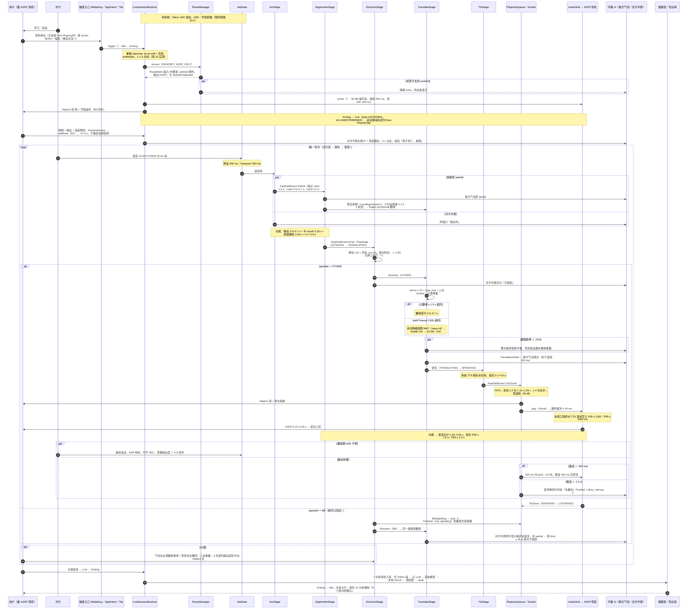

泳道为 A1 角色；loop 内 par 表示 partial 与对方半屏并行、播放期 ASR 不停与插话 duck 并行，alt 区分 OTHER／ME 说话与云翻译超时。Note 标注各段延迟（端点 0.7–0.9 s、翻译 0.3–0.7 s、TTS 0.1–0.6 s、A2DP 0.15–0.25 s）。矩阵规格 §3.2–§3.5、§5.1–§5.4、§6.1、§9.3。

#### A1 句尾 → 译文首音 延迟预算时间轴（时间轴）

```mermaid
gantt
    title A1 句尾 → 译文首音入耳 延迟预算（混合档 中英流式 矩阵规格 §5.2）
    dateFormat x
    axisFormat %s.%L s
    todayMarker off
    section 最短 1.25 s
    静音阈值 0.5 s（rule2 端点） :a1, 0, 500
    半 chunk 0.16 s :a2, 500, 660
    终结解码 0.05 s :a3, 660, 710
    云翻译首字 0.3 s（qwen-mt／Haiku） :a4, 710, 1010
    系统 TTS 首包 0.1 s :a5, 1010, 1110
    A2DP 编码 + 耳机缓冲 0.15 s :a6, 1110, 1260
    section 最长 2.45 s
    静音阈值 0.7 s（rule2 端点） :b1, 0, 700
    半 chunk 0.16 s :b2, 700, 860
    终结解码 0.05 s :b3, 860, 910
    云翻译首字 0.7 s（超时上限 1.5 s） :b4, 910, 1610
    系统 TTS 首包 0.6 s（iOS 首次合成） :b5, 1610, 2210
    A2DP 编码 + 耳机缓冲 0.25 s :b6, 2210, 2460
    section 字幕轨
    字幕先于音频 150 ms 上屏（最短路径） :crit, c1, 1110, 1260
    字幕先于音频 150 ms 上屏（最长路径） :crit, c2, 2310, 2460
    section 目标与口径
    本机口径 P50 ≤ 1.3 s（终点 TTS 首帧写 AudioSink） :milestone, m1, 1300, 1300
    入耳目标 P50 ≤ 1.5 s（周 10 验收后才对外承诺） :milestone, m2, 1500, 1500
    本机口径 P95 ≤ 2.0 s :milestone, m3, 2000, 2000
    入耳目标 P95 ≤ 2.2 s :milestone, m4, 2200, 2200
```

时间轴以 VAD 回推的句尾为 0，上下两段分别为 §5.2 分项的最短（1.26 s）与最长（2.46 s）叠加；里程碑为本机口径 P50/P95（终点 TTS 首帧写 AudioSink）与入耳目标 P50 ≤ 1.5 s／P95 ≤ 2.2 s，均未实测。轴格式用 %s.%L 以避免 %L 在 1 s 处回绕。矩阵规格 §1、§5.2、§6.1；主方案 §3.1。

### A2 M0 仅听：手机在口袋、只我戴耳机的零门槛入口

待机档下对方开口、我按耳机单击（或 Action Button／磁贴）开始，到对方句尾后译文经耳机播出；手机全程不出口袋，DirectionStage 锁单工只做「我的声音不译」说话人过滤，对方看不到任何设备。

关键数字：

- 被迫点击 1；待机 → Live 重载 1–2 s 后震动短-短；冷启动 +1 步 +3 s
- 到首句译文 ≈ 4.5 s（含对方说 3 s），句尾后 ≤ 1.5 s（目标）
- 中英流式混合档 1.25–2.45 s；离线档 0.9–1.5 s（矩阵）／1.0–1.7 s（主方案）
- 粤／川非流式 +0.5–1 s，P50 目标 ≤ 2.2 s（本机口径 ≤ 2.0 s）；在线档 v1.1 1.0–2.0 s
- 端点 rule1 1.5 s／rule2 0.5–0.7 s／rule3 12 s；积压 ≥ 2 句 1.15–1.25×，≥ 4 句合并
- metrics prewarm_to_first_m0_rate 目标 ≥ 50%

#### A2 M0 仅听：口袋里的零门槛入口（流程图）

```mermaid
flowchart TD
    subgraph SG1["前提与触发（矩阵规格 §2.2 / §3.1；<br/>主方案 §1.4）"]
        T1["待机档：出门预热已激活，只常驻 Silero<br/>VAD，ASR／声纹／LID 卸载；Live<br/>Activity 最小版／常驻通知可见"]
        T2["手机在胸前口袋／手持胸前／挂绳，内置麦<br/>cardioid 朝外；对方不需要 App、<br/>不碰我的设备"]
        T3["对方开口（问路／听讲座／听方言长辈／被搭话）"]
        T4{"当前有其他 Now Playing App？"}
        T5["耳机单击控制音乐；入口退回 Action<br/>Button／磁贴／手表软开关"]
        T6["耳机单击<br/>togglePlayPause／Action<br/>Button／磁贴 →<br/>LiveSessionMachine.trigg<br/>er（被迫点击 1，手机不出口袋）"]
        T7{"待机进程仍在？"}
        T8["按耳机无任何反馈 = 预热失效；<br/>通知「预热已失效，解锁点一下」；冷启动 +1<br/>步 +3 s"]
        T9["Idle → Arming：重载流式<br/>zipformer zh-en + 声纹<br/>embedder（LID 不加载），1–2 s<br/>目标；就绪后 Haptics 短-短"]
        T10["RouteManager.ensure（HEAD<br/>SET_A2DP_ONLY）：内置麦 back<br/>cardioid + A2DP；绝不<br/>defaultToSpeaker／HFP；<br/>setPreferredDevice +<br/>getRoutedDevice 校验；不开<br/>AEC"]
        T11["AudioSink.prime −60 dB<br/>噪声帧（提前 200 ms，省 100–300<br/>ms）→ Arming →<br/>Live（LISTENING）；近静音轨成为<br/>Now Playing；App 内常驻录音指示"]
    end
    subgraph SG2["采集与识别（主方案 §7.3；矩阵规格<br/>§5.2）"]
        C1["内置麦 16 kHz mono PCM16<br/>20 ms 帧 → 环形缓冲 →<br/>VadGate 预滚 200<br/>ms／hangover 300 ms"]
        C2{"对方语言？"}
        C3["中英：流式 zipformer zh-en →<br/>Partial／Final；端点 rule1<br/>1.5 s／rule2 0.5–0.7<br/>s／rule3 12 s；Eager 可用"]
        C4["粤／川：<br/>SenseVoice／Paraformer +<br/>VAD 段结束后整段推理；无 partial、<br/>Eager 关、热词不生效；+0.5–1 s"]
        C5["SegmenterStage mergeGap<br/>400 ms → Final（端点 ≈<br/>0.7–0.9 s）；PlayState<br/>LISTENING → TRANSLATING"]
        C6["DirectionStage 单工 S-in：<br/>锁方向 对方 → 我，不跑 LID；<br/>仅说话人过滤，声纹余弦 = ME 的段不译"]
        C7{"长独白 ＞ 12 s（rule3）？"}
        C8["强制分句翻译 + Haptics 长"]
    end
    subgraph SG3["翻译与合成（矩阵规格 §5.1–§5.3；<br/>主方案 §3.5）"]
        F1{"PipelineProfile？"}
        F2["混合档：云翻译 timeout 1.5 s，<br/>terms + style_line + 上句<br/>context；Eager 仅流式路径；首字<br/>0.3–0.7 s"]
        F3["离线档（无 Key／无网／RTT ＞ 400<br/>ms／隐私）：端侧 NMT<br/>opus-mt 中↔英（两端一致），<br/>术语 S0 占位符回填；句尾 → 首音 0.9–1.5<br/>s（矩阵）／1.0–1.7 s（主方案）"]
        F4["在线档（v1.1，胶囊显式选）：云 ASR +<br/>云翻译 + 云 TTS 1.0–2.0 s；云<br/>ASR 首包 1.2 s 超时 → 端侧流式"]
        F5["语言对 NMT 模型未下载：<br/>入口提示下载（≈80 MB／方向）；粤语零 Key<br/>仅繁简转换 + zh-HK TTS 复述"]
        F6["TtsStage 系统 TTS 按标点切块，<br/>PCM 经 App 混音写 AudioSink；<br/>首包 0.1–0.6 s；<br/>TRANSLATING → SPEAKING"]
        F7["Android 无中文 TTS 包：切<br/>Matcha 中文或提示安装"]
    end
    subgraph SG4["播放与手势（矩阵规格 §3.1 / §3.4<br/>/ §5.4 / §6.1）"]
        P1["PlaybackQueue FIFO；耳语档<br/>−20 dB 随环境噪声自适应；积压 ≥ 2<br/>句 1.15–1.25×，≥ 4<br/>句合并「已合并」；Haptics 短 =<br/>译文就绪"]
        P2["AudioSink.play → A2DP<br/>0.15–0.25 s → 耳机播出译文；<br/>字幕若开启先于音频 150 ms；句尾后 ≤<br/>1.5 s（目标）"]
        P3{"对方在播放中插话？"}
        P4["＞ 300 ms：100 ms 内 duck<br/>−12 dB，静音 500 ms 后恢复；＞<br/>1.5 s：丢弃剩余队列标「未播完」"]
        P5["播放期 ASR 持续、不开 AEC；<br/>开放式耳机泄漏相似度 ＞ 0.8 丢弃；<br/>TtsDone → SPEAKING →<br/>LISTENING"]
        P6["耳机手势：单击暂停／继续；双击<br/>nextTrack 跳过当前译文；三击<br/>previousTrack 重播上句"]
    end
    subgraph SG5["升级与结束（矩阵规格 §2.3 / §5.1<br/>/ §10）"]
        U1{"要升级？（每级只加一个动作，setMode<br/>不重启音频管线）"}
        U2["翻转手机 → M1（A1）；只想说一句 →<br/>M4（A3）；对方也有 App →<br/>M8（v1.1）；对方无 App 要看字 →<br/>M11-web（v2）；任一级一键回 M0"]
        U3["没带耳机想看本机字幕：M0「静音字幕」开关关<br/>TTS，本机屏幕显示字幕"]
        U4["长按／结束 → Live → Ending →<br/>慢路径一次性润色入库（只存文本，对方音频不落盘）<br/>→ Idle"]
        U5["录后 10 分钟通知「对话卡片已生成，N<br/>个新词待确认」；metrics<br/>prewarm_to_first_m0_rate<br/> ≥ 50%"]
    end
    subgraph SG6["失败路径（矩阵规格 §6.1 / §9.3 /<br/>§11）"]
        X1["耳机断开：回调内同步 stop + flush，<br/>绝不切扬声器 →<br/>Paused（EarbudLost），<br/>未播句转屏幕，重连续播（A4）"]
        X2["来电／Siri／音乐 → Paused<br/>保存队列；恢复失败<br/>NeedForeground「点一下继续」"]
        X3["路由被拉到 HFP：自动重配 A2DP；<br/>连续失败提示「请勿在系统里把麦克风切到耳机」"]
        X4["对方说日／韩／欧语：端侧无 ASR，需在线档 +<br/> Key（多语端侧包 v1.1 评估）；<br/>场景卡设语言芯片时即提示"]
    end
    T1 --> T2 --> T3 --> T4
    T4 -->|"是"| T5 --> T7
    T4 -->|"否"| T6 --> T7
    T7 -->|"否"| T8 --> T9
    T7 -->|"是"| T9
    T9 --> T10 --> T11 --> C1 --> C2
    C2 -->|"中 ↔ 英"| C3 --> C5
    C2 -->|"粤／川"| C4 --> C5
    C2 -.->|"日／韩／欧"| X4
    C3 --> C7
    C7 -->|"是"| C8 --> C5
    C5 --> C6 --> F1
    F1 -->|"混合档（默认）"| F2 --> F6
    F1 -->|"离线档"| F3 --> F6
    F1 -->|"在线档"| F4 --> F6
    F1 -->|"无 Key 且语言对模型未下载"| F5
    F6 -.->|"启动自检"| F7
    F6 --> P1 --> P2 --> P3
    P3 -->|"是"| P4 --> P5
    P3 -->|"否"| P5
    P5 --> P6 --> U1
    U1 -->|"是"| U2
    U1 -->|"否，下一轮次"| C1
    U1 -->|"静音字幕"| U3
    U1 -->|"结束"| U4 --> U5
    P2 -.->|"摘耳机"| X1
    T11 -.->|"中断"| X2
    T10 -.->|"HFP"| X3
```

M0 手机不出口袋：触发后走与 A1 相同的 Arming／路由／prime，但 DirectionStage 锁单工只做「我的声音不译」过滤；分支按对方语言（中英流式／粤川非流式 +0.5–1 s）与 PipelineProfile（混合／离线／在线／无翻译）展开；末段为升级阶梯与 Ending 入库。矩阵规格 §2.2、§3.1、§5.2、§5.4、§11。

### A3 M3 双屏对话 与 M4 速译卡片（含 M1 摘耳机自动降级到 M3）

路径一：从 M1 摘下耳机（或 App 内点「面对面」）在路由回调内 stop + flush 后 setMode M3，双方通过 180° 上下半屏文字对话，黄标外放为默认关的可选支路，重连后续播；路径二：Action Button 长按说一句，M4 单工 S-out 端侧定稿 + 快路径翻译，松手后屏幕大字朝对方。

关键数字：

- M3 到首句译文 ≈ 6 s（1–2 步）；摘耳机 stop + flush 硬件缓冲 ≤ 40 ms、泄漏窗口 ≤ 100 ms
- 耳机重连 200 ms 内校验 输入=内置麦、输出=A2DP，Paused → Live 从未播句续播
- M3 句尾 → 上屏 ≈ 端点 700–900 ms + 翻译首字 300–700 ms（由 §5.2 分项推算，文档未单列）
- 黄标外放：播放后 800 ms 麦克风门控，近场限幅 −12 dB，speaker_yellow_ratio ≤ 10%
- M4 说完后 ≈ 1 s 出字，被迫点击 1–2；4 人团队预设 A 下 M4 移到 v1.1

#### A3 M3 双屏对话（摘耳机降级）与 M4 速译卡片（流程图）

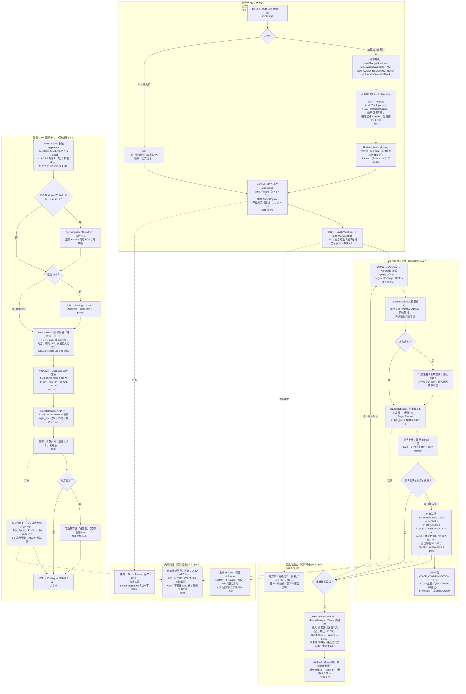

左列路径一：摘耳机回调内 stop + flush（泄漏 ≤ 100 ms）→ Paused／setMode M3（次序文档未明写）→ 180° 双屏字幕，黄标外放为默认关的可选支路；右列路径二：Action Button 长按 → M4 单工 S-out 端侧定稿 → 大字卡 ≈ 1 s。矩阵规格 §2.2–§2.3、§4、§6.1–§6.2；主方案 §1.3、§7.10。

### A4 Stage Health 降级链、热／电四级阶梯与耳机断开／重连

从 Live 中云翻译超时开始，经 SLOW → FALLBACK（端侧 NMT）→ PROBING → RECOVERED 升回；热状态 nominal → fair → serious → critical 的四级动作；耳机断开进入 Paused(EarbudLost) 绝不切扬声器，重连后从未播句续播；来电／Siri 中断与 NeedForeground 前台恢复。

关键数字：

- 每 Stage 超时 mt=1500 ms／ttsFirst=800 ms／asrFirst=1200 ms；语言对 NMT 模型未下载时超时延长到 3 s 仅本句「未译」并提示下载
- Probing 每 5 句影子请求或 RTT 探针 ＜ 400 ms，连续 2 次正常升回；RTT ＞ 400 ms 自动选离线档
- fair 关 Eager 省 30–50% 翻译调用；serious 线程降 1、字幕 5 Hz、不加载 237 MB SenseVoice；critical 暂停 TTS
- 耳机断开：硬件缓冲 ≤ 40 ms、泄漏窗口 ≤ 100 ms（诚实边界）；重连 200 ms 内校验
- 电量 ＜ 20% 省电模式；验收 30 分钟不断流、混合档 1 小时 ≤ 15% 电量（待周 10 实测）

#### A4 LiveSessionMachine × Stage Health × 热阶梯 状态图（状态图）

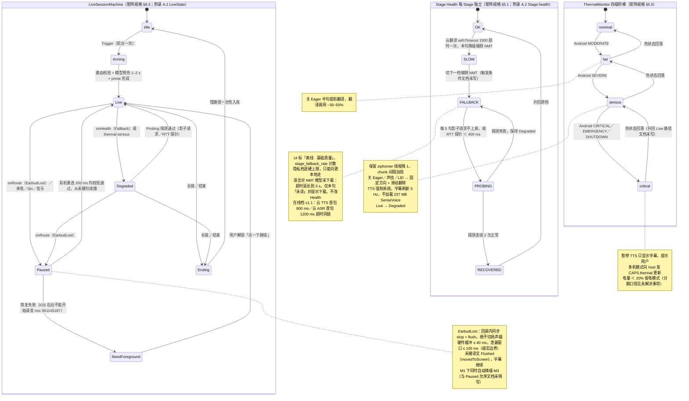

三个并列复合状态：LiveSessionMachine 七态（Idle/Arming/Live/Degraded/Paused/NeedForeground/Ending）；Stage Health OK → SLOW → FALLBACK → PROBING → RECOVERED（Fallback／serious 把 Live 推到 Degraded，仅 Probing 通过升回）；热阶梯 nominal → critical 各级动作见 note。矩阵规格 §5.1、§5.5、§6.1、§9.3。

#### A4 降级链、热阶梯与耳机断开／重连 流程（流程图）

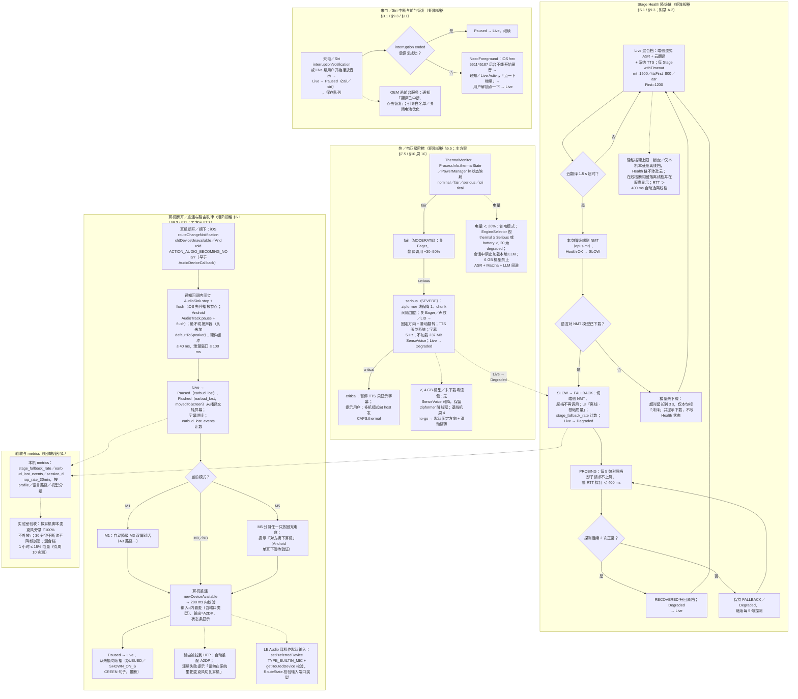

四条独立触发链：云翻译 1.5 s 超时 → SLOW → FALLBACK → 每 5 句 Probing → 连续 2 次正常升回；热阶梯 fair/serious/critical 各级动作与电量 ＜ 20%；耳机断开回调内 stop + flush（≤ 100 ms）→ Paused → 200 ms 内校验重连续播；来电／Siri → NeedForeground。矩阵规格 §5.1、§5.5、§6.1、§9.3、§11。

## P2P 多机

两台以上设备通过局域网互连。铁律：说话方只发 Opus 音频流，每个听者在自己设备上用自己的模型或 Key 做 ASR → 翻译 → TTS；文本只在 HINT、网页字幕、字幕共享三种显式情况下出站。

### B1 M8 双机私聊（v1.1，周 19–28）：同网发现 / 扫码 → 密钥 + CAPS → 我说一句 → 对方耳机听到译文

双方各装 App、各戴耳机、各用各的语言与 Key；从 Bonjour / 二维码配对起，到我的一句话经 VAD + ME 声纹门控编成 Opus 密文，经局域网 WebSocket 发到发起人手机上的 P2pHost 再 fan-out 给对方，对方在自己设备上完成 ASR → 翻译 → TTS 并从自己耳机听到译文；说话方只发音频流，文本只在三种显式例外下出站（HINT 为 v2）。

关键数字：

- 到首句译文：同网 ≈ 10 s / 热点 20–30 s，之后每句 ≤ 1.5 s（§4 M8）
- 句尾 → 首音目标 P50 ≤ 1.5 s / P95 ≤ 2.2 s；远端流起点 = TURN_END，比本机麦快 150–300 ms（待验证第 11 项）
- VAD 预滚 200 ms / hangover 300 ms；Opus 20 ms CBR 24 kbps，2 帧 = 40 ms 一个 WebSocket 帧；≈ 30 kbps/流；链路 ＜ 10 ms（内部假设）
- 听者 JitterBuffer 目标 60 ms（40–200 ms）；翻译首字 0.3–0.7 s（云超时 1.5 s）；TTS 首包 0.1–0.6 s（云 0.8 s）；A2DP 0.15–0.25 s；字幕先 150 ms
- 控制通道：PING/PONG 2 s（3 次未答掉线）、SILENCE 2 s、CLOCK 三次往返 + 每 30 s；重连退避 0.5 → 8 s，＞ 30 s 重扫码；host 缓存 10 s 音频 + 200 条控制
- 加密：X25519 + HKDF PairKeys（c2s/s2c）+ sender-key ChaCha20-Poly1305 + 16 B tag；REKEY 触发 2^40 帧 / 4 h / 成员变动；host 可解包 wrappedKey 待安全评审（第 22 项）

#### B1 M8 双机私聊：从同网发现 / 扫码到对方耳机听到译文（主线 + 分支 + 失败）（流程图）

```mermaid
flowchart TD
    subgraph S0["触发与升级阶梯"]
        B1a["M0 仅听 →<br/>选「双机私聊」·ModeSpec（M8,<br/>requiresP2p）<br/>·LivePipeline.setMode<br/>不重启音频管线 §2.3 §9.3"]
    end
    subgraph S1["发现与配对（v1.1）"]
        B1b{"有共同 Wi-Fi？"}
        B1c["同网：Discovery advertise<br/>/ browse<br/>_scenenote._tcp·TXT<br/>只发布公钥指纹·P2pLinkState.DIS<br/>COVERING §7.2"]
        B1d["热点兜底：Android<br/>LocalOnlyHotspot / iOS<br/>控制中心 172.20.10.1·二维码<br/>scenenote://join 附<br/>Wi-Fi 配置·首句译文 20–30 s<br/>§7.2 §4"]
        B1e["一方点名字、另一方确认（防陌生人静默加入）<br/>·点名字方 = 发起人 = host（推断）<br/>·每人 1–2 步 §7.3"]
        B1f["P2pHost.open（RoomConfig）<br/>Ktor CIO WebSocket·无<br/>TLS → 应用层端到端加密·host<br/>只做成员管理 / fan-out / 缓存<br/>10 s 音频 + 200 条控制，<br/>不解码不识别 §7.1"]
    end
    subgraph S2["出站门禁（说话方）"]
        B1g{"PrivacyMode？"}
        B1h["锁定档：Egress 抛<br/>EgressDenied，拒绝一切 P2P<br/>出站 §7.11"]
        B1i["逐段授权档：会话级一次授权「本会话语音将发给<br/>N 台设备」（预设，附录 B 23）"]
        B1j["账本 lan 类目：对端设备名 / 字节 /<br/>仅音频·胶囊「局域网 → 1 台设备（仅音频）<br/>」 §7.12"]
    end
    subgraph S3["密钥与能力协商（PAIRING →<br/>CONNECTED）"]
        B1k["P2pClient.join →<br/>PAIRING·HELLO（name,<br/>platform, protoVer,<br/>pubKey, joinOrder）<br/>·protoVer 不匹配处理未写 §7.5"]
        B1l["X25519 + HKDF →<br/>PairKeys（c2s / s2c）杜绝<br/>nonce<br/>重用·成对通道只用于控制与流密钥分发 §7.4<br/>①"]
        B1m["StreamKey sender-key<br/>ChaCha20-Poly1305·REKEY（<br/>epoch, streamId,<br/>wrappedKey）说话方 → host →<br/>all·host 可解包待安全评审 §13.3<br/>第 22 项"]
        B1n["CAPS（asrLangs, mtPairs,<br/>ttsLangs, audioEgress,<br/>listenLang, thermal）→<br/>host ROSTER 广播 →<br/>P2pLinkState.CONNECTED<br/>§7.5 §9.3"]
        B1o{"对方 audioEgress = cloud？"}
        B1p["说话方 UI 常驻「N<br/>位听者使用云端识别」·host 可发<br/>ROOM_POLICY.localAsrOnly<br/> = true §7.1"]
        B1q["CLOCK 三次往返对时（之后每 30 s）<br/>·PING / PONG 2 s 心跳·与<br/>CONNECTED 先后未写 §7.5"]
    end
    subgraph S4["路由与预热（双方各自）"]
        B1r["RouteManager：内置麦<br/>cardioid 朝对方 + A2DP<br/>输出·禁 HFP·不加<br/>defaultToSpeaker·Arming<br/>→ Live 需路由校验 + 预热 +<br/>prime·路由变化 200 ms 内重校验<br/>§6.1 §9.3"]
        B1s["各说一句注册「我」声纹<br/>embedding（3D-Speaker /<br/>CAM++，余弦 0.6）·可选<br/>SRC_LANG 声明源语言让听者跳过 LID<br/>§3.2 §7.5"]
    end
    subgraph S5["采集与门控（说话方，每句）"]
        B1u["AudioSource 16 kHz<br/>PCM16 → Silero VAD（Opus<br/>DTX 关）·语音前回溯预滚 200 ms<br/>§7.4"]
        B1v{"ME 声纹门控：speaker = ME？"}
        B1w["非 ME<br/>段不出站（否则对方会把自己的话再翻一遍）<br/>·ownerConf 0–3 写入 flags<br/>bit5–6 §7.1"]
        B1x["首帧 turnStart +<br/>TURN_START（streamId,<br/>utteranceId, ptsMs）<br/>·Opus VoIP 20 ms CBR 24<br/>kbps·FEC 关·packMulti 2<br/>帧 = 40 ms §7.4 §7.5"]
        B1y["FrameCodec.encode：帧头明文<br/>magic X ver flags<br/>streamId seq ptsMs<br/>ctrLow<br/>len·ChaCha20-Poly1305 +<br/>16 B tag·nonce = 4 B 前缀<br/>+ 8 B 计数 §7.4"]
        B1z["语音结束 hangover 300 ms →<br/>末帧 turnEnd +<br/>TURN_END·静默期每 2 s<br/>SILENCE 区分「没人说」与「掉线」<br/>§7.4 §7.5"]
    end
    subgraph S6["链路与 host（并行：去重 +<br/>fan-out）"]
        B1aa["P2pSession.sendAudio →<br/>Wi-Fi WebSocket·链路 ＜ 10<br/>ms（内部假设）·≈ 30 kbps/流<br/>§5.2 §7.6"]
        B1ab["host 同源去重：ptsMs ± 200<br/>ms + 帧能量，保留最高一路，其余回<br/>SUPPRESSED（阈值待实测第 17 项）<br/>§7.3"]
        B1ac["P2pHost.fanOut（frame,<br/>from）密文原样转发·不解密不重加密·1:1<br/>无特殊分支 §7.1 §7.3"]
    end
    subgraph S7["听者快路径（对方设备，自己的引擎与 Key）"]
        B1ad["FrameCodec.decode 按<br/>epoch + seq 重建 nonce、校验<br/>tag → JitterBuffer 目标<br/>60 ms 自适应 40–200 ms·按<br/>ownerConf 丢低置信·入站不记账<br/>§7.4"]
        B1ae["TURN_END 到达 →<br/>drainForAsr（force =<br/>true）立即排空 → OpusDecoder<br/>→<br/>RemoteOpusSource（REMOTE_<br/>STREAM）§2.4"]
        B1af["AsrStage（Zipformer int8<br/>两端统一 sherpa-onnx<br/>/ BYOK 云，云首包超时 1.2 s）→<br/>SegmenterStage TURN_END<br/>强制端点，省去 0.5–0.7 s<br/>静音等待·Listening →<br/>Translating §5.2"]
        B1ag["TranslateStage：云翻译超时<br/>1.5 s 降 Apple<br/>Translation / ML<br/>Kit·Eager 半句提前译·首字<br/>0.3–0.7 s·词库跟听者走 §5.1<br/>§5.3"]
        B1ah["TtsStage：系统 TTS 按标点切块，<br/>首包 0.1–0.6 s·云 TTS 首包超时<br/>0.8 s·PCM 由 App 混音写<br/>AudioSink·Translating →<br/>Speaking §5.2 §6.1"]
    end
    subgraph S8["播放与字幕"]
        B1ai["PlaybackQueue FIFO：积压 ≥<br/>2 句语速 1.15–1.25×，≥ 4<br/>句合并标「已合并」→ AudioSink<br/>A2DP 0.15–0.25 s<br/>入对方耳机·震动「短」 §5.4"]
        B1aj["字幕先于音频 150 ms·灰 partial<br/>→ 黑 final·M12 抬腕字幕<br/>100–500 ms（待验证）§6.1 §3.4"]
        B1ak["TtsDone → Listening·句尾 →<br/> 首音目标 P50 ≤ 1.5 s / P95<br/>≤ 2.2 s·之后每句 ≤ 1.5 s §1<br/>§4 M8"]
    end
    subgraph S9["并行轨道"]
        B1al["反向流：对方回话时角色互换，独立<br/>streamId +<br/>StreamKey·两流全双工·内置麦 +<br/>A2DP 无回灌不开 AEC §5.4 §7.1"]
        B1am["FEEDBACK（utteranceId,<br/>kind = retry / slower /<br/>didntGet）→ 说话方震动「双短」<br/>§7.5 §3.4"]
        B1an["v2 扩展：WANT_HINT →<br/>HINT_ASR /<br/>HINT_MT（显式文本出站例外 ①，默认关）<br/>·D1–D4 降级 §7.7 §13.1 P2"]
    end
    subgraph S10["失败路径"]
        B1ao["PING 3 次未答 →<br/>RECONNECTING 退避 0.5 → 8<br/>s → RESUME（lastSeq）host<br/>补发 10 s 音频 + 200 条控制·＞<br/>30 s 提示重扫码·震动「长-长-长」<br/>§7.5 §9.3"]
        B1ap["耳机断开 / 摘下 → 回调内同步<br/>AudioSink.stop + flush，<br/>泄漏 ≤ 100 ms，绝不切扬声器 →<br/>Paused（EarbudLost）<br/>未播译文转屏幕 §6.1 §11"]
        B1aq["远端继续说 ＞ 300 ms → 100 ms<br/>内 duck −12 dB（Speaking →<br/> Ducked）·＞ 1.5 s →<br/>Flushed 标「未播完」·听者自己开口<br/>stop 转屏幕 §5.4"]
        B1ar["云超时 / 断网 / RTT ＞ 400 ms<br/>→ Stage Health Ok →<br/>Slow → Fallback →<br/>Probing →<br/>Recovered·只向更本地降级，<br/>永不越过隐私档 §5.1 §11"]
    end
    subgraph S11["结束"]
        B1as["host END_SESSION（reason）<br/>→ 各端 Ending 一次性慢路径：按说话人<br/>/ 语言拆 Transcript → 纪要 →<br/>知识库·对方音频不落盘只存文本·P2pHost.<br/>close → CLOSED §7.5 §5.1"]
    end
    B1a --> B1b
    B1b -->|"是·首句译文 ≈ 10 s"| B1c
    B1b -->|"否"| B1d
    B1c --> B1e
    B1d --> B1e
    B1e --> B1f
    B1f --> B1g
    B1g -->|"锁定"| B1h
    B1g -->|"逐段授权"| B1i
    B1g -->|"仅文本上云 / 音频上云"| B1j
    B1i --> B1j
    B1j --> B1k
    B1k --> B1l
    B1l --> B1m
    B1m --> B1n
    B1n --> B1o
    B1o -->|"是"| B1p
    B1p --> B1q
    B1o -->|"否"| B1q
    B1q --> B1r
    B1r --> B1s
    B1s -->|"我开口"| B1u
    B1u --> B1v
    B1v -->|"否"| B1w
    B1v -->|"是"| B1x
    B1x --> B1y
    B1y --> B1aa
    B1y -.->|"语音结束"| B1z
    B1aa --> B1ab
    B1ab --> B1ac
    B1ac --> B1ad
    B1z -->|"TURN_END 经<br/>host 转发"| B1ae
    B1ad --> B1ae
    B1ae --> B1af
    B1af --> B1ag
    B1ag --> B1ah
    B1ah --> B1aj
    B1ah --> B1ai
    B1ai --> B1ak
    B1ak -->|"下一句"| B1u
    B1ak -->|"host 结束"| B1as
    B1ac -.-> B1al
    B1ai -.-> B1am
    B1n -.-> B1an
    B1aa -.->|"心跳超时"| B1ao
    B1ai -.->|"routeChange"| B1ap
    B1ai -.->|"对方插话"| B1aq
    B1af -.-> B1ar
    B1ag -.-> B1ar
    B1ah -.-> B1ar
```

自上而下 12 个泳道：发现 / 配对 → 出站门禁 → 密钥 + CAPS（PAIRING → CONNECTED）→ 路由预热 → 每句「VAD + ME 门控 → Opus 40 ms → ChaCha20 封帧 → host 去重 + fan-out → 听者 JitterBuffer 60 ms → TURN_END 强制端点 → 翻译 → TTS → A2DP」；虚线为并行轨道与失败路径。矩阵规格 §7.1–§7.6、§5.1–§5.4、§6.1、§9.3、§11；主方案 §3.4、§7.11、§7.12、A.3。

#### B1 M8 双机私聊：时序（配对 → 密钥 → 每句 → 反向流 / RESUME / REKEY → 结束）（时序图）

```mermaid
sequenceDiagram
    autonumber
    participant Me as "我（说话方手机·发起人）"
    participant Eg as "隐私档 / Egress 门面"
    participant Host as "P2pHost（Ktor CIO，在我手机上）"
    participant Peer as "对方手机（听者·本机管线）"
    participant Ear as "对方耳机（A2DP）"

    rect rgb(235, 240, 250)
    Note over Me,Peer: 发现与配对（矩阵规格 §7.2 §7.3）
    alt 有共同 Wi-Fi
        Me->>Peer: Discovery browse / advertise<br/>_scenenote._tcp（TXT 只含公钥指纹）·<br/>DISCOVERING
        Note over Me,Peer: 到首句译文 ≈ 10 s（含对方说 3 s，§4 M8）
    else 无共同 Wi-Fi
        Me->>Me: 开热点（Android LocalOnlyHotspot /<br/>iOS 控制中心 172.20.10.1）
        Me->>Peer: 二维码<br/>scenenote://join?host&port&pk&salt<br/>&lang（附 Wi-Fi 配置）
        Note over Me,Peer: 到首句译文 20–30 s（§4 M8）
    end
    Me->>Peer: 点名字
    Peer-->>Me: 另一方确认（防陌生人静默加入）
    Me->>Host: P2pHost.open（RoomConfig）· 无 TLS →<br/>应用层端到端加密
    Me->>Eg: 出站门禁检查
    alt 锁定档
        Eg-->>Me: EgressDenied，拒绝 P2P 出站（§7.11 ⑤）
    else 逐段授权档
        Eg-->>Me: 会话级一次授权「本会话语音将发给 N 台设备」（预设，附录 B<br/>23）
    else 仅文本上云 / 音频上云
        Eg-->>Me: 允许，账本 lan 类目（对端设备名 / 字节 / 仅音频）
    end
    end

    rect rgb(240, 248, 235)
    Note over Host,Peer: 密钥交换 + CAPS = PAIRING →<br/>CONNECTED（§7.4 §7.5 §9.3）
    Peer->>Host: HELLO（name, platform, protoVer,<br/>pubKey, joinOrder）· PAIRING
    Host-->>Peer: X25519 + HKDF → PairKeys（c2s /<br/>s2c）成对通道
    Me->>Host: REKEY（epoch, streamId, wrappedKey）<br/>我的 StreamKey（sender-key）
    Host->>Peer: REKEY fan-out（host 可解包 wrappedKey，<br/>待安全评审第 22 项）
    Peer->>Host: CAPS（asrLangs, mtPairs, ttsLangs,<br/>hasCloudKey, audioEgress,<br/>listenLang, thermal）
    Host->>Peer: ROSTER（members, hostId, mode /<br/>hotspotHost 两处字段不一致）· CONNECTED
    Host->>Me: ROSTER
    opt 对方 audioEgress = cloud
        Note over Me: UI 常驻「N 位听者使用云端识别」
        Host->>Peer: ROOM_POLICY（localAsrOnly = true）<br/>可禁用听者在线档
    end
    Host->>Peer: CLOCK（t0..t3）三次往返对时，之后每 30 s
    loop 每 2 s
        Host->>Peer: PING
        Peer-->>Host: PONG（3 次未答判掉线）
    end
    Note over Me,Peer: RouteManager 校验：内置麦 cardioid +<br/>A2DP，禁 HFP · Arming → Live（§6.1）
    Note over Me,Peer: 各说一句注册「我」声纹（3D-Speaker，余弦 0.6）·<br/>可选 SRC_LANG
    end

    rect rgb(250, 240, 235)
    Note over Me,Ear: 每句主线（说话方只发音频，§7.1）
    loop 我说一句
        Me->>Me: AudioSource 16 kHz → Silero VAD →<br/>ME 声纹门控（ownerConf 写 flags bit5–6）
        Note over Me: 预滚 200 ms · Opus VoIP 20 ms CBR<br/>24 kbps FEC 关 · packMulti 2 帧 =<br/>40 ms
        Me->>Host: TURN_START（streamId, utteranceId,<br/>ptsMs）+ 首帧 turnStart
        Me->>Host: AudioFrame ×N（ChaCha20-Poly1305 +<br/>16 B tag，ctrLow）
        Note over Me,Host: 链路 ＜ 10 ms（内部假设）· ≈ 30 kbps/流 ·<br/>账本 lan 记字节
        par host 同源去重
            Host->>Host: ptsMs ± 200 ms + 能量，保留最高一路，其余回<br/>SUPPRESSED
        and fan-out
            Host->>Peer: AudioFrame 密文原样转发（不解密）· 缓存最近 10 s
        end
        Peer->>Peer: FrameCodec.decode → JitterBuffer<br/>目标 60 ms（40–200 ms）· 按 ownerConf<br/>丢低置信
        Note over Me: 语音结束 hangover 300 ms
        Me->>Host: 末帧 turnEnd + TURN_END（streamId,<br/>utteranceId, ptsMs）
        Host->>Peer: TURN_END
        Peer->>Peer: drainForAsr（force = true）→<br/>OpusDecoder →<br/>RemoteOpusSource（REMOTE_STREAM）
        Peer->>Peer: AsrStage → SegmenterStage<br/>TURN_END 强制端点（省 0.5–0.7 s 静音等待，快<br/>150–300 ms 待验证第 11 项）
        Peer->>Peer: TranslateStage 首字 0.3–0.7 s（云超时<br/>1.5 s 降端侧 NMT）· Listening →<br/>Translating
        par 字幕轨
            Peer->>Peer: 字幕先于音频 150 ms，灰 partial → 黑 final<br/>· M12 抬腕 100–500 ms（待验证）
        and TTS 轨
            Peer->>Peer: TtsStage 系统 TTS 首包 0.1–0.6 s（云<br/>TTS 0.8 s 超时）· Translating →<br/>Speaking
            Peer->>Ear: PlaybackQueue → AudioSink A2DP<br/>0.15–0.25 s · 震动「短」
        end
        Note over Peer,Ear: 句尾 → 首音目标 P50 ≤ 1.5 s / P95 ≤ 2.2<br/>s（远端流起点 = TURN_END，§1 §4）
        Peer->>Peer: TtsDone → Listening
        opt 静默期
            Me->>Host: SILENCE（streamId, sinceMs）每 2 s，<br/>区分「没人说」与「掉线」
        end
        opt 对方没听清
            Peer->>Host: FEEDBACK（utteranceId, kind =<br/>retry / slower / didntGet）
            Host->>Me: FEEDBACK → 震动「双短」
        end
    end
    end

    rect rgb(245, 235, 245)
    Note over Me,Ear: 并行与分支
    par 反向流（角色互换，全双工，不开 AEC）
        Peer->>Host: 对方的 AudioFrame（独立 streamId +<br/>StreamKey）
        Host->>Me: fan-out → 我本机 ASR → 翻译 → TTS →<br/>我的耳机
    and 播放中断
        Note over Peer,Ear: 远端继续说 ＞ 300 ms → duck −12 dB · ＞<br/>1.5 s → Flushed「未播完」· 耳机断开 → stop<br/>+ flush ≤ 100 ms →<br/>Paused（EarbudLost）
    end
    alt PING 3 次未答
        Peer->>Peer: RECONNECTING，指数退避 0.5 → 8 s ·<br/>震动「长-长-长」
        Peer->>Host: RESUME（lastSeq per streamId）
        Host-->>Peer: 补发缓存的最近 10 s 音频 + 200<br/>条控制消息（ctrLow 对齐）
        Note over Peer: ＞ 30 s 提示重新扫码
    else 成员变动 / 2^40 帧 / 4 小时
        Me->>Host: REKEY 新 epoch
        Host->>Peer: REKEY fan-out，接收端按新 epoch 重建<br/>nonce 高位
    end
    end

    Me->>Host: END_SESSION（reason）
    Host->>Peer: END_SESSION
    Note over Me,Peer: 各端 Ending → 一次性慢路径（拆 Transcript →<br/>纪要 → 知识库，对方音频不落盘）· P2pHost.close →<br/> CLOSED
```

五个角色（我 / Egress / P2pHost / 对方手机 / 对方耳机），四个色块依次为配对、密钥 + CAPS、每句主线、并行分支。par 表示 host 去重与 fan-out、字幕与 TTS 并行；alt 表示隐私档、掉线 RESUME 与 REKEY；Note 标延迟。host 在发起人手机上，只转发密文不解码。矩阵规格 §7.2–§7.5、§5.2、§5.4、§6.1；主方案 §3.4、§7.11、§7.12。

#### B1 P2pLinkMachine 链路状态（DISCOVERING → PAIRING → CONNECTED → RECONNECTING → CLOSED）（状态图）

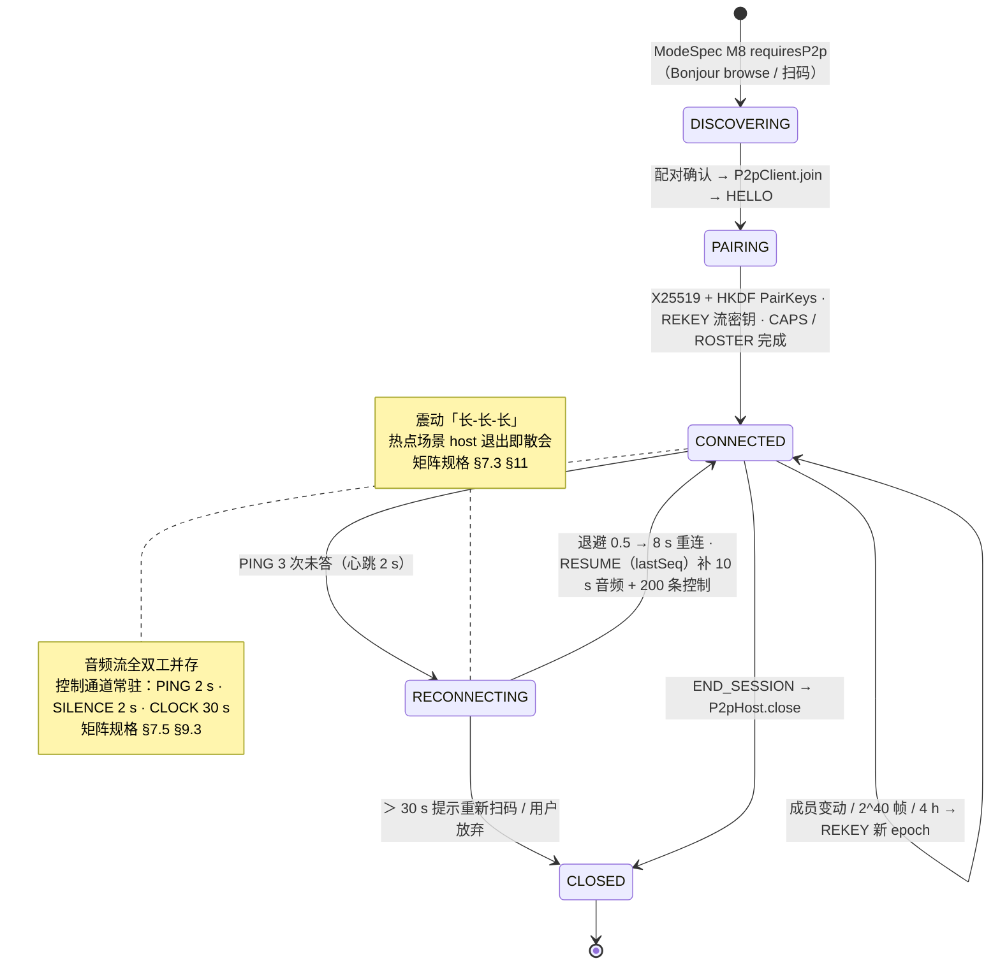

P2P 链路状态机补充图：Pairing = 密钥交换 + CAPS；CONNECTED 自环为 REKEY；RECONNECTING 靠 RESUME 补 host 缓存。CLOCK / PING 与 CONNECTED 的先后文档未写。矩阵规格 §7.5、§9.3、§11。

### B2 M10 多人同传（v2，周 29–42）：host 建房 salt / PIN → N 听者各听各语言 → host 同源去重 / 圆桌单路 → host 退出散会

发起人开房，N 位听者扫同一个码（校验 salt / PIN）加入并各选目标语言；当前说话人手机经 VAD + ME 门控发一路 Opus 密文，host 星型 fan-out 给每位听者，每位听者用自己的语言、引擎与 Key 做 ASR → 翻译 → TTS；host 按 ptsMs ± 200 ms + 能量同源去重并按圆桌 MODE 只放行一路 SPEECH；host 退出按热点 / 现场 Wi-Fi 分别散会或 joinOrder 接任。

关键数字：

- 建房 1 步，每人加入 2 步，到首句译文 ≈ 10–15 s/人（§4 M10）
- host 同源去重窗口 ptsMs ± 200 ms + 帧能量，保留最高一路回 SUPPRESSED（阈值待实测第 17 项）；圆桌单路，讲座听者并发上限 2 路 ASR
- host 带宽：4 人 1 路 上行 30 / 下行 90 kbps；8 人 2 路 60 / 420 kbps；1 → 20 30 / 600 kbps；＞ 6 人须现场 Wi-Fi（iOS 热点 5 客户端待验证）
- 每听者：JitterBuffer 60 ms + 翻译首字 0.3–0.7 s + TTS 首包 0.1–0.6 s + A2DP 0.15–0.25 s；每路 ASR 占一个大核 15–25%
- D1 / D2 走 WANT_HINT → HINT_ASR / HINT_MT（按 listenLang 去重，预设 D3 ≤ 5）；D4 只收音频提示下载离线模型 ≈ 70–230 MB 或填 Key
- 掉线退避 0.5 → 8 s + RESUME 补 10 s 音频 + 200 条控制；热点无客户端 90 s 关闭；REKEY 触发成员变动 / 2^40 帧 / 4 h；host 接任时 §7.3 与 §7.4 对「是否已持有密钥」不一致

#### B2 M10 多人同传（v2）：建房 salt / PIN → N 听者各听各语言 → host 去重 / 圆桌单路 → host 退出散会（流程图）

```mermaid
flowchart TD
    subgraph S0["建房（v2，发起 1 步）"]
        B2a["P2pHost.open（RoomConfig：<br/>pin / salt 校验,<br/>localAsrOnly）Ktor CIO →<br/>RoomInfo 二维码<br/>scenenote://join 含 pk /<br/>salt·Discovery 发布<br/>_scenenote._tcp（M10<br/>必须扫码 / PIN，零扫码仅 M8）§7.2<br/>§7.3"]
        B2b{"有现场 Wi-Fi？"}
        B2c["host<br/>开热点（LocalOnlyHotspot /<br/>iOS 控制中心 172.20.10.1）<br/>同一码附 Wi-Fi 配置·iOS 热点上限<br/>5 客户端（待验证第 8 项）§7.2 §7.6"]
        B2d["＞ 6 人用现场 Wi-Fi·讲座 1 →<br/>20 host 强制 5 GHz §7.6"]
        B2e["host 只做成员管理 / 控制广播 /<br/>fan-out / 缓存 10 s 音频 +<br/>200 条控制，<br/>不解码不翻译·自己作为听者另起本地虚拟成员<br/>§7.1"]
    end
    subgraph S1["加入与协商（每人 2 步，≈ 10–15<br/>s/人）"]
        B2f["听者 ×N 扫同一个码·校验二维码 salt<br/>或房间 PIN（PIN 输入 UI /<br/>位数未写）拒绝陌生人静默加入 §7.3"]
        B2g["P2pClient.join：<br/>DISCOVERING →<br/>PAIRING·HELLO（name,<br/>platform, protoVer,<br/>pubKey, joinOrder）→<br/>X25519 + HKDF<br/>PairKeys（c2s / s2c）§7.4<br/>§7.5"]
        B2h["各选目标语言（默认系统语言）→<br/>CAPS（listenLang,<br/>audioEgress, thermal,<br/>canHint...）（listenLang<br/>对应为推断）§4 §7.5"]
        B2i["host ROSTER 广播·可发<br/>ROOM_POLICY（localAsrOnly<br/> = true）·密钥 + CAPS 完成 →<br/>CONNECTED §7.5 §9.3"]
        B2j["MODE（interaction C / S,<br/>speakerAllowlist,<br/>singleSpeech = true）：饭桌<br/>= 圆桌单路·讲座 = 单工白名单 §7.3<br/>§7.5"]
        B2k["第三台加入 → 1:1<br/>自动升级星型·每位潜在说话方<br/>StreamKey 经成对通道 REKEY<br/>分发·成员加入 / 退出即 REKEY 新<br/>epoch·CLOCK 三次往返·PING 2<br/>s §7.3 §7.4"]
        B2l["所有成员：RouteManager 内置麦 +<br/>A2DP 禁<br/>HFP·各说一句注册「我」声纹（余弦 0.6）<br/>§6.1 §3.2"]
    end
    subgraph S2["出站门禁（每位潜在说话方）"]
        B2m{"PrivacyMode？"}
        B2n["锁定档：Egress 拒绝作为说话方出站，<br/>仍可作听者接收（后半为推断）§7.11"]
        B2o["逐段授权档：会话级一次授权「本会话语音将发给<br/>N 台设备」（预设）·账本 lan<br/>胶囊「局域网 → N 台设备（仅音频）<br/>」§7.12 附录 B 23"]
    end
    subgraph S3["说话人采集与门控（当前发言者）"]
        B2p["AudioSource 16 kHz<br/>PCM16 → Silero VAD → 只发<br/>speaker = ME<br/>的段（ownerConf flags<br/>bit5–6）·预滚 200 ms·首帧<br/>turnStart + TURN_START<br/>§7.1 §7.4"]
        B2q["Opus VoIP 20 ms CBR 24<br/>kbps FEC 关 DTX 关·2 帧 /<br/>WebSocket 帧（code 3）<br/>·ChaCha20-Poly1305 封帧<br/>ctrLow →<br/>P2pSession.sendAudio<br/>§7.4"]
        B2r["hangover 300 ms → 末帧<br/>turnEnd + TURN_END·静默期每<br/>2 s SILENCE §7.4 §7.5"]
    end
    subgraph S4["host 去重 / 仲裁 /<br/>fan-out（并行）"]
        B2s["同源去重：所有内置麦拾到同一说话人 → 按<br/>ptsMs ± 200 ms +<br/>帧能量保留最高一路，其余回<br/>SUPPRESSED（阈值待实测第 17 项）<br/>§7.3"]
        B2t{"MODE 仲裁"}
        B2u["圆桌 singleSpeech：<br/>同一时刻只放行一路 SPEECH，UI<br/>显示当前发言者 §7.3"]
        B2v["讲座 / 白名单：仅<br/>speakerAllowlist 内<br/>streamId 可发·每 streamId<br/>一条 ASR·听者并发上限 2 路，<br/>超出按能量丢弃标「有人同时说话」§7.3 §11"]
        B2w["P2pHost.fanOut 密文原样转发·4<br/>人 1 路 上行 30 / 下行 90<br/>kbps·8 人 2 路 60 / 420<br/>kbps·1 → 20 30 / 600<br/>kbps §7.6"]
    end
    subgraph S5["听者 ×N 各自快路径（各自语言 / 引擎 /<br/>Key）"]
        B2x["FrameCodec.decode（epoch<br/>+ seq 重建 nonce）→<br/>JitterBuffer 60<br/>ms（40–200）→ 按 ownerConf<br/>丢低置信 → TURN_END<br/>drainForAsr（force）→<br/>OpusDecoder →<br/>RemoteOpusSource·入站不记账<br/>§7.4 §2.4"]
        B2y["AsrStage 源语言（每路占一个大核<br/>15–25%）→ SegmenterStage<br/>TURN_END 强制端点 §5.2 §7.6"]
        B2z{"听者能力？"}
        B2aa["D0 全能力：TranslateStage<br/>译成自己的 listenLang（词库跟听者走，<br/>云超时 1.5 s 降端侧 NMT）首字<br/>0.3–0.7 s §5.1 §7.7"]
        B2ab["D1 无源语 ASR →<br/>WANT_HINT（asr）·D2 只有<br/>TTS → WANT_HINT（mt,<br/>targetLang）·说话方若<br/>canHint 且显式允许发 HINT_ASR<br/>/ HINT_MT，按 listenLang<br/>去重·UI「N 位听者需要我帮忙转写」账本<br/>text → lan·预设 D3 ≤ 5<br/>§7.7 §7.8"]
        B2ac["D4 说话方也无能力：只收音频，<br/>提示「下载离线模型 ≈ 70–230 MB<br/>或填 Key」，原声播到耳机不漏听 §7.7"]
        B2ad["TtsStage 系统 TTS 按标点切块首包<br/>0.1–0.6 s →<br/>PlaybackQueue →<br/>AudioSink 各自耳机 A2DP<br/>0.15–0.25 s·耳语档 −20<br/>dB·字幕先 150 ms·天然多语言：3<br/>位听者可分别听英 / 日 / 法 §5.2<br/>§6.1 §7.1"]
        B2ae["数据层：<br/>Utterance.finalTranslati<br/>on 为 Map，每个 listenLang<br/>一条·speaker =<br/>REMOTE:streamId·UttSourc<br/>e.REMOTE_AUDIO·对方音频不落盘<br/>A.2 §4.9"]
    end
    subgraph S6["并行轨道"]
        B2af["FEEDBACK（utteranceId,<br/>kind）→ 说话方震动「双短」·对方扫一次码、<br/>戴耳机、手机放回口袋 §3.4 §7.5"]
        B2ag["热状态：critical 暂停 TTS 只字幕<br/>+ 发 CAPS（thermal）<br/>·serious 降线程 / 关 Eager<br/>声纹 LID / TTS 强制系统·fair<br/>关 Eager §5.5"]
        B2ah["M11-web 网页听者可同房并存（走 B3<br/>文本推送）·M9 无耳机听者关 TTS 看字幕<br/>§2.2 第 10–12 格"]
    end
    subgraph S7["失败路径"]
        B2ai["听者掉线：RECONNECTING 退避<br/>0.5 → 8 s +<br/>RESUME（lastSeq）补 10 s<br/>音频 + 200 条·＞ 30 s<br/>重扫码（是否重校 salt / PIN 为推断）<br/>·震动「长-长-长」§7.5 §11"]
        B2aj["某听者耳机断开 → 仅该听者<br/>Paused（EarbudLost），stop<br/>+ flush 泄漏 ≤ 100 ms，<br/>字幕继续，不影响其他听者 §6.1 §11"]
        B2ak["某听者云端超时 / 断网 → 只对该听者<br/>Stage Health 逐档降级端侧，<br/>不影响房间 §5.1"]
        B2al["热点无客户端 90 s 关闭：<br/>最后一个客户端断开时 host 提示「热点将在<br/>90 s 后关闭」·SILENCE 不承担保活<br/>§11"]
    end
    subgraph S8["host 退出与散会"]
        B2am{"host 退出：热点还是现场 Wi-Fi？"}
        B2an["热点场景：热点消失即散会·UI<br/>明示「发起人请勿离开 / 锁屏」·iOS<br/>Ktor CIO 锁屏存活待验证第 7 项，<br/>兜底 host 保持前台 §7.3 §9.5"]
        B2ao["现场 Wi-Fi：joinOrder<br/>最小者自动接任·§7.3<br/>写「已持有会话密钥」但 §7.4<br/>sender-key 要求新 host 重新<br/>REKEY（两处不一致）·新 host<br/>PairKeys 重建未写 §7.3 §7.4"]
        B2ap["END_SESSION（reason）→ 各端<br/>Ending 一次性慢路径（按说话人 /<br/>语言拆 Transcript →<br/>finalTranslation 各 lang<br/>→ 纪要 → 知识库）·围桌共录（v2）<br/>会后交换带时间戳文本段落 LWW<br/>合并·CLOSED §7.5 §5.1 §4.8"]
    end
    B2a --> B2b
    B2b -->|"否"| B2c
    B2b -->|"是"| B2d
    B2c --> B2e
    B2d --> B2e
    B2e --> B2f
    B2f --> B2g
    B2g --> B2h
    B2h --> B2i
    B2i --> B2j
    B2j --> B2k
    B2k --> B2l
    B2l --> B2m
    B2m -->|"锁定"| B2n
    B2m -->|"逐段授权 / 上云档"| B2o
    B2o -->|"某成员开口"| B2p
    B2p --> B2q
    B2q --> B2s
    B2q -.->|"语音结束"| B2r
    B2s --> B2t
    B2t -->|"圆桌"| B2u
    B2t -->|"讲座 / 白名单"| B2v
    B2u --> B2w
    B2v --> B2w
    B2w --> B2x
    B2r -->|"TURN_END 转发"| B2x
    B2x --> B2y
    B2y --> B2z
    B2z -->|"D0"| B2aa
    B2z -->|"D1 / D2（v2）"| B2ab
    B2z -->|"D4"| B2ac
    B2ab --> B2ad
    B2aa --> B2ad
    B2ad --> B2ae
    B2ae -->|"下一句"| B2p
    B2ad -.-> B2af
    B2i -.-> B2ag
    B2i -.-> B2ah
    B2w -.->|"PING 3 次未答"| B2ai
    B2ad -.->|"routeChange"| B2aj
    B2aa -.-> B2ak
    B2c -.-> B2al
    B2ae -->|"host 退出"| B2am
    B2am -->|"热点"| B2an
    B2am -->|"现场 Wi-Fi"| B2ao
    B2an --> B2ap
    B2ao --> B2ap
    B2ae -->|"host 散会"| B2ap
```

九个泳道：建房（Wi-Fi / 热点分支）→ 加入协商（salt / PIN、CAPS.listenLang、MODE、REKEY）→ 门禁 → 说话人采集 → host 同源去重 + MODE 仲裁（圆桌单路 / 讲座 2 路）+ fan-out（带宽表）→ N 听者各自快路径（D0 / D1 / D2 / D4 分支）→ 并行轨道 / 失败 → host 退出（热点散会 vs joinOrder 接任，文档不一致处已标）。矩阵规格 §7.1–§7.8、§5.1–§5.5、§11、§13；主方案 §3.6、§7.12、A.2、A.3。

### B3 M11-web 网页字幕（对方无 App，v2 P2 最后兜底）：同网 / 热点 → Ktor 托管页面 → 扫码 → D3 host 代做 ASR + MT → 浏览器字幕 + speechSynthesis

对方没有 App 且坚持要看字时的最后兜底：host（我）用本地 Ktor CIO 在 http://host-ip:8080 托管 ＜ 100 KB 内联页面，对方扫码打开并点「点击开始收听」解锁 speechSynthesis；我对着自己手机说，host 本机做 ASR + 翻译后把文本推送到浏览器（三种显式文本出站例外之②），浏览器显示字幕并可选朗读；网页端因 http 非安全上下文无 getUserMedia，只能单工收听。

关键数字：

- 到首句译文：同网 ≈ 15 s（对方 2 步）/ 热点 30–45 s（对方 3 步）（§4 M11-web）
- 页面 ＜ 100 KB 全内联，Ktor CIO 仅 HTTP/1.x 无 TLS，热点网关 172.20.10.1
- host 本机端点 ≈ 0.7–0.9 s（静音 0.5–0.7 s + 半 chunk 0.16 s + 终结 0.05 s）+ 翻译首字 0.3–0.7 s（云超时 1.5 s）→ 句尾到译文文本就绪 ≈ 1.0–1.6 s（推算，文档未单列）
- D3 网页听者预设 ≤ 5（附录 B 19），按 listenLang 去重翻译；隐私档须 ≥ 仅文本上云等价档，锁定档拒绝
- 网页端掉线 3 s 自动重连；热点无客户端 90 s 关闭；speechSynthesis 失效退回纯字幕 + 「再点一次收听」（实测第 9 项）
- 待定项：推送通道（WebSocket / SSE / 轮询）、partial 是否推送、「没听清」是否复用 Ctrl.FEEDBACK、iOS Ktor 锁屏存活（第 7 项）

#### B3 M11-web 网页字幕（对方无 App，v2）：同网 / 热点 → Ktor 托管页面 → 扫码 → D3 host 代做 ASR + MT → 浏览器字幕 / speechSynthesis（流程图）

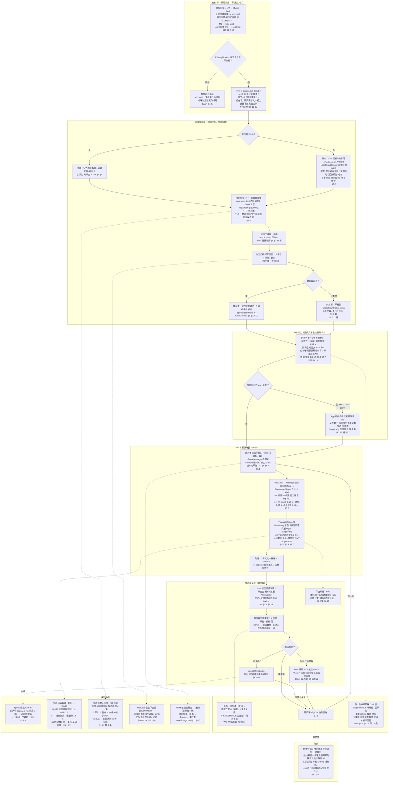

八个泳道：隐私门禁（text → lan）→ 同网 / 热点分支（15 s vs 30–45 s）→ Ktor 托管 ＜ 100 KB 页面 → 扫码 + 手势解锁 speechSynthesis → D3 判定（host 代做 ASR + MT，D3 ≤ 5）→ host 本机快路径（端点 0.7–0.9 s + 翻译首字 0.3–0.7 s）→ 文本推送（通道未指明）→ 字幕 / 朗读三选一；虚线为并行与失败路径。矩阵规格 §8、§7.7 D3、§5.1–§5.5、§11、§13；主方案 §3.7、§7.12、附录 B 19。

## 屏内

翻译手机自己正在播放的内容。Android 走 MediaProjection 系统抓取 + PiP 字幕；iOS 在 MVP 只承诺文件 / 相册 / 直链 MP4，其他 App 内视频为实验路径。

### C1 S1 Android 系统字幕：从正在看视频到 PiP 字幕与会后入库

用户在 YouTube 等 App 看外语视频时点 QS 磁贴“屏内翻译”，首次经显著披露页与载体选择页，系统投屏授权后前台服务以 AudioPlaybackCapture 抓取系统音频，2 s 可抓性探测通过后 PiP 字幕条由“正在聆听…”变为灰字 partial → 白字定稿（均属快路径）；停止后慢路径一次性生成精修轨 / SRT / 纪要 / 生词候选入库。MVP 只出字幕不出声，S2 耳机配音为 v1.1 分支。图：flowchart TD（主线 + 并行轨道 + 分支 + 失败路径）、sequenceDiagram（角色时序）、stateDiagram-v2（共用状态机）。

关键数字：

- 冷启动 ≤3 步 ≤8 s ／ 热启动 2 步 ≤5 s（屏内规格 §4.1 / §5.6；主方案 §1.4）
- 投屏授权 RequestingPermission 拒绝或 30 s 超时回 Idle（屏内规格 §6.3）
- CaptureProbe 抓 2 s 测 RMS + isMusicActive 判可抓性（屏内规格 §6.2）
- 流式 ASR partial 分块 0.5–1.5 s，首条字幕落后画面 ≤3 s，端到端落后 1.5–3 s（屏内规格 §5.2 / §5.6；主方案 §3.5）
- 云翻译 1.5 s 超时降端侧 NMT（语言对模型未下载时延长 3 s）；热状态 serious 字幕 5 Hz（主方案 §3.5；屏内规格 §6.6）
- VadProfile.media：阈值 0.65、minSpeech 250 ms、minSilence 600 ms；S2 配音落后画面 2–4 s（v1.1）（主方案 附录 A.1；屏内规格 §4.2）

#### S1 Android 系统字幕：从 QS 磁贴到 PiP 字幕与会后入库（主流程 + 分支 + 失败路径）（流程图）

```mermaid
flowchart TD
  subgraph sg1["触发与预热（屏内规格 §4.1 / §6.3；<br/>主方案 §7.10）"]
    U1["用户在 YouTube 下拉通知栏点 QS<br/>磁贴“屏内翻译”｜冷启动 ≤3 步 ≤8 s<br/>／ 热启动 2 步 ≤5 s"]
    T1["TileService.startActivit<br/>yAndCollapse → 透明<br/>Activity｜（推断 =<br/>CaptionPipHost，Android<br/>14+ microphone 类 FGS<br/>不能后台启动）"]
    SM1["ScreenInSessionMachine：<br/>Idle → Intake（触发源：磁贴）"]
    D1{"首次使用？"}
    P1["显著披露页：<br/>抓取应用音频·是否离开设备·BYOK<br/>去向·锁屏停止·状态栏<br/>chip｜抓取音频不落盘、不转播、入站不记账"]
    P2["载体选择页：角落画中画（默认）<br/>／全宽悬浮条（Overlay v1.1，跳<br/>OVERLAY_PERMISSION +<br/>OemGuide 静态 JSON）"]
    P3["会话开始页醒目行：音频／文本将发送到你配置的<br/>XXX（text 类目记账，位置为推断）"]
    CF["组装<br/>ScreenInConfig（modeId=S1<br/>、host=PIP、route=AUTO、<br/>dubbing=OFF、<br/>VadProfile.media）｜→<br/>ScreenInPipeline.start（c<br/>onfig）"]
  end
  subgraph sg2["授权与探测（屏内规格 §6.2 / §6.5；<br/>主方案 §3.8 / §7.3）"]
    SM2["Intake →<br/>RequestingPermission：<br/>MediaProjection<br/>系统投屏弹窗｜createConfigForDe<br/>faultDisplay 整屏；每会话必弹；<br/>30 s 超时"]
    D2{"用户点“开始”？"}
    SM3["RequestingPermission →<br/>Probing"]
    FG["ScreenInForegroundServic<br/>e 启动（mediaProjection +<br/>microphone 类型）｜先<br/>startForeground 再<br/>getMediaProjection（同一<br/>token 仅一次）=<br/>SessionKeepAlive.acquire"]
    CAP["SystemAudioCapture.start<br/>：AudioPlaybackCapture<br/>addMatchingUsage<br/>MEDIA／GAME／UNKNOWN｜+<br/>excludeUid 自身；<br/>AudioRecord 16 kHz mono<br/>PCM16；不创建 VirtualDisplay"]
    PIP["CaptionHost.show（PIP）：<br/>透明 Activity 进 PiP，<br/>2.39:1 长条 2 行，四角，约<br/>240×100 dp｜字幕条显示“正在聆听…”；<br/>ScreenInEvent.Host（PIP,<br/>active）"]
    PR["CaptureProbe.probe：<br/>自家播放器静默 + excludeUid<br/>前提下抓 2 s，测 RMS 并读<br/>isMusicActive"]
    D3{"2 s 内 RMS≈0 且<br/>isMusicActive 为真？"}
    SM4["Probing → Listening：首帧<br/>PCM<br/>到达｜ScreenInEvent.Probe（O<br/>k）记入<br/>ScreenInSessionRecord.pr<br/>obe（不记账）"]
  end
  subgraph sg3["快路径：采集 → 灰字 partial →<br/>白字定稿（屏内规格 §5.1 / §5.2 /<br/>§6.6；主方案 §3.5）"]
    VAD["VadGate<br/>VadProfile.media：阈值<br/>0.65、minSpeech 250 ms、<br/>minSilence 600 ms、BGM<br/>谱平坦度丢弃｜AudioMode.MEDIA、<br/>SenseVoice use_itn、<br/>DirectionStage 关闭（一律<br/>SIMPLEX_IN）"]
    ASR1["AsrStage 流式 partial：<br/>0.5–1.5 s 分块｜流式小模型 int8<br/>20–40 MB（普通话／英文<br/>zipformer zh-en）"]
    MT["TranslateStage 轻量 MT：<br/>混合档云翻译<br/>qwen-mt-lite／Haiku<br/>4.5／Flash-Lite｜1.5 s<br/>超时降级端侧 NMT（模型未下载<br/>延长 3 s、本句标“未译”并提示下载）"]
    CUE1["CaptionHost.update：PiP<br/>第一句灰字 partial｜字号 14／18<br/>sp、黑 60% 半透明底 + 白字描边；<br/>首条字幕落后画面 ≤3 s（验收）"]
    ASR2["VAD 断句 → 定稿<br/>ASR（SenseVoice int8 约<br/>230 MB，主方案写 237 MB）｜→<br/>翻译 + style_line +<br/>术语表（S0 轻量子集：ITN +<br/>Aho-Corasick ≤10 条 +<br/>PII 占位）"]
    CUE2["白字定稿在同一 cue<br/>原位替换灰字（partial → final，<br/>属快路径）｜保留最近 2 句、旧句淡出；仅<br/>cue 变化重绘；端到端落后画面 1.5–3 s"]
    D4{"停止？（通知栏／chip／磁贴再点／视频结束）"}
  end
  subgraph sg4["并行轨道（主方案 §7.12 / §3.5；<br/>屏内规格 §3.1 / §6.6）"]
    PT1["系统侧：Android 15 QPR1+<br/>状态栏 chip 常驻、<br/>投屏期间隐藏敏感通知｜前台服务常驻通知提供停止入<br/>口（Live Updates v1.1）"]
    PT2["ThermalMonitor 热电四级阶梯：<br/>serious → 停定稿 ASR<br/>只留流式小模型、线程降 1、chunk<br/>间隔加倍、字幕 5 Hz｜critical →<br/>暂停 TTS；低电量低于 20% 未充电 →<br/>降分块频率 + 提示改用文件模式"]
    PT3["Stage Health：Ok → Slow →<br/> Fallback → Probing（每 5<br/>句影子请求或 RTT 小于 400 ms）→<br/>Recovered（连续 2 次）<br/>｜隐私档为硬上限，只向更本地降级"]
    PT4["去向账本：SYSTEM_AUDIO 入站不记账、<br/>不落盘、不转播；文本上云记 text<br/>类目｜本地兼容表（标注核实日期）随探测结果维护"]
  end
  subgraph sg5["停止与慢路径（屏内规格 §5.2 / §6.3<br/>/ §7；主方案 §2.4 / 附录 A.4）"]
    SM5["Listening → Stopping：<br/>ScreenInPipeline.stop<br/>返回 ScreenInSessionRecord"]
    SLOW["Stopping → Finalizing：<br/>ASR 卸载后一次性对整段<br/>SubtitleTrack 跑 S0–S4<br/>润色阶梯｜云 LLM → 系统模型 → 本地<br/>GGUF（v1.1）→ 规则层（零 Key<br/>亦有）；6 GB 机型禁止 ASR 与端侧<br/>LLM 同驻"]
    OUT["产出：<br/>第二条精修轨（SubtitleCue.polis<br/>hed、polishedComplete）·<br/>纪要 · 章节 · 新词候选｜SRT／VTT<br/>产物（会话相对时间戳，MediaStore<br/>Movies + ACTION_SEND）；<br/>永不替换已显示 cue"]
    KB["FTS 知识库（系统抓取只存文本、无<br/>bookmark，不可跳回视频）<br/>｜生词抽屉一键入库 → 观影词汇视图（CSV）；<br/>card.png 分享卡"]
    SM6["Finalizing → Idle"]
  end
  subgraph sg6["分支（屏内规格 §4.2 / §4.3 /<br/>§5.5；主方案 附录 A.4）"]
    B1["S2 耳机配音（v1.1，+1 步）：<br/>Listening ⇄ SpeakingTts，<br/>TTS 只对 FINAL cue｜默认<br/>DUCK_REPLACE（MAY_DUCK<br/>播完 abandon）<br/>／MIX_NO_FOCUS／MUTE_ORIGI<br/>NAL；excludeUid 防回环；落后画面<br/>2–4 s"]
    B2["S3 屏幕取词（MVP 手动截帧）：复用同一<br/>MediaProjection，<br/>registerCallback →<br/>createVirtualDisplay +<br/>ImageReader｜截帧前 hide<br/>PiP 或按矩形裁剪；ML Kit OCR（+<br/>12–16 MB）译文原位覆盖；<br/>FLAG_SECURE 画面截黑"]
    B3["LOCAL_ONLY／隐私档：<br/>zipformer + 端侧 NMT +<br/>系统 TTS｜语言对模型未下载 →<br/>提示下载"]
  end
  subgraph sg7["失败路径（屏内规格 §8 / §6.3 /<br/>§10.2）"]
    F1["拒绝或 30 s 超时 → 回 Idle，<br/>提示可改用文件模式"]
    F2["Probing →<br/>DegradedChoice：<br/>CaptureCapability.Silenc<br/>ed（opt_out）<br/>｜文案“该应用不允许其他应用获取它的声音（版权保<br/>护）”→ S3 取词 OcrActive ／<br/>S8 外放旁听<br/>MicFallback（仅外部设备）／ 取消 →<br/> Stopping｜不提供绕过；引导系统<br/>Live Caption；写入本地兼容表"]
    F3["Android 15 锁屏<br/>onStop／chip 停止／来电 →<br/>Listening →<br/>Interrupted｜解锁后低打扰通知“已因锁<br/>屏停止，点击恢复”→ Interrupted →<br/> RequestingPermission<br/>重新授权（不可避免）"]
    F4["PiP 被其他 App 的 PiP<br/>顶掉（全系统单 PiP）→<br/>onPictureInPictureModeCh<br/>anged（false）｜→<br/>自动切通知栏最近一句 NOTIFICATION<br/>或提示开 Overlay；不自动重进 PiP"]
    F5["OEM 杀后台／悬浮窗被禁 →<br/>OemGuide 按品牌引导页，PiP<br/>优先｜Tile 直进 PiP 在<br/>MIUI／ColorOS／OriginOS<br/>待验证（周 17 OEM 矩阵）"]
  end
  U1 --> T1 --> SM1 --> D1
  D1 -->|"是"| P1 --> P2 --> P3 --> CF
  D1 -->|"否（热启动 2 步 ≤5<br/>s）"| CF
  CF --> SM2 --> D2
  D2 -->|"拒绝 ／ 30 s 超时"| F1
  D2 -->|"开始（resultCode<br/>成功）"| SM3 --> FG --> CAP --> PIP --> PR --> D3
  D3 -->|"是（被抓 App<br/>opt-out）"| F2
  D3 -->|"否，首帧 PCM 到达"| SM4
  SM4 --> VAD --> ASR1 --> MT --> CUE1 --> ASR2 --> CUE2 --> D4
  D4 -->|"否，下一段语音"| VAD
  D4 -->|"是"| SM5 --> SLOW --> OUT --> KB --> SM6
  SM4 -.->|"随会话持续"| PT1
  SM4 -.-> PT2
  MT -.-> PT3
  SM4 -.-> PT4
  CUE2 -.->|"用户开耳机配音"| B1
  SM4 -.->|"用户点取词（MVP<br/>触发方式未定义）"| B2
  MT -.->|"RoutePolicy =<br/>LOCAL_ONLY"| B3
  SM4 -.->|"锁屏 ／ 来电"| F3
  F3 -.->|"点击恢复"| SM2
  PIP -.->|"YouTube 自身<br/>PiP 抢占"| F4
  FG -.->|"服务被杀"| F5
```

读图要点：主线自上而下经磁贴→透明 Activity→（首次）三页→投屏弹窗（每会话必弹、30 s 超时）→FGS+AudioPlaybackCapture→PiP“正在聆听…”→2 s 探测→Listening；快路径内灰字 partial（0.5–1.5 s 分块，首条 ≤3 s）在同一 cue 被白字定稿原位替换（落后画面 1.5–3 s）；停止后慢路径一次性 S0–S4 出精修轨/SRT/纪要/生词。虚线为并行轨道、分支（S2 配音 v1.1、S3 取词、LOCAL_ONLY）与失败路径（opt-out→DegradedChoice、锁屏→Interrupted 重新授权、PiP 被顶掉）。MVP 的 S1 只出字幕不出声，配音为分支。引用：屏内规格 §3.1/§4.1/§5.2/§6.2–6.6/§8；主方案 §3.5/§3.8/§7.3/§7.10/§7.12/附录 A.4。

#### S1 Android 系统字幕：磁贴按下到白字定稿的角色时序（含并行轨道与停止/锁屏分支）（时序图）

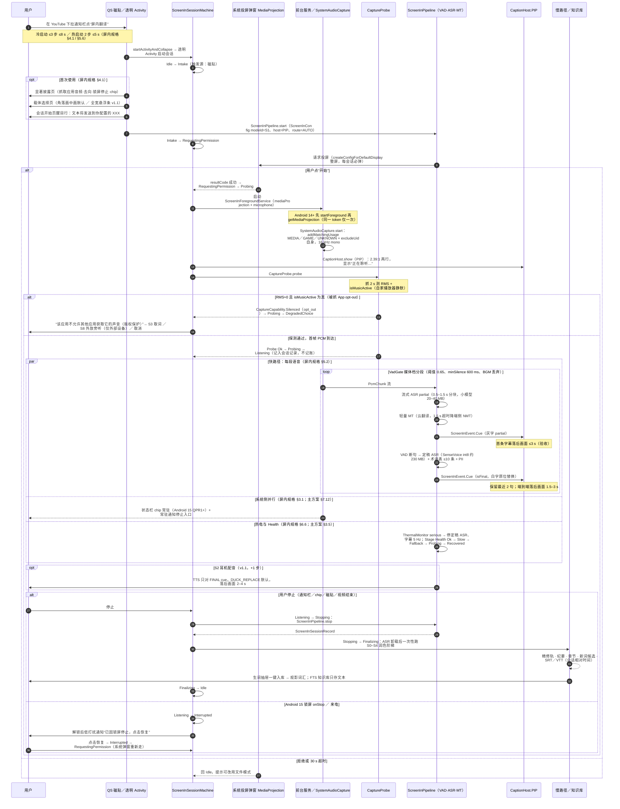

读图要点：外层 alt 为投屏授权（开始 / 拒绝或 30 s 超时）；内层 alt 为 2 s 可抓性探测（opt-out→DegradedChoice / 通过→Listening）；par 块并列快路径循环（partial→final 同 cue 替换）、系统侧 chip/通知、热电与 Stage Health；opt 为 v1.1 的 S2 耳机配音；末尾 alt 区分用户停止（→Finalizing→Idle）与锁屏 Interrupted（必须重新授权）。Note 标出 ≤8 s/≤5 s 启动、2 s 探测、≤3 s 首条、1.5–3 s 落后。引用：屏内规格 §4.1/§5.2/§5.6/§6.2/§6.3/§6.6/§8；主方案 §3.5/§7.3/§7.12。

#### ScreenInSessionMachine 屏内会话状态机（S1/S4/iOS 实验路径共用）（状态图）

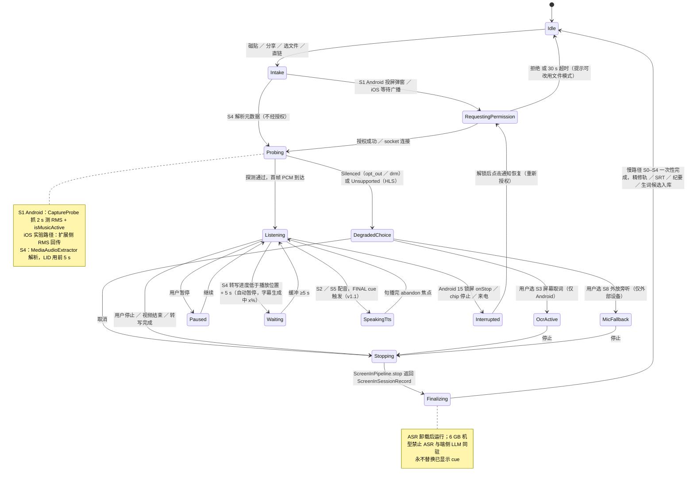

读图要点：Idle→Intake→（S1/iOS 经 RequestingPermission，S4 直进）Probing→Listening 为主干；Probing 的失败出口统一到 DegradedChoice（OcrActive / MicFallback / 取消）；Listening 的旁路为 Paused、Waiting（仅 S4，+5 s 阈值）、SpeakingTts（v1.1 配音）、Interrupted（锁屏须重新授权）；所有停止都经 Stopping→Finalizing（慢路径一次性）→Idle。文档未定义 Listening→OcrActive 及其返回。引用：屏内规格 §6.3；主方案 §7.5 屏内会话状态机 / 附录 A.4。

### C2 S4 文件字幕（两端）：从分享 / 选择 / 直链到边转边看、精修轨、SRT 导出与生词入库

用户把相册 / 文件 / 微信视频分享给本 App（或 App 内选文件 / 剪贴板直链），自动抽音频、LID 前 5 s、批式端侧 ASR 边转边看，内置播放器同步字幕并在转写落后时自动暂停等待（Waiting）；结束后慢路径整段精修生成第二条精修轨，用户可导出 SRT / VTT（默认精修、精确时间戳），生词抽屉入库、FTS 存 bookmark 可跳回时间点。S5 文件配音为 v1.1 分支。图：flowchart TD（入口 A–E + 解析判语 + 快路径 + 并行轨道 + 慢路径 + 分支 + 失败路径）。

关键数字：

- 分享 / 选文件入口 2 步，首条字幕 ≈3–5 s（验收 ≤5 s，iPhone 15 / 骁龙 8 Gen 2，10 分钟 1080p）；MP4 直链 ≈4–6 s；已处理过 1 步 0 s（屏内规格 §4.4 / §5.6）
- 语言自动检测 LID 用前 5 s（屏内规格 §4.4；主方案 §3.8）
- 批式端侧 ASR 桌面 10–30× 实时、手机预期 5–15×（待实测）；全片转写 ≤1/4 时长（屏内规格 §5.4 / §5.6；主方案 附录 B 32）
- 自动暂停阈值：转写进度 ≥ 播放位置 + 5 s，缓冲 ≥5 s 恢复（屏内规格 §5.4 / §6.3）
- 云翻译 1.5 s 超时降端侧 NMT（语言对模型未下载 3 s）；cue 点击回跳 3 s（主方案 §3.5；屏内规格 §4.4）
- S5 配音（v1.1）原声压低：句级替换 −18 dB / 纯混音 −8 dB（屏内规格 §5.3）

#### S4 文件字幕（两端）：入口 A–E 到边转边看、Waiting 自动暂停、精修轨、SRT 导出与生词入库（流程图）

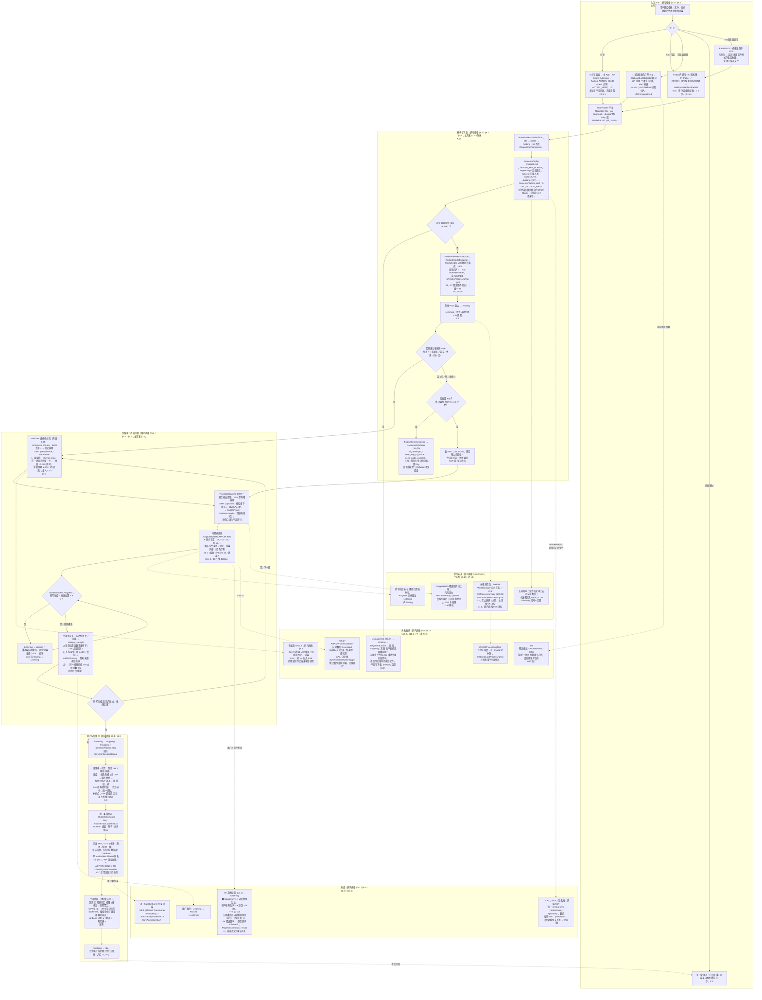

读图要点：五个入口（分享 / App 内选 / 剪贴板直链 / 已处理过 0 s / S1 低电量引导）汇入 MediaRef，S4 不经授权直接 Probing；iOS HLS 在抽取前即分流到 Unsupported；LID 用前 5 s 后判语言覆盖（Refused 不是错误）；快路径为批式端侧 ASR（手机预期 5–15×）边转边看，Progress 决策“转写 ≥ 播放 + 5 s”否则 Waiting 自动暂停；停止后慢路径一次性出精修轨、SRT/VTT（默认精修、精确时间戳）与生词入库，FTS 存 bookmark 可跳回。虚线为并行轨道、S5 配音（v1.1）等分支与失败路径。引用：屏内规格 §4.4/§5.3/§5.4/§5.6/§6.2/§6.3/§6.6/§7/§8；主方案 §3.5/§3.8/§7.5/§7.10/§7.12/附录 A.4。

### C3 iOS 屏内路径决策树：想翻译 iPhone 上正在播的视频时如何引导（含 ReplayKit + PiP 实验路径与四项验证门）

iOS 用户进入屏内入口后，App 按视频来源引导：相册 / 文件 / 直链 MP4 → S4；其他 App 内视频 → MVP 只给“保存后用文件字幕”降级；电视 / 电脑 → S8 外放旁听；HLS / 网页 → 诚实文案；DRM 只能在实验路径 Probing 由扩展侧 RMS≈0 发现。ReplayKit + PiP 实验路径仅在 v1.1 且四项真机验证（探审核 / DRM 静音 / 30 分钟功耗 / 保活）全部通过后开放，否则预设“整体不做”，主线 S4 / S8 不受影响。图：flowchart TD 决策树（Q1–Q7 + 验证门 + 实验路径 + 旁支）。

关键数字：

- S4 首条字幕 ≈3–5 s（文件）/ ≈4–6 s（MP4 直链）；“保存后用文件字幕”降级被迫 3–4 步（屏内规格 §4.4；主方案 §1.4）
- 实验路径全程 3 步，“开始直播”倒计时 3 s，首条字幕 ≈8–12 s（屏内规格 §4.5 / §3.2）
- 30 s 未连接 socket 提示“请点开始直播”/ RequestingPermission 30 s 超时回 Idle（屏内规格 §4.5 / §6.3）
- 扩展 socket 5 s 无 ACK 结束广播；BroadcastExtension <10 MB 只转发 PCM、不含 ASR（屏内规格 §4.5 / §6.5 / §8）
- PiP 字幕帧率 ≤10 fps；四项验证③功耗测试 30 分钟（屏内规格 §6.5 / §10.1）
- 快路径同 S1：字幕落后画面 1.5–3 s；云翻译 1.5 s 超时降端侧 NMT（模型未下载延长 3 s）；S8 媒体档 VAD 0.65 / 600 ms（屏内规格 §5.2 / §4.6；主方案 §3.5 / 附录 A.1）

#### iOS 屏内路径决策树：来源判定（S4 / 保存后 S4 / S8 / 诚实文案）与 ReplayKit + PiP 实验路径的四项验证门（流程图）

```mermaid
flowchart TD
  subgraph sg1["入口与能力（屏内规格 §3.2 / §6.2<br/>/ §3；主方案 §3.8 / §7.12）"]
    S["iOS 用户想翻译 iPhone<br/>上正在播的外语视频 → 打开本 App 屏内<br/>Tab"]
    HN["首次进入：iOS 诚实说明页（代替<br/>Android 显著披露页）<br/>｜相册／文件／分享来的视频完整支持；其他<br/>App<br/>视频需“屏幕录制”获取声音并以画中画显示字幕，<br/>属实验功能（需点“开始直播”、顶部红色指示、<br/>Netflix 等可能没有声音、Safari<br/>网页视频请改用对应 App、<br/>同一时间只能一个画中画）<br/>｜本机播放可先保存再用文件字幕；<br/>电视／电脑用外放旁听"]
    PC["PlatformCaps iOS：<br/>supportsSystemCapture=EX<br/>PERIMENTAL、<br/>supportsOcrOverlay=false<br/>、singlePipOnly=true、<br/>Overlay=Unsupported｜tier<br/> 措辞：CORE 可写商店描述、<br/>IOS_EXPERIMENTAL 写“实验功能，<br/>可能随时调整”、FALLBACK 只在帮助页；<br/>禁止“Beta 即将推出”"]
  end
  subgraph sg2["决策树（屏内规格 §2.2 / §3.2 /<br/>§4.4 / §4.6 / §8；主方案<br/>§1.4）"]
    Q1{"Q1 视频在相册／文件／分享面板／直链 MP4？"}
    Q1b{"Q1b 直链是 HLS（m3u8）？"}
    S4["S4 文件字幕（CORE，MVP 周<br/>12–13）→ 见 C2<br/>全流程｜PHPicker（不申请相册权限）<br/>／Share Extension／剪贴板直链 →<br/> AVAssetReader；直链 MP4 走<br/>MTAudioProcessingTap｜首条字<br/>幕 ≈3–5 s（文件）／ ≈4–6<br/>s（MP4 直链）"]
    HLS["MediaAudioExtractor 返回<br/>Unsupported（HLS）→<br/>Probing →<br/>DegradedChoice → 取消 →<br/>Stopping｜“暂不支持流媒体链接：<br/>可用该平台的 App 播放并用外放旁听，<br/>或改用已保存的视频文件。<br/>”不引导下载（movpkg 仍是 HLS，<br/>AVAssetReader 不可读）；fMP4<br/>分片自取 v1.1 待验证"]
    Q2{"Q2 视频在本机其他 App 内正在播放？"}
    Q2b{"Q2b<br/>网页视频／WKWebView／Safari？"}
    WEB["CaptureCapability.Silenc<br/>ed（webview）：“网页视频暂不支持，<br/>请使用该平台的 App 版。”（§3.2<br/>另有“或系统实时字幕”）"]
    Q3{"Q3 视频在电视／电脑／别人手机上播？"}
    S8["S8 外放旁听（FALLBACK）= M0<br/>媒体档 VadProfile.media（阈值<br/>0.65、minSilence 600 ms、<br/>BGM 检测）｜屏内入口兜底按钮 ／ 耳机单击<br/>／ 磁贴触发（具体步骤属屏外 M0）"]
    S8N["S8 对本机正在播放的视频不适用：本机外放 +<br/>本机麦触发 §7.3 外放 AEC 路径，<br/>且公放即社死；UI 明示"]
    Q5{"Q5 已到 v1.1？（MVP<br/>期入口不显示实验路径，不写“即将推出”）"}
    SAVE["MVP 显式降级引导：在视频 App<br/>内“保存到相册 ／ 分享面板 →<br/>存储到文件”或 Safari 下载 →<br/>分享给本 App → S4｜被迫点击 3–4 步"]
  end
  subgraph sg3["实验层准入：四项真机验证门（屏内规格<br/>§10.1 / §10.3；主方案 附录 B<br/>决策 16 / 31）"]
    GATE["① TestFlight 探审核：PiP<br/>承载纯字幕的审核态度（翻译／计时器类 PiP<br/>被拒先例）｜② Netflix／Apple<br/>TV+ .audioApp 是否静音｜③<br/>PiP + 扩展 30 分钟功耗与稳定性｜④<br/>保活链路：PiP 关闭后主 App 挂起 →<br/>扩展 5 s 无 ACK 结束广播｜系统识别为 v1.1 可选插件，<br/>不在扩展内验证 SpeechAnalyzer"]
    Q6{"四项全部通过？"}
    NO["附录 B 决策 16 预设“整体不做”：<br/>实验层不上线，主线 S4／S8<br/>不受影响（备选纯转发 + 云 ASR）"]
  end
  subgraph sg4["实验路径：ReplayKit +<br/>PiP（屏内规格 §4.5 / §6.5 /<br/>§6.2 / §5.5；主方案 §7.2 /<br/>§7.10）"]
    EXP1["App 内点“屏内字幕（实验）”→ 说明页 →<br/>RPSystemBroadcastPickerV<br/>iew（隐藏麦克风按钮）→ 点“开始直播”3<br/>s 倒计时，红色指示常驻（系统提供）｜全程 3<br/>步"]
    SM1["Intake →<br/>RequestingPermission（iOS<br/> 等待广播）：<br/>SystemAudioCapture iOS<br/>返回<br/>CaptureCapability.NeedsB<br/>roadcastPicker｜30 s 未连接<br/>socket<br/>提示“请点开始直播”／RequestingPer<br/>mission 30 s 超时回<br/>Idle（是否同一计时未明）"]
    EXT["BroadcastExtension（独立<br/>Swift target，不链接 Kotlin，<br/>小于 10 MB，不含 ASR）：<br/>RPBroadcastProcessMode<br/>SampleBuffer，只处理<br/>.audioApp，视频 buffer 立即<br/>invalidate｜AVAudioConver<br/>ter → 16 kHz mono → App<br/>Group Unix socket；各自<br/>PrivacyInfo.xcprivacy"]
    PIP["主 App PiP 字幕窗（Swift 经<br/>Koin 注入）：<br/>AVSampleBufferDisplayLay<br/>er、无限 timeRange、≤10 fps、<br/>窗内不可交互｜自动进入需<br/>canStartPictureInPicture<br/>AutomaticallyFromInline<br/>+ 用户切后台 + 活跃 playback<br/>会话｜AVAudioSession<br/>playback +<br/>mixWithOthers；入后台关闭 App<br/>Group SQLite 连接（避免<br/>0xdead10cc）"]
    PR["socket 连接 →<br/>RequestingPermission →<br/>Probing：扩展侧 RMS<br/>回传（CaptureProbe iOS<br/>actual）"]
    Q4{"Q4 RMS≈0？（DRM 只能在此发现，<br/>入口无法预判；DrmProbe 判据文档未定义）"}
    DRM["CaptureCapability.Silenc<br/>ed（drm）→<br/>DegradedChoice｜“该应用可能受版权<br/>保护，未收到声音。可试系统实时字幕（不翻译）<br/>或外放旁听。”（§3.2<br/>表格写“无法获得声音”）｜→ S8<br/>MicFallback（仅外部设备）或取消 →<br/>Stopping；引导系统 Live<br/>Captions"]
    FAST["Probing → Listening，<br/>快路径同 S1：socket 流 →<br/>VadGate 媒体档 → ASR（sherpa-onnx<br/>SenseVoice／zipformer，再<br/>BYOK）→ 翻译：AUTO +<br/>TextOnlyCloud<br/>混合档云翻译（1.5 s 超时降端侧<br/>NMT；模型未下载延长 3 s、本句标“未译”）→<br/>PiP 灰字 partial →<br/>白字定稿｜首条字幕 ≈8–12 s；落后画面<br/>1.5–3 s（iOS 26 以下是否有<br/>partial 未交代）"]
    Q7{"PiP 可用？（审核通过 且 PiP 位未被占）"}
    NOPIP["退“耳机 TTS +<br/>通知最近一句”（CaptionHostKind.<br/>HEADSET_TTS ／<br/>NOTIFICATION）｜PiP 位被占：<br/>“同一时间只能有一个画中画，请先关闭其他画中画。<br/>”本 App PiP 会顶掉 YouTube<br/>自己的 PiP"]
    KEEP["保活链路 SessionKeepAlive<br/>iOS：S1 无音频输出时 audio<br/>后台模式不保活 → 靠 PiP 存活 或<br/>持续播放 TTS／近静音轨 二选一｜用户关掉<br/>PiP → 主 App 挂起、socket<br/>无人读 → 扩展 5 s 无 ACK<br/>finishBroadcastWithError<br/>，红条消失；主 App 恢复后提示重新开始"]
    END["用户停止 → Stopping →<br/>Finalizing：慢路径精修 → 纪要 →<br/>SRT（会话相对时间戳）→ FTS<br/>知识库（系统抓取只存文本）→ Idle"]
  end
  subgraph sg5["旁支与观察项（屏内规格 §5.3 / §5.5<br/>/ §4.4 / §6.2 / §9；主方案<br/>§7.5 / §10 v2）"]
    LO["LOCAL_ONLY：端侧 NMT（core/nmt）<br/>两端一致，与 iOS 版本无关｜<br/>语言对模型未下载 → 提示下载｜<br/>日／韩音频需配置 Key，否则提示“该语言需配置 Key<br/>或等待多语端侧包（v1.1）”"]
    S2["iOS S2 系统配音（实验，v2）：<br/>duckOthers（可关，关后<br/>mixWithOthers）；不可控他人音量 →<br/> 提示用户手动｜观察项：iOS 27<br/>Generated<br/>Subtitles（仅美／加英语）无检测<br/>API，只提供<br/>SystemSubtitleUserToggle<br/>“我已看到系统字幕，只做翻译”手动开关"]
    MEM["内存压力 jetsam 预警 → 慢路径延后；<br/>扩展始终小于 10 MB（只转发 PCM）"]
  end
  S --> HN --> PC --> Q1
  Q1 -->|"是"| Q1b
  Q1b -->|"否（文件／MP4 直链）"| S4
  Q1b -->|"是（iOS）"| HLS
  Q1 -->|"否"| Q2
  Q2 -->|"是"| Q2b
  Q2b -->|"是"| WEB
  Q2b -->|"否"| Q5
  Q2 -.->|"不作为本机视频出路"| S8N
  Q5 -->|"否（MVP）"| SAVE --> S4
  Q5 -->|"是（v1.1）"| GATE --> Q6
  Q6 -->|"任一项不通过"| NO --> SAVE
  Q6 -->|"全部通过，实验层开放"| EXP1
  Q2 -->|"否"| Q3
  Q3 -->|"是"| S8
  Q3 -->|"否"| Q1
  EXP1 --> SM1 --> EXT --> PIP --> PR --> Q4
  SM1 -.->|"30 s 超时"| Q5
  Q4 -->|"是（DRM）"| DRM
  DRM -.->|"外部设备"| S8
  Q4 -->|"否，首帧 PCM 到达"| FAST --> Q7
  Q7 -->|"否"| NOPIP --> KEEP
  Q7 -->|"是"| KEEP --> END
  FAST -.->|"RoutePolicy ／<br/>语言"| LO
  FAST -.->|"v2"| S2
  FAST -.-> MEM
```

读图要点：Q1 来源在相册/文件/分享/MP4 直链→S4（HLS 分流到 Unsupported 诚实文案）；Q2 本机其他 App 播放→网页视频直接拒绝，否则 MVP 只给“保存后用文件字幕”（3–4 步）；Q3 电视/电脑→S8 外放旁听（S8 对本机播放不适用）；Q5/Q6 实验层须到 v1.1 且四项真机验证（探审核 / DRM 静音 / 30 分钟功耗 / 5 s 无 ACK 保活）全过，否则预设“整体不做”；实验路径 3 步、3 s 倒计时、30 s 等广播、扩展 <10 MB 只转发 PCM、PiP ≤10 fps、首条 ≈8–12 s；DRM 仅在 Probing 由 RMS≈0 发现。引用：屏内规格 §2.2/§3.2/§4.4/§4.5/§4.6/§6.2/§6.3/§6.5/§8/§10.1/§10.3；主方案 §1.4/§3.8/§7.2/§7.10/附录 B 决策 16/31。

