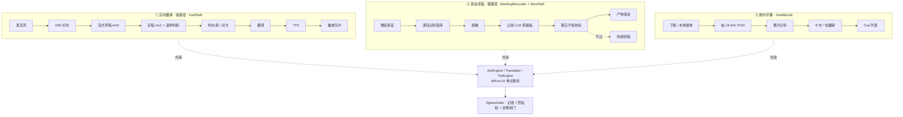

# 翻译管线 · 实现对照

> **这篇讲什么**：代码里三条管线实际怎么跑、每一步调哪个模型、要换模型该动哪一行。
> **谁该看**：开发；交接 / 面试时当索引用。
> **和 05 / 06 / 08 篇的关系**：那三篇是**设计规格**（该长什么样），这篇是**实现现状**（代码实际长什么样）。两者不一致的地方集中在末节「规格与实现的差距」，不在正文里混着写。
> **口径**：截至 2026-09-18 的 `main`。行号会随提交漂移，按符号名搜更稳。

## 先看这个（大白话）

1. **三条管线**：实时翻译（快路径，目标 < 2 s）、录音成稿（慢路径，会话结束后跑一次）、屏内字幕（离线整片批处理）。三条共用同一套引擎接口，接线全在 `di/Koin.kt` 一个文件里。
2. **识别 100% 在端侧**。云端真正接上的只有**翻译**（qwen-mt）和**润色**（qwen-flash），而且都要用户自己填密钥。
3. **端侧一共 7 类模型**，都不随包内置，用户在「设置 → 模型」按需下载，HF 镜像优先 + sha256 强校验。清单只有一份：`models/ModelCatalog.kt`。
4. **每一步都有降级**：云端翻译 1.5 s 超时就退端侧，连续 2 次熔断 30 s；系统语音没有就用端侧语音；云端润色失败退纯规则版。降级永远不阻塞管线，最差是「只出字不出声」。
5. **换模型分四档**：设置里换云端模型（零代码）→ 改 `ModelCatalog` 换权重（不动逻辑）→ 实现接口改 Koin 一行（换整个实现）→ 动硬编码的 `when` 分支（加语种 / 加模型种类）。
6. **所有出网都过 `EgressGate`**：记账、隐私档拦截、消费闸门，没有第二条出口。

---

## 一、三条管线总览



三条管线对同一批接口的用法不同，差别值得记住：

| | 实时 | 慢路径 | 屏内字幕 |
|---|---|---|---|
| 译员实例 | `FastTranslator`，超时 1.5 s | `FallbackTranslator`，**不带超时** | 独立的 `FastTranslator`，超时 20 s |
| 为什么 | 晚了不如不译 | 成稿质量优先，等得起 | 8 句一批，1.5 s 太紧；熔断也不能牵连实时会话 |
| 熔断 | 连续 2 次 → 30 s | 无 | 独立实例，自己熔断 |

---

## 二、实时快路径

`live/FastPath.kt`。ASR Final → 判向 → 翻译 → TTS → 播放队列。

| # | 阶段 | 代码 | 调用的模型 | 降级 / 兜底 |
|---|---|---|---|---|
| 1 | 采集 | `audio/` expect/actual | — | 16 kHz PCM，平台层 |
| 2 | VAD 切句 | `SherpaStreamingSession` | **Silero VAD** 0.6 MB | 无（必需） |
| 3 | 流式草稿 rev0 | 同上 | **zipformer 中英双语 int8** 189 MB | 无（必需） |
| 4 | 定稿 rev1 + LID | `finalizeUtterance` | **SenseVoice** 228 MB，或四川话选 **川渝 Paraformer** 227 MB | < 4 GB 机型不装定稿模型，只出草稿 |
| 5 | 判向 | `live/Direction.kt` | **3D-Speaker CAM++** 27 MB + `translate/Script.kt` 脚本规则 | 无声纹模型 / 未注册 → 退化为脚本 + 两句防抖 |
| 6 | 术语 / 纠错 | `FastPath.applyCorrections` | — | 纯字符串替换 |
| 7 | 翻译 | `translate/Translator.kt` `FastTranslator` | **云** qwen-mt-flash → **端** opus-mt / FuguMT int8 | 1.5 s 超时 → 端侧；都没有 → 只出原文 + 原因码 |
| 8 | TTS | `tts/TtsRouter.kt` | **系统 TTS** → **Matcha-TTS + Vocos** 135 MB | 都没有 → 标 `SHOWN_ON_SCREEN`，只出字 |
| 9 | 播放 | `live/PlaybackQueue.kt` | — | 软半双工见下 |

### 两个容易被忽略的时序细节

- **草稿要等定稿 1.2 s**（`REFINE_WAIT_MS`）。流式 zipformer 会叠字，句尾即跑的定稿通常 0.1–1 s 就到；等它再翻译，播出去的译文就来自干净的原文。超时就照草稿翻。
- **rev1 到达时只改原文**。译文若还没送 TTS 就重译；**已经播过的不改** —— 用户已经听见的话不会被悄悄改写。

### 软半双工与泄漏过滤

- 对方插话 > 300 ms → 压低 −12 dB；累计 > 1.5 s → 丢弃剩余队列并标「未播完」。
- 我开口 → 立即停播，未播译文转屏幕文字。
- 开放式耳机 / 外放会把 TTS 播出去的声音重新录回来：识别结果与最近送播译文的字符二元组 Dice 相似度 > 0.8 就丢弃。

---

## 三、慢路径（录音成稿）

`polish/SlowPath.kt`，02 篇 §2.4 的 S0–S4。会话结束后整段跑一次，产物写 `session_note`，**永不改动已显示的原文**；重跑追加新版本。

```
S0 拼稿      每段前缀 [mm:ss]，用户当场标记的要点行前缀 [要点]
S1 脱敏      Redactor 正则打占位符（手机号 / 身份证 / 邮箱 / 卡号）→ «PHONE1»
S2 模板      Templates.minutesSystem / cardSystem → 云端 LLM（qwen-flash）→ 解析 JSON
S3 回填      占位符还原（容错模型把 «PHONE1» 改写成 <PHONE1> / PHONE 1）
S4 事实守恒  FactCheck：润色不能丢数字、不能改否定；摘要不能凭空出现数字
```

规则层的分组逻辑（按停顿 ≥ 8 s 或 3 分钟窗口切组、标记要点处强制切组）在 `RulesMinutes.minutes()` 里，
**只在降级时才跑**，不在云端主链路上。

**降级是三层的**：没密钥 / LLM 报错 → `RulesMinutes` 纯规则版（时间轴要点 + 待办候选句，永远可用）；事实守恒不过 → 保留云端结果但挂 flag，并把时间轴换回规则版。`backend` 字段如实记录用了哪一层，不粉饰。

翻译用 `FallbackTranslator`（云端优先、端侧兜底、不带超时）。

---

## 四、屏内字幕

`screen/SubtitleJob.kt`。`IDLE → DOWNLOADING → EXTRACTING → TRANSCRIBING → TRANSLATING → DONE`。

- 抽音频到 16 kHz PCM → 整片跑识别 → `transcribedMs` 单调更新，**边转边看**：播放位置追上转写进度就暂停等。
- 翻译按 `batchesByLang(indices, langs, size = 8)` 分批，**同语种的 8 句拼成一次请求**（`\n` 分隔）省 token。
- 批翻回来行数对不上就**逐句重翻**兜底 —— 这是模型不按行数返回时的唯一防线。
- 只有句子语种和目标语不同才产生译文；整片都是目标语时只出原文字幕。

---

## 五、模型清单

全部定义在 `models/ModelCatalog.kt`，不随包内置，经 `EgressGate` 记账（kind = `model_asset`）下载，HF 镜像（hf-mirror.com）优先，落盘后 sha256 强校验。

| 阶段 | 模型 | 体积 | 许可 | 备注 |
|---|---|---|---|---|
| VAD | Silero VAD v4 | 0.6 MB | MIT | 切句与待机档 |
| 流式 ASR | zipformer 中英双语 int8 | 189 MB | Apache-2.0 | 快路径上屏 |
| 定稿 ASR + LID | SenseVoice（zh/en/ja/ko/yue） | 228 MB | FunASR MODEL_LICENSE | **非 Apache，上架前法务复核** |
| 定稿 ASR（川渝） | Paraformer-large 川渝微调 int8 | 227 MB | 上游 Apache-2.0 / 底座 FunASR | CER 12.2 vs 原版 14.3 |
| 声纹 | 3D-Speaker CAM++ | 27 MB | Apache-2.0 | 判向「我 / 对方」 |
| TTS | Matcha-TTS + Vocos + espeak-ng 子集 | 135 MB | Apache-2.0 / MIT | 无系统语音机型的主路径 |
| 端侧 NMT | opus-mt zh↔en、ko→en；FuguMT ja↔en | 108–139 MB / 方向 | CC-BY-4.0 / Apache-2.0 / CC-BY-SA-4.0 | **三种许可不同，逐个复核** |
| 云端 MT | qwen-mt-flash / lite / plus / turbo | — | — | 设置项 `mtModel` |
| 云端 LLM | qwen-flash / plus / turbo | — | — | 设置项 `llmModel` |

**端侧 NMT 没有直连模型的方向走英语中转**（日↔中、韩→中/日），路由表在 `nmt/NmtRoutes.kt`。两个已知空洞：英→韩没有可用端侧模型（`opus-mt-en-mul` 不含韩语，`tc-big-en-ko` 的 HF 词表缺源语言），只能走云端；`ja↔en` 的 ONNX 导出来自第三方仓库 Kadonox，sha256 锁死，仓库消失需另找镜像。

---

## 六、换模型：四档代价

### ① 用户在设置里换（零代码）

云端 MT 模型、云端 LLM 模型、TTS 偏好（`auto / system / local / off`）、厂商 base_url。`Providers` 里已有 `openai_compat` 这一档，就是为兼容端点留的。

### ② 换权重（只改 `ModelCatalog` 一个 block）

改 `ModelPack` 的 `mirrors` + 各 `ModelFile` 的 bytes / sha256 即可，**代码不用动**。适用于：VAD、流式 ASR、声纹、端侧 NMT 这四类 —— 它们是纯数据替换。

### ③ 换实现（改 `Koin.kt` 一行）

`AsrEngine` / `Translator` / `TtsEngine` / `EngineSelector` 都是 interface，Koin 单点绑定。例：接一个新云端译员，实现 `Translator` 后替换 `FastTranslator(cloud = { ... })` 的 lambda，超时 / 熔断 / 降级逻辑全部照旧复用。

### ④ 动硬编码（加语种 / 加模型种类时绕不开）

| 位置 | 卡在哪 |
|---|---|
| `ModelCatalog.ttsSpec()` | `when (pack.id)` + `else -> error(...)`，加 TTS 包必须补分支 |
| `SherpaAsrEngine.mapLang()` | SenseVoice 那 5 个语种标签写死，换 LID 模型要改映射 |
| `SherpaAsrEngine` 的 `LoadPlan.forLang()` | `lang == ZH_SICHUAN → SICHUAN` 硬编码，加方言包要改 |
| `NmtRoutes.direct()` | 语言对 → 包的映射是手写 `when`，加语向要改表 |
| `asr/SherpaNative.kt` | 端侧只认 sherpa-onnx 的模型格式（zipformer / paraformer / SenseVoice / Matcha）；换推理框架等于重写这一层 |
| `translate/Script.kt` | 脚本判别只认汉 / 拉丁 / 假名 / 谚文四种，加别的书写系统要改 |

---

## 七、规格与实现的差距

这一节是这份文档存在的主要理由：**规格写了但代码还没接上的东西**。

1. **云端 ASR 引擎没有实现**。`AsrEngine` 只有 `SherpaAsrEngine` 一个实现类；全仓库没有任何地方给 `SelectorContext.cloudEngines` 赋值。`DefaultEngineSelector` 的 `CloudOnly` / `CloudFirst` 分支和对应单测都写好了，靠 `cloudEngines.isEmpty()` 这个条件让选路矩阵先跑通，但拿到的 `Route.streaming` 实际是 `null`。
   **影响**：02 篇「上海话 / 闽南语只能云端」这条路目前走不通 —— 选到了也没有引擎。
2. **方言不能自动识别，只有语种能**。`Lang.family()` 把 `zh-CN / yue-HK / zh-CN-sichuan / wuu-CN / nan-CN` 全归进 `"zh"` 一族（同脚本，LID 分不开）。自动判别只覆盖 zh / en / yue / ja / ko；四川话等必须用户手动选标签，**是语言标签驱动模型加载，不是模型识别出方言**。
3. **`ScenePreset.dialectPriority` 是死字段**。定义了但全仓库没有任何地方读它。
4. **系统引擎插件只在接口层预留**（iOS SpeechTranscriber / Android SpeechRecognizer、Apple Translation / ML Kit Translation），MVP 不实现、不依赖，v1.1 评估。

---

## 八、按符号找代码

| 想找 | 搜这个 |
|---|---|
| 全部接线 | `di/Koin.kt` |
| 快路径主流程 | `live/FastPath.kt` 的 `translate()` |
| 翻译降级 / 熔断 | `translate/Translator.kt` 的 `FastTranslator` |
| 端侧翻译路由（含英语中转） | `nmt/NmtRoutes.kt` 的 `resolve()` |
| 端云选路矩阵 | `asr/Asr.kt` 的 `DefaultEngineSelector` |
| 语种映射 / LID 门控 | `asr/SherpaAsrEngine.kt` 的 `mapLang()` / `acceptLid()` |
| 模型清单与下载源 | `models/ModelCatalog.kt` |
| 事实守恒规则 | `polish/SlowPath.kt` 的 `FactCheck` |
| TTS 选择 | `tts/TtsRouter.kt` 的 `choose()` |
