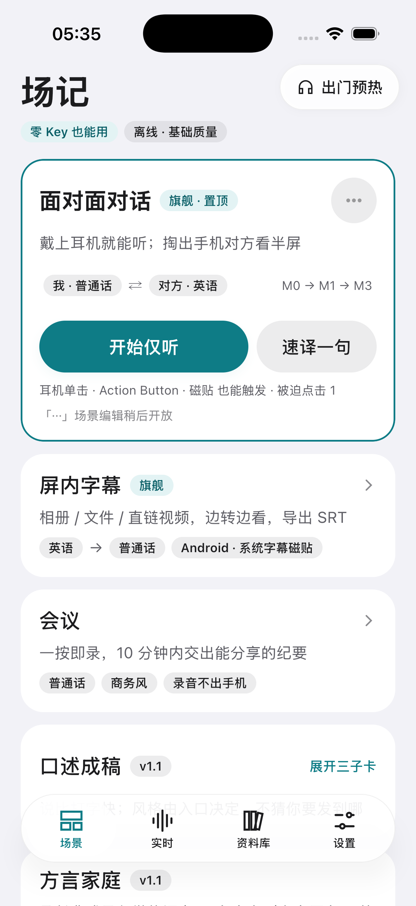
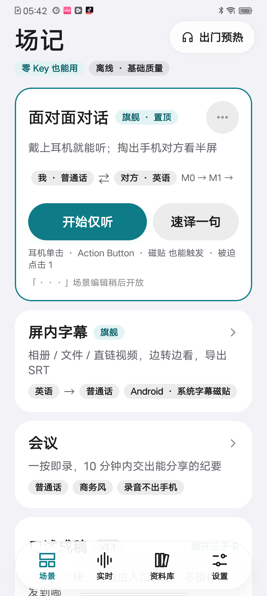
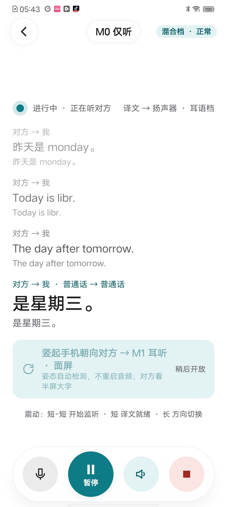
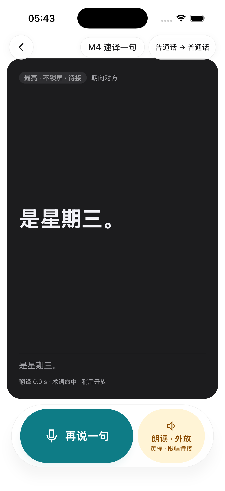

# 验收记录 · I3 实时管线 + M0 / M4（含 I2.5 壳迁移）

日期：2026-09-17 · 执行：Claude（代码 + vivo V2054A 真机 + iPhone 17 模拟器）· 本记录随 I3 收尾持续更新

## 1. 交付物

| 项 | 状态 | 位置 |
|---|---|---|
| 翻译层：`Translator` / `MtRequest` / `MtResult`、`FastTranslator`（云端优先、1.5 s 超时降级、连续 2 次超时熔断 30 s、401 直接熔断）、脚本判向 `Script` | ✅ 6 + 2 单测 | `translate/Translator.kt`、`Script.kt` |
| 百炼 qwen-mt 译员（OpenAI 兼容端点 + `translation_options` 顶层、`tm_list` 传上下文、`terms` 传术语；401/429 错误语义；价格表 + 每句估算写入去向账本）、Key 测试器 | ✅ | `translate/BailianMt.kt` |
| TTS 层：`TtsEngine`（只产 16 kHz PCM，不直接出声）、`TtsRouter`（auto / system / local / off）、`Resample`、短句切分 `Clauses` | ✅ 4 单测 | `tts/*.kt` |
| 系统 TTS：iOS `AVSpeechSynthesizer.writeUtterance:toBufferCallback:`（按 buffer 格式重采样）；Android `TextToSpeech.synthesizeToFile` → WAV → PCM，引擎异步探测 + `awaitReady()` | ✅ 双端实测 | `iosMain/tts/IosSystemTts.kt`、`androidMain/tts/AndroidSystemTts.kt` |
| 端侧 TTS：sherpa-onnx OfflineTts（Android AAR Kotlin API：回调必须是显式 `Function1` 类，indy lambda 会 JNI 崩溃；iOS C API + `StableRef` 回调），模型包 `matcha-tts-zh-en`（Matcha 声学 75.7 MB + vocos-16khz 53.9 MB + lexicon/tokens/fst + espeak-ng-data 子集 140 文件 3 MB） | ✅ vivo 实测 | `asr/SherpaNative*.kt`、`tts/SherpaTts.kt`、`models/ModelCatalog.kt` |
| 播放队列 `PlaybackQueue`（串行合成 + 播放、空→非空 prime、flush 丢弃 + 停当前）；快路径 `FastPath`（Final → 判向 → 翻译 → TTS → 队列；rev1 到达只改原文、未送播的重译；健康状态 mt/tts） | ✅ 2 单测 | `live/PlaybackQueue.kt`、`live/FastPath.kt` |
| `LiveViewModel` 重构（场景 → 模式 → 语言对；`LoadPlan` + TTS 预热；M4 `holdStart/holdEnd/speakCurrent`）；`LiveTranscriber` 事件外抛 + `forceEndpoint` | ✅ | `ui/live/LiveViewModel.kt`、`live/LiveTranscriber.kt` |
| 内存分级 `MemoryTier`（`MemoryInfo.totalBytes()`）：< 4 GB 实时档不带 SenseVoice 定稿 | ✅ vivo 实测 | `core/platform/MemoryInfo*.kt`、`asr/SherpaAsrEngine.kt` |
| S0：zipformer 全大写英文归一化（"TODAY IS MONDAY" → "Today is monday."） | ✅ 2 单测 | `polish/TextCleaner.kt` |
| 验收工具：`FileAudioSource` 喂 WAV（深链 `feed=`）、自检页「朗读测试（中 + 英）」（深链 `selftest?tts=1`）、会话深链 `other=` / `my=` 指定语言对 | ✅ | `audio/FileAudioSource.kt`、`ui/selftest/*` |
| Android：`<queries>` 声明 TTS_SERVICE 可见性；启动时异步探测系统 TTS 引擎 | ✅ | `AndroidManifest.xml`、`SceneNoteApp.kt` |
| 设置：TTS 偏好、翻译模型（flash / lite / plus / turbo + 价格）、Key 测试连接（行内结果：延迟 / 模型 / 样句 / 估算费用） | ✅ | `ui/settings/SettingsViewModel.kt` |
| I2.5 壳：四 Tab（场景 / 实时 / 资料库 / 设置）`GlassScaffold + SceneTabBar`；会话页按 `liveModeId` 分发（M0/M1/M3 → LiveM0Screen，M4 → LiveM4Screen） | ✅ 壳；页面见 §2 | `ui/App.kt` |
| 页面迁移（Home / Live Tab / M0 / M4 / Settings + KeyWallet sheet / Models / SelfTest / Onboarding 三页）与 material3 移除（`grep material3` 仅剩注释；`compose-material3` 依赖已删；`SceneNoteTheme` 只包 `SceneTheme`） | ✅ 双端截图见 `截图/I3-*.png` | `ui/**`、`shared/build.gradle.kts` |
| 壳覆盖层 `LocalShellOverlay`：Key 钱包 sheet 盖在玻璃 Tab 栏之上；M0「速译」先结束本会话再以 popUpTo 替换为 M4；深链切 Tab 用 popUpTo 重建壳 | ✅ | `ui/Shell.kt`、`ui/App.kt` |
| 两位审查员（原型对照 / Compose 正确性）共 17 条：high 1 + medium 5 全部修复；low 已修 9 条（里程碑编号不进文案、Tab 顶部留白统一、M0 dock 三圆钮 + 主钮、M4 卡片底距、占位页玻璃壳、零 Key 口径统一、M1/M3 不显示"升级到 M1"卡、Models/SelfTest 深链副作用只执行一次、Settings 入口页脚不虚报耳机键） | ✅ | 见 §5 未修项 |
| M4 体验：进页预热引擎（按住不再等装载）；松手收句后 300 ms 停采集，识别会话先排空再关闭（不丢最后一句） | ✅ 代码 | `LiveViewModel.prepare/holdEnd`、`LiveTranscriber.stop` |

## 2. 实测数据

### vivo V2054A（Android 11，骁龙 480，3.6 GB，无 GMS）

| 项 | 数据 |
|---|---|
| 系统 TTS 引擎 | `com.vivo.aiservice.tts.VivoTextToSpeechService`（`tts_default_synth = null`、包名不含 tts，`pm list packages | grep tts` 查不到，靠 `TextToSpeech.engines`）|
| 系统 TTS（synthesizeToFile 整句） | 中文 4.2 s 音频：首块 395 ms；英文 2.9 s 音频：首块 232 ms |
| 端侧 Matcha zh-en（冷态，2 线程 / 4 线程） | 中文整句 3.9 s 音频：首块 3.2 s / 3.5 s，总 4.2 s / 4.3 s（RTF ≈ 1.1）；英文 2.9 s 音频：首块 263 ms（"Hello," 小句）总 3.0 s |
| 端侧 TTS 驻留 | PSS 306 MB（仅 TTS，Matcha + vocos）|
| 实时档内存（仅听，LOW 分级） | zipformer + VAD：装载 vad 80–180 ms / asr 1.25 s；PSS **351 MB**（对比：四模型全驻留 899 MB、zipformer + VAD + SenseVoice 701 MB）；系统 TTS 不占 App 内存，端侧 Matcha 再 +≈ 200 MB |
| 端到端（喂 `test0.wav`，同语恒等翻译，vivo 系统 TTS） | 4 句全部识别 → 播放；句尾 → 首音 176 / 200 / 311 ms（不含翻译；译 0 ms）|
| 模型下载 | `matcha-tts-zh-en` 147 文件 127 MB，vocoder 走 GitHub Release 直链在 vivo 网络下可达 |

### iPhone 17 模拟器（iOS 26.1）

| 项 | 数据 |
|---|---|
| 系统 TTS（`write` 逐块回调） | 中文 4.1 s 音频：首块 429 ms，总 4.4 s；英文 2.3 s 音频：首块 112 ms |
| 端到端（喂 `test0.wav`，同语） | 4 句全部识别 → 播放；装载 vad 82 ms / asr 325 ms；首音 361 ms（首句）/ 3–5 ms（后续句已排队）|

## 3. 需要你来测的（统一测试清单）

1. **填百炼 Key**：设置 → Key 钱包 → 阿里云百炼 → 粘贴 `sk-…`（北京地域）→「测试连接」应显示 ✅ 与延迟 / 估算费用（不要把 Key 发到聊天里）。
2. **M0 仅听（中 → 英 / 英 → 中）**：首页「开始仅听」；对方语言默认英语；说英文 → 屏上出中文译文 + 耳机 / 外放播中文；记录一句的"句尾 → 首音"体感（目标 ≤ 2.5 s，vivo 会更慢）。深链复现：`scenenote://scene/listen?autostart=1`。
3. **M4 速译一句**：首页「速译一句」→ 按住说话 → 松手 → 大字英文卡朝向对方；点「朗读 · 外放」应出声。
4. **四川话单工 M0**：仅听页把对方语言切到「四川话」（需已下载川渝包）→ 说四川话 → 译文（要 Key）。
5. **TTS 音质对比（vivo）**：设置 → 语音输出 → 分别选「系统」与「端侧」→ 设置 → 诊断 → 录音自检 →「朗读测试（中 + 英）」，听 vivo 引擎 vs Matcha 谁更自然、英文口音是否可接受；决定 vivo 上的默认值。
6. **iPhone 真机**：`iosApp/Configuration/Config.xcconfig` 填 10 位 TEAM_ID 后跑一遍 1–3；iOS 系统语音默认是 compact 音色，增强 / Siri 音色需在系统设置里下载。
7. **无 Key 体验**：不填 Key 时 M0 每句显示原文 + "无云端 Key 或当前隐私档不允许"，不出声——确认文案与行为可接受（端侧 NMT 在 I3.5）。 **2026-09-18**：I3.5 已落地，零 Key 下载语言对包后走端侧翻译，此条作废。
8. **30 分钟不断流**（关卡 B 前置）：M0 连续听 30 分钟，观察是否有崩溃 / 卡死 / 发热降速。

## 4. 截图

| iOS 模拟器 首页 | vivo 首页 | vivo M0（喂 WAV） | iOS M4 大字卡 |
|---|---|---|---|
|  |  |  |  |

## 5. 审查遗留（low，未修）

- `SettingsTab.RowIconColor` 直接写了 6 个系统色十六进制（设计系统没有行图标色令牌；`DesignSystemGallery` 同样如此）→ 待设计系统补 `rowIcon*` 令牌。
- 实时 Tab 的档位选择只是本地状态，没持久化、没传给会话（`AppSettings.profileTier` 待加）；`SceneSegmentedControl` 没有逐项禁用参数。
- 设置分组顺序在原型六组中插入了「语音输出」「语言」两组；「关于场记」行未做（无版本常量）。
- Android 首页旗舰卡语言对行在 vivo 宽度下「M0 → M1 → M3」被截为「M0 → M1 →」（Android 字体更宽；待决策 30 字体）。
- `LiveTranscriber.stop()` 按 jobs 顺序区分采集 / 事件协程（有注释）。
- I2.5 验收项「CI 截图矩阵（深色 × 最大字号 × 降低透明度 × 提高对比度）」未做：CI 尚无模拟器截图流水线。

## 6. 未做 / 后移

- 端侧 NMT `core/nmt`（opus-mt）→ I3.5（13 篇决策记录）；无 Key 时翻译诚实降级为"不翻译"。 **2026-09-18 已落地**，见 `I3.5.md`。
- Anthropic / OpenAI 兼容端点 → 延后（决策记录"云端 provider"）。
- 声纹判向 → I4（M1）；I3 判向：M0 固定对方 → 我，M4 固定我 → 对方，M1 按输出脚本（中 ↔ 英）。
- 震动语义 / 耳语档增益 → I4。
- qwen-mt 流式（SSE 增量）→ 待实测 TTFT 后决定是否需要（一句一请求、RPM 60 已够 M0 节奏）。
